<a id="anchor0"></a>

# はじめに

この章はまずAutonomous Database(ADB) を構成するために必要なリージョンおよびコンパートメントを設定いただきます。  
その上で、ADBインスタンスを作成、データベース・ユーザー（スキーマ）を作成し、Database Actionsを使用してアクセスしてみます。


<br>

**目次**

- [1. リージョンを設定し、コンパートメントを用意しよう](#anchor1)
- [2. ADBインスタンスを作成してみよう](#anchor2)
- [3. Database Actionsで操作してみよう](#anchor3)

<br>

**所要時間 :** 約20分

<a id="anchor1"></a>
<br>

# 1. リージョンを設定し、コンパートメントを用意しよう

## 1-1. サービス画面へのアクセス

まず初めにOracle Cloud Infrastructure のコンソール画面から、ADBのサービス画面にアクセスします。

1. ブラウザから https://www.oracle.com/jp/index.html にアクセスし、ページ上部の **アカウントを表示** をクリックし、**クラウドにサインイン** をクリックします。

   本手順書ではFirefoxを前提に記載しています。英語表記の場合は **Sign in to Cloud** をクリックしてください。

    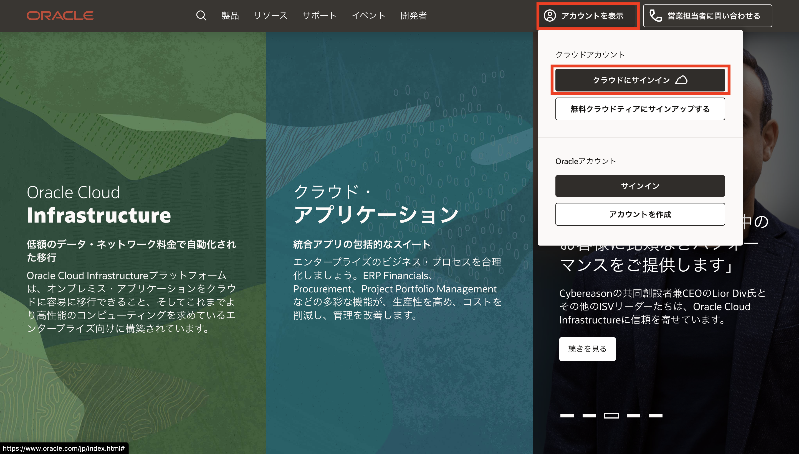

1. お手持ちのクラウドテナント名（アカウント名）を入力し、 **Continue** をクリックします。（ここでは例としてテナント名に「SampleAccount」を入力しています。）  

    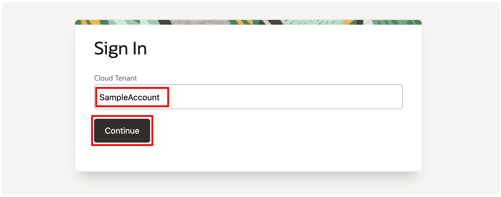

1. **クラウドユーザー名** と **パスワード** を入力し、 **Sign In** をクリックしてログインします。 （ここでは例として「SampleName」を入力しています。）   

    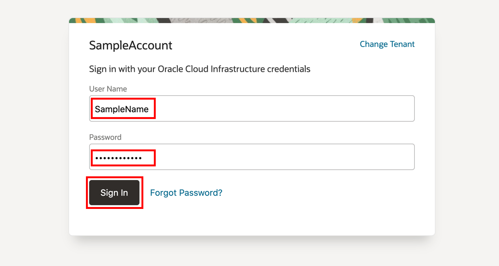  

<br>

以下のようなダッシュボード画面が表示されればOKです。  

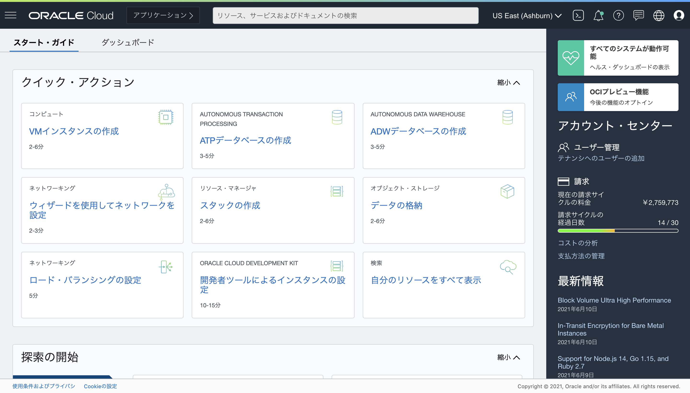

  > **補足**
  >
  > 上手く表示されない場合は以下のURLをお試しください。  
  > ```
  >https://console.ap-tokyo-1.oraclecloud.com/?tenant=<クラウド・アカウント名>
  > ```
  > 
  > ※ **<クラウド・アカウント名>** はご自身のクラウドアカウント名（テナント名）に置き換えてください。
  >
  > <br>
  >
  > **< ダッシュボード画面の使い方 >**
  > <ol>  
  > <li>ユーザー関連の確認/設定が可能です（ユーザ名の表示・パスワード変更 等）</li>  
  > <li>表示言語の設定が可能です</li>
  > <li>リージョン（データセンター）の選択が可能です</li>
  > <li>画面左上のメニューボタン（赤点線の枠内）を押すと任意のサービスを選択することが可能です</li>
  > </ol>
  >

  

<br>


## 1-2. リージョンの確認、設定

  クラウドアカウントを作成した直後のデフォルト設定では、クラウドアカウント作成時に指定した **Home Region** のみが利用可能になっていますので、  
  他のリージョンでインスタンスを作成したい場合は、以下を参考にリージョンを追加してください。

<br>

**[リージョンの追加方法]**

  1. 画面右上にある、**リージョン選択** から、**リージョンの管理** をクリックします。

      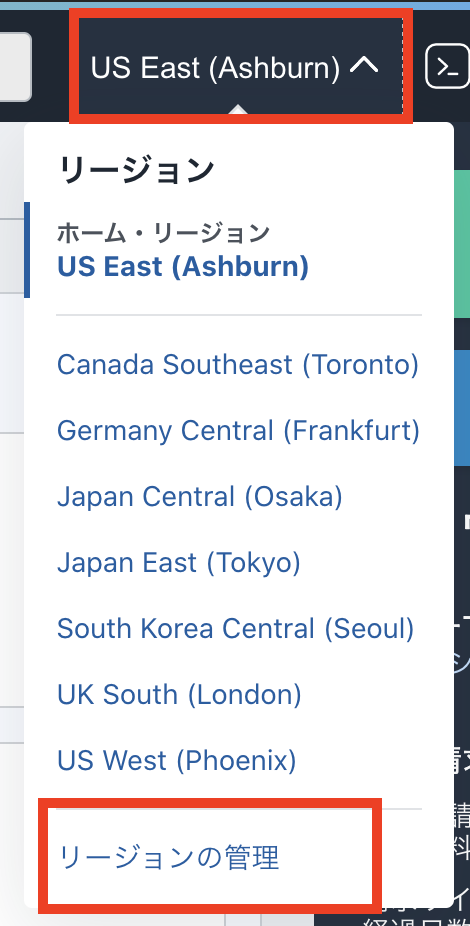

  1. Regions選択画面より有効化したいリージョンの **サブスクライブ** をクリックします  
  （有効化されると緑色に表示が変わります） 

       

  > **補足**
  > 
  > * 有効にしたリージョンが表示されない場合、一度ブラウザをリロード（F5）してください。それでも表示されてない場合は一旦ログアウトし再度ログインしてください。
  > * リージョンを追加しても課金には影響ありません。

<br>

## 1-3. コンパートメントの確認、作成
コンパートメントはOracle Cloud Infrastructure独自の機能で、テナントの中で論理的な区画を設け、権限やリソースの管理、課金状況の確認等を実施いただくことができます。  
（詳細は [こちら](https://oracle-japan.github.io/ocitutorials/beginners/getting-started/)、もしくは [マニュアル](https://docs.oracle.com/en-us/iaas/Content/Identity/Tasks/managingcompartments.htm)を参照ください。）  

以下の手順でコンパートメントの選択します。  

1. 画面左上の **メニュー** をクリックし、サービスの一覧の中から、**Oracle Database**、**Autonomous Transaction Processing** の順で選択します。

    
  
1. 次に画面左の **コンパートメント** から適切なコンパートメントを選択します。  
(本チュートリアルでは任意のコンパートメントを指定して実施いただけます。)  

    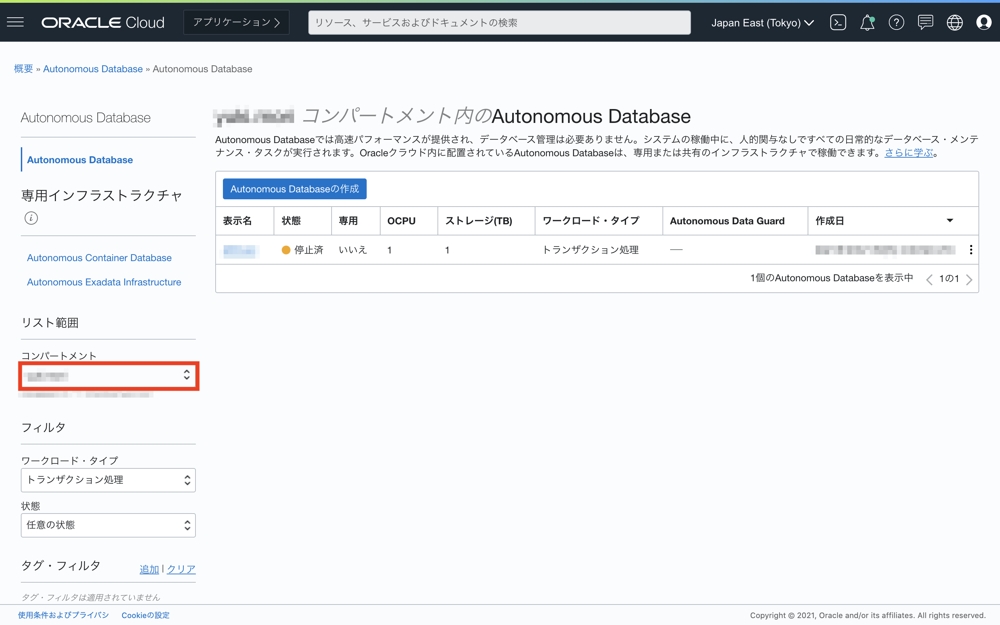

<br>

**[コンパートメントの追加方法]**

クラウドアカウントを作成した直後のデフォルト設定ではrootコンパートメントのみが表示されます。  
この場合、rootコンパートメントの直下でADBインスタンスが構成されますが、新たにコンパートメントを追加したい場合は以下の手順で追加してください。

1. 画面左上のボタンからメニュー画面を表示し、**アイデンティティとセキュリティ**、**コンパートメント** の順で選択します。

   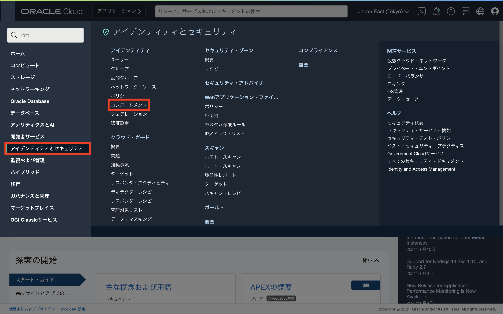

1. 次に **コンパートメントの作成** をクリックします。

   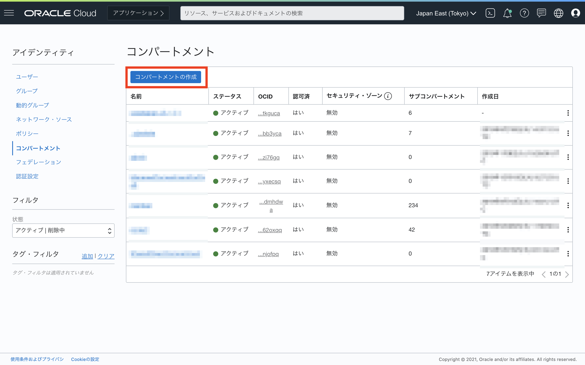

1. 作成したいコンパートメント名を入力し、**コンパートメントの作成** をクリックします。(例では、test-compartmentと入力しています)

   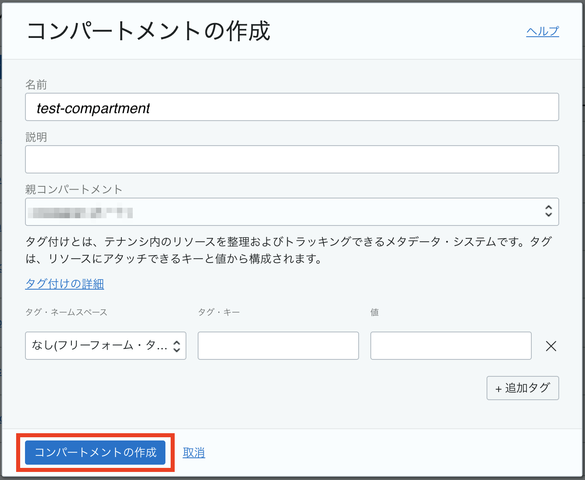


<br>
以上で、ADBインスタンスを作成する準備が整いました！  
<br>

<a id="anchor2"></a>

<br>

# 2. ADBインスタンスを作成してみよう
それではここからは実際にADBインスタンス（データベース）を1つ作成してみましょう！

> **補足**
>
> Autonomous Database (ADB)は、対象システムの処理特性に応じて以下を選択できます。本チュートリアルでは、ATPを対象に記載していますが、その他に関しても基本的な操作は同じです。  
> * 分析系システムを対象とするAutonmous Data Warehouse (ADW)
> * 汎用的な用途で利用可能なAutonomous Transaction Processing (ATP)
> * 主にJSONデータを扱うシステムに適したAutonomous JSON Database (AJD)
> 

ATPインスタンスをプロビジョニングします。

1. サービス一覧から 「**Oracle Database**」>>「**Autonomous Transaction Processing**」 を選択し、ADBのサービス画面を表示します。  

    

1. **Autonomous Database の作成** をクリックすると作成ウィンドウが立ち上がります。 

    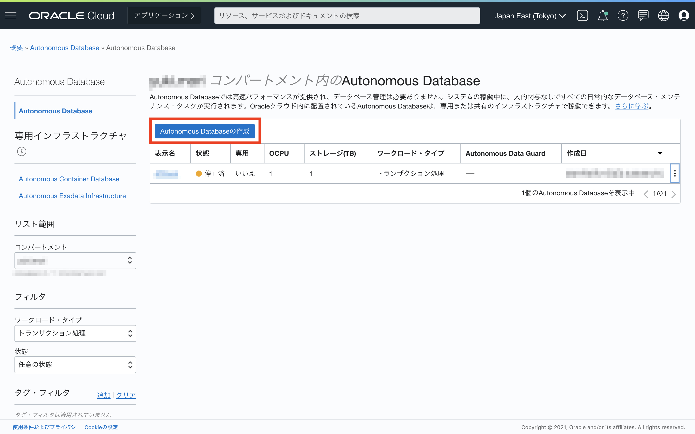

1. 以下の記載例を参考に各項目を入力します。

    <table>
    <tr>
       <td>コンパートメントの選択</td>
       <td><span style="color: red;"><b> &lt;コンパートメントから選択&gt; </b></span></td>
    </tr>
    <tr>
       <td>表示名</td>
       <td><span style="color: red; "><b>atp01</b></span>
	   <br>※サービスメニュー画面での表示用です。
	  </td>
    </tr>
    <tr>
       <td>データベース名</td>
       <td><span style="color: red; "><b>atp01</b></span>
	   <br>※インスタンスへの接続時に利用します。
	   </td>
    </tr>
    <tr>
       <td>ワークロード・タイプの選択</td>
       <td><span style="color: red; "><b>トランザクション処理</b></span>
	  <br>※
      <ul>
      <li>システムが分析用途であればデータ・ウェアハウス（ADW）を選択する</li>
      <li>JSON 中心のアプリケーション開発にはJSONを選択する</li>
      <li>APEX アプリケーション開発にはAPEXを選択する</li>
      <li>それ以外はトランザクション処理（ATP）を選択する（本ハンズオンではこちらを選択ください。</li>
      </ul>
	  </td>
    </tr>
    <tr>
       <td>デプロイメント・タイプの選択</td>
       <td><span style="color: red; "><b>共有インフラストラクチャ</b></span></td>
    </tr>
    <tr>
       <td>Always Free</td>
       <td><b>なし</b></td>
    </tr>
    <tr>
       <td>データベース・バージョンの選択</td>
       <td><b>19c</b></td>
    </tr>
    <tr>
       <td>ECPU数</td>
       <td><span style="color: red; "><b>8</b></span>
	   <br>※インスタンスに割り当てるECPU数です。インスタンス作成後でもオンラインで増減可能です。</td>
    </tr>
    <tr>
       <td>ストレージ(TB)</td>
       <td><span style="color: red; "><b>1</b></span>
	   <br>※ストレージ容量。システム関連の予約領域も含みます。インスタンス作成後でもオンラインで増減可能です。</td>
    </tr>
    <tr>
       <td>自動スケーリング</td>
       <td><b>なし</b>
	   <br>※チェックを有効にすると負荷状況に応じて自動的にコア数を増減します。</td>
    </tr>
    <tr>
       <td>プレビュー・モードの有効化</td>
       <td><b>なし</b>
       <br>※チェックを有効にすると、開発評価に利用可能な新しいバージョンのデータベースを構成できます。</td>
    </tr>
    <tr>
       <td>Username</td>
       <td><b>（固定値 / 変更不可）</b>
	   <br>※ADMINスキーマはインスタンスを管理するためのユーザーです。他のユーザーの作成等、さまざまな管理業務を実行できます。
	   </td>
    </tr>
    <tr>
       <td>Password</td>
       <td><span style="color: red; "><b>Welcome12345#</b></span>
	   <br>※ADMINスキーマのパスワードです。
	   </td>
    </tr>
    <tr>
       <td>ネットワーク・アクセスの選択</td>
       <td><span style="color: red; "><b>すべての場所からのセキュアアクセスを許可</b></span>
      <br>※アクセス制御ルールの構成にチェックを入れると、特定のIPレンジ、CIDR、VCNからのアクセスのみを許可するようホワイトリストを設定できます。今回はなしでOKです。
      <br><br>
        ※ADBインスタンスを作成する際に選択できるアクセスタイプは３つあります。<b>選択するアクセスタイプによって、ADBへ接続する際に可能な認証方法が異なります</b>のでご注意ください。詳細は下記の補足をご確認ください。
    </td>
    </tr>
    <tr>
       <td>ライセンスタイプの選択</td>
       <td><span style="color: red; "><b>ライセンス込み</b></span>
	  <br>※
    <ul>
	  <li>ライセンス持込み（BYOL)：　すでにお持ちのDBライセンスをCloudに持ち込んで利用する場合に選択します(Bring Your Own License)。有効なDBライセンスをお持ちでなくこちらのタイプを選択するとライセンス違反となりますのでご注意ください。</li>
	  <li>ライセンス込み： 　DBソフトウェアの利用料やサポート費用を含め全てサブスクリプション形式で利用する場合に選択します。</li>
	  </ul></td>
    </tr>
    <tr>
       <td>拡張オプション（タグ）</td>
       <td><span style="color: red; "><b>なし</b></span>
	   <br>※利用しているテナント内で各種リソースを管理する際に有用です。例えば、"Prod"、"Dev"といった形でタグ付けし、夜間利用しない開発用のインスタンス(Dev)はREST APIを使って夜間は一括で停止し、利用コストを抑えるといった使い方が可能です。</td>
    </tr>
   </table>

      <br>

      > **集合ハンズオンセミナーにおける注意事項**
      > 
      > * 集合ハンズオンセミナー実施時に限り、記載されている通りにご入力ください。 **赤色** の箇所は特に注意ください。
      > * ネットワーク・アクセスの選択は、「**すべての場所からのセキュアアクセスを許可**」をご選択ください。
      >

      <br>

    > **【補足】ネットワーク・アクセス・タイプについて**
    >
    >  ADBでは次の３つのネットワーク・アクセス・タイプを選択できます：
    > * すべての場所からのセキュア・アクセス
    > * 許可されたIPおよびVCN限定のセキュア・アクセス
    > * プライベート・エンドポイント・アクセスのみ 
    > 
    > ADBに接続する際に利用可能な認証方法は**相互TLS接続**と**TLS接続**の２種類があり、選択したアクセス・タイプにより利用可能な認証方法が次のように異なります：
    > <table>
    >  <tr>
	>   <td><b>アクセス・タイプ</b></td>
    >   <td><b>相互TLS認証の要否</b></td>
    >    </tr>
	>   <tr>
	>   <td>すべての場所からのセキュア・アクセス</td>
    >   <td><b>必須</b><br>相互TLS認証のみ利用可</td>
    >    </tr>
	>   <tr>
	>   <td>許可されたIPおよびVCN限定のセキュア・アクセス</td>
    >   <td rowspan="2" valign="middle"><b>任意</b><br>相互TLS認証およびTLS認証から選択可</td>
    >    </tr>
	>   <tr>
	>   <td>プライベート・エンドポイント・アクセスのみ</td>
    >    </tr>
    >   </table>
    > ご自身の環境に合わせた適切なアクセスタイプをご選択ください。
    > 認証方法についての詳細な情報は<a href="https://docs.oracle.com/cd/E83857_01/paas/autonomous-database/adbsa/connect-introduction.html#GUID-CD4C10A6-1C1E-4969-8F67-1433B6CE626A">こちら</a>のドキュメントを参照ください。
    >

1. 全て入力できたことを確認し、**Autonomous Databaseの作成** をクリックします。  
  （インスタンス作成が完了すると、オレンジ色のプロビジョニング中から緑色の使用可能に変わります。緑色になればOKです！）

<br>

<a id="anchor3"></a>

<br>

# 3. Database Actionsで操作してみよう
それでは作成したADBインスタンス（データベース）に接続してみましょう！

## 3-1.インスタンスに接続してみよう 
  Autonomous Databaseではいくつか開発ツールがビルトインされており、インスタンス作成直後から利用することが可能です。  
  ここではデータベースオブジェクトの管理、SQL作成など様々な操作を実行できるDatabase Actionsを利用し、  
  上記で作成したATPインスタンスにアクセスしてみましょう。

1. メニュー画面から、インスタンスを選択してインスタンスのメニュー画面を表示します。

    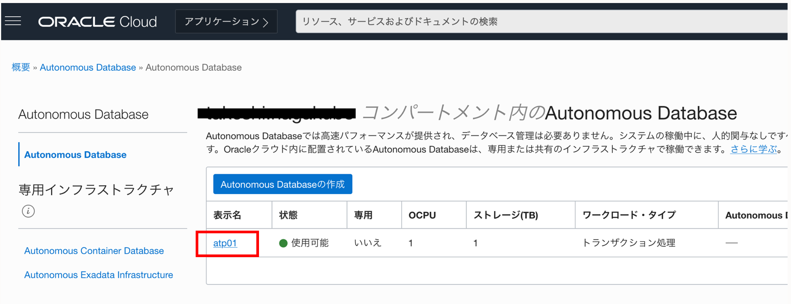

1. ツールタブを選択し、データベース・アクションを開く をクリックします。 

    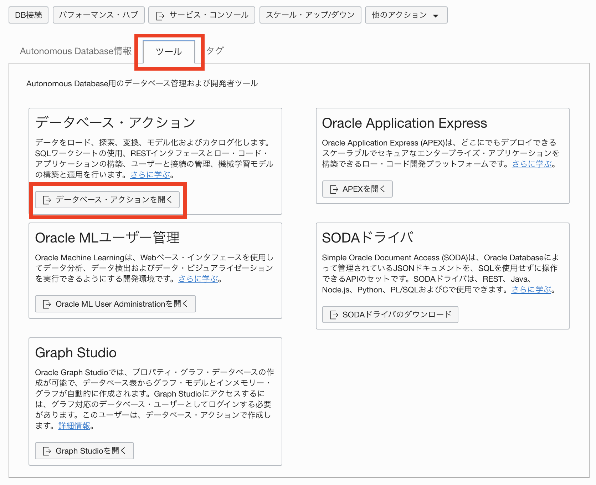

1. ユーザ名に **admin** 、パスワードは **インスタンス作成時に指定した値** （Welcome12345#）を入力し、 **サインイン** をクリックします。 

    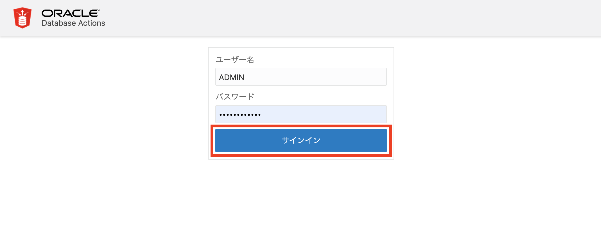

1. Database Actionsのランディングページで**SQL**をクリックします。  

    

1. ワークシートが起動します。ADBインスタンスを操作できるか確認するために、ワークシートに任意のSQLを貼り付け、 **緑色の実行** ボタンをクリックします。  
以下は例として接続しているユーザーのユーザー名を確認するSQLです。ADMINが表示されたらOKです。

    ```sql
    SELECT USERNAME FROM USER_USERS ;
    ```

    


## 3-2. データベース・ユーザーを作成してみよう(Database Actions)

ADBインスタンスを作成すると、デフォルトでADMINユーザが作成されていますが、アプリケーションを構成する場合は、個別にデータベース・ユーザー（スキーマ）を作成することが多いかと思います。  
<br>ここではADBにおけるデータベース・ユーザーの作成してみます。

> **補足**
>
> Oracle ML(Notebook)やAPEX等、Autonomous Databaseに同梱される一部のアプリケーションを利用する際は、それぞれのアプリ内でユーザ作成を実施するため、本手順は不要です。
> <br>また以下はDatabase Actionsを利用していますが、SQL Developerでも実施いただけます。


1. Database Actionsのランディングページで**データベース・ユーザー**をクリックします。

    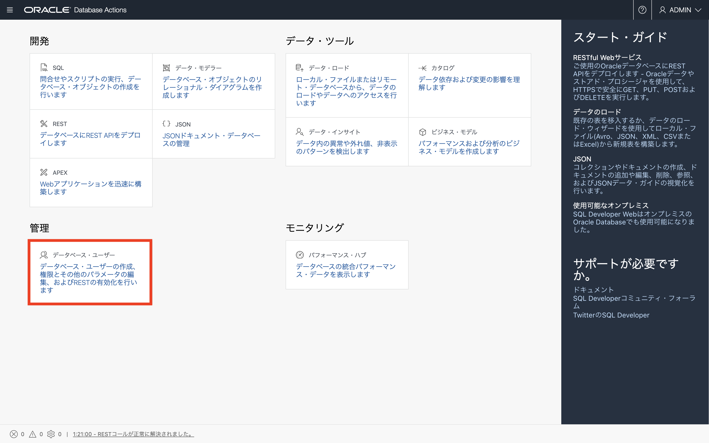

2. データベース・ユーザーの管理画面で、**ユーザーの作成**をクリックします。

    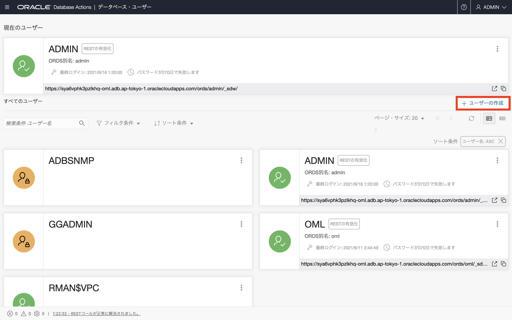

3. ユーザーの作成にて、**ユーザー名(ADBUSER)**と**パスワード**を入力します。

    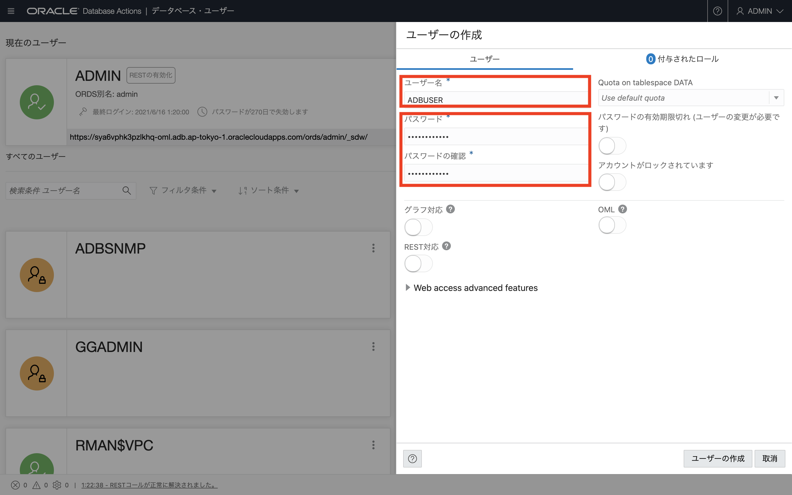

4. ユーザに割り当てる**テーブルスペース**を設定し、**ユーザーの作成**をクリックします。

    > **補足**
    >
    > * グラフ対応をONにした状態でユーザ作成するとGraph Studio用のロールが付与されたユーザが作成されます。
    > * OMLをONにした状態でユーザ作成するとOML用のロール(OML_DEVELOPER, DWROLE, PYQADMIN)が付与されたユーザが作成されます。
    > * REST対応をONにした状態でユーザ作成するとRESTが有効化された状態でユーザ作成されます。
    >

    <!-- ドキュメントにグラフ対応についての記載無し(2021/06/17)
    説明が追加されたのを確認次第、グラフ対応の補足文章に説明を加える -->

    <br>
  
    

5. ADBUSERが作成されたことが確認できます。

    

<br>

## 3-3. データベース・ユーザーを作成してみよう（コマンドライン)

次にコマンドラインからABDUSERを新規作成するステップを紹介します。（SQLコマンドを実行するために、再びDatabase ActionsのSQLワークシートを利用しましょう）

1. Database Actionsのランディングページで**SQL**をクリックします。  

    

1. Database Actionsにて、ADMINユーザーが選択されていることを確認します

    

1. 以下をワークシートに貼り付け、**緑色の実行ボタン** をクリックし、新規データベース・ユーザー（スキーマ）を作成します。

    ここでは、ユーザ名: **adbuser** 、パスワード : **Welcome12345#** で新規作成しています

    ```sql
    CREATE USER adbuser IDENTIFIED BY Welcome12345#;
    ```

1.  以下をワークシートに貼り付け、 **緑色の実行ボタン** をクリックし、操作権限（ロール）をユーザーに付与します。

    ここでは例としてAutonomous Databaseで事前定義されている **DWROLE** ロール を付与しています。（要件に応じて、従来の権限（Connect, Resource,等々）を個別に付与することも可能です）

    ```sql
    GRANT DWROLE TO adbuser;
    ```

1. 以下をワークシートに貼り付け、 **緑色の実行ボタン** をクリックし、データ利用の上限を設定します。

    インスタンス作成時のストレージを1TBと指定した場合、その1TBの中で各ユーザがどれだけ利用できるかを設定できます。
    <br>ここでは例として上限を10GBにしています。

    ```sql
    BEGIN
      DBMS_CLOUD_ADMIN.GRANT_TABLESPACE_QUOTA(
        username => 'adbuser', tablespace_quota => '10G'
      );
    END;
    /
    ```

    特に上限を設けず、ストレージサイズ上限まで利用する場合は以下を実行します。

    ```sql
    BEGIN
      DBMS_CLOUD_ADMIN.GRANT_TABLESPACE_QUOTA(
        username => 'adbuser', tablespace_quota => 'UNLIMITED'
      );
    END;
    /
    ```

1. 新規ユーザ(ここではadbuser)が作成されたことを確認してください。表示されない場合はブラウザをリフレッシュ(F5)してください

    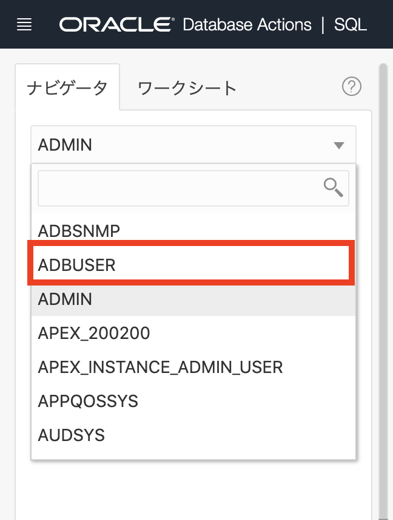

以上で、この章の作業は終了です。

<br>

# よくある質問やTips

**ECPUが4未満の場合、パラレル処理されるの？？**

ECPUが4未満の場合はパラレル処理されないため、より高い性能を求めたい場合は4以上を選択するようにしてください。

パラレル処理とは、Oracle DatabaseのEnterprise Editionの機能であり、ひとつのDDL/DML/Query文を複数のCPUコアを利用して高速に処理させることです。

特に大量データを扱うようなDWHやバッチ処理には有効です。

尚、Autonomous Database はECPU数を増やすことでコア数、メモリ数、IO帯域が増えます。

また、ECPU増はコストに跳ね返ってきますが、ECPUはオンラインでスケールアップ・ダウンが可能なので、週末・夜間など使わないタイミングはコア数を減らすことでコストを削減できます。


<br>
以上で、この章は終了です。  
次の章にお進みください。


