

# はじめに

この章ではADBインスタンスは作成済みであることを前提に、APEXコンソールの起動から簡単なアプリケーション作成までを体験いただきます。
サンプルとして、これまでExcelで管理していた受発注データを利用して、簡単なアプリケーションを作ってみましょう。

> Autonomous Databaseはインスタンスを作成するとすぐにWebアプリ開発基盤であるOracle APEXを利用できるようになります。追加コストは不要です。  
Oracle APEXは分かりやすいインターフェースで、コーディングと言った専門的な知識専門的な知識がなくてもアプリケーションを開発できるため非常に人気があります。
Autonomous Database上でAPEXを利用すると、バックアップや可用性、セキュリティ等のインフラの面倒は全てオラクルに任せて、アプリケーションだけに集中できます。 

 

**前提条件**
+ ADBインスタンスが構成済みであること
     ※ADBインタンスを作成方法については、[101:ADBインスタンスを作成してみよう](../adb101-provisioning){:target="_blank"} を参照ください。 

 

**目次**

- [1. スプレッドシートのサンプルを用意](#anchor1)
- [2. APEXのワークスペースの作成](#anchor2)
- [3. APEXコンソールの起動](#anchor3)
- [4. スプレッドシートから簡易アプリケーションの作成](#anchor4)
- [5. アプリケーションの実行](#anchor5)
- [6. 実行確認](#anchor6)

 
**所要時間 :** 約10分

 

# 1. スプレッドシートのサンプルを用意

サンプルとして受発注データ(orders.csv)を用意します。
下記のリンクをクリックし、サンプルファイル(orders.zip)を手元のPCにダウンロードして展開してください。

+ [orders.csvをダウンロード](../adb-data/orders.csv)

受発注データは次のような表になっており、ORDER_KEY(注文番号)、ORDER_STATUS(注文状況)、UNITS(個数) ...etc などの列から構成される、5247行の表となっています。

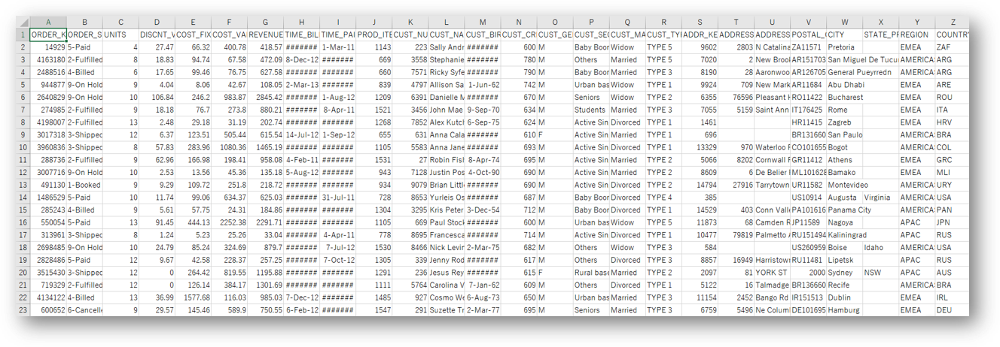

 

# 2. APEXのワークスペースの作成

アプリケーションを作成するためには、ワークペースを作成する必要があります。
最初にADMINユーザで管理画面にログインします。

1. ADBインスタンスの詳細画面を表示します。メニュー画面上部の **`ツール構成`** タブを選択し、**`Oracle APEX`** のパブリック・アクセスURLをコピーして、ブラウザの別のタブから開きます。

    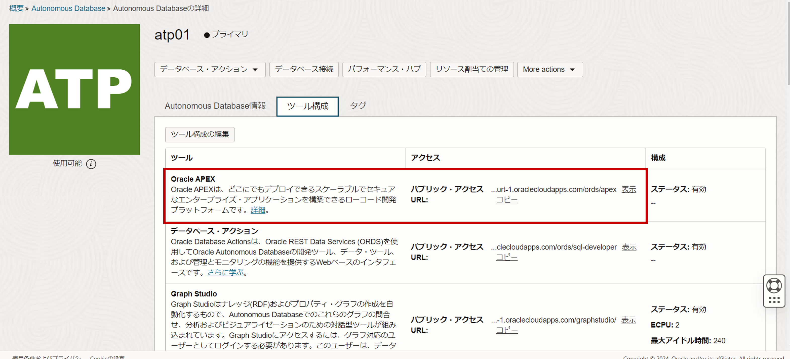

2. ログイン画面が表示されるので、下部の言語欄から **`日本語`** を選択しておきます。（初回は英語表示ですが、日本語を含めた他言語表示に変更することが可能です）

    

3. ADBインスタンス作成時に指定したADMINユーザのパスワード（本ガイドを参考に作成した方のパスワードは「Welcome12345#」）を入力し、サインインします。

4. Oracle APEXの管理サービスにサインインしました。初回起動時に下記のような画面が表示されますので、**`ワークスペースの作成`** をクリックします。

    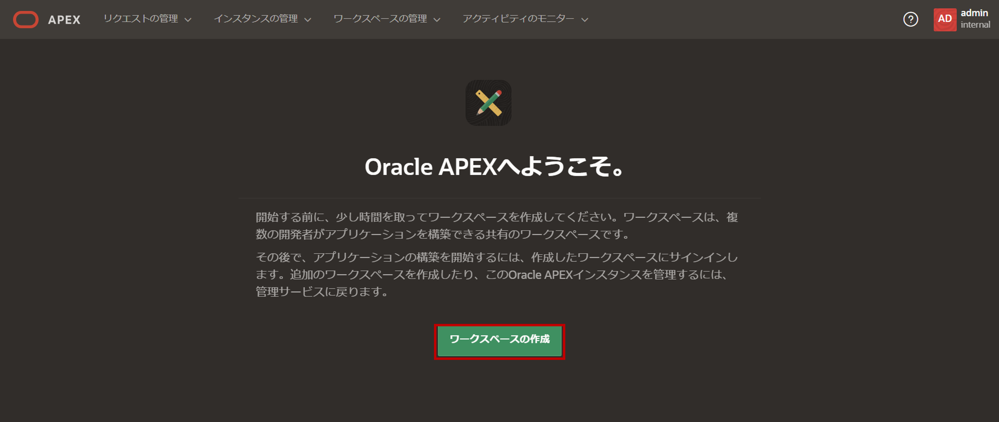

5. 新規のワークスペース作成を選択します。
    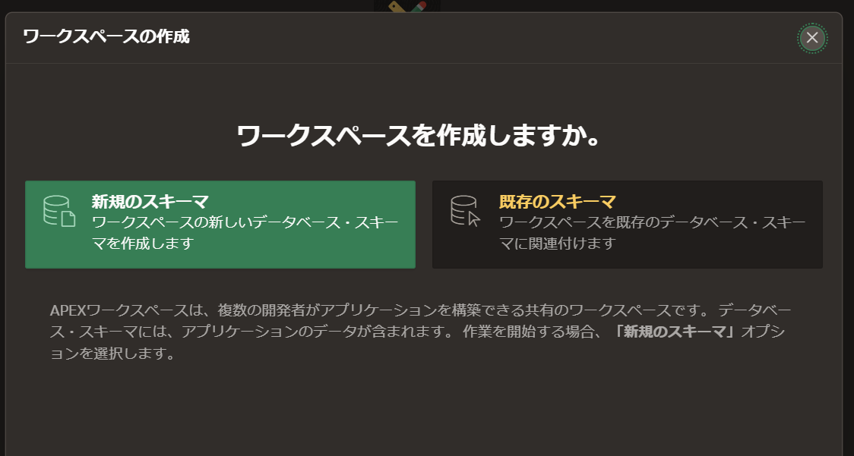
    
    以下の記載例を参考に各項目を入力し、最後に **`ワークスペースの作成`** をクリックします。

    <table>
     <tr>
      <td>データベース・ユーザー</td>
      <td>APEXDEV</td>
     </tr>
     <tr>
      <td>ワークスペース名</td>
      <td>APEXDEV</td>
     </tr>     
     <tr>
      <td>パスワード</td>
      <td>Welcome12345#</td>
     </tr>
    </table>

    

6. ワークスペースが作成されたことを確認します。ページ上部の注意書き通り、アプリケーションの構築を開始するには、管理サービスからサインアウトしてAPEXDEVにサインインする必要があります。
右上の **`ユーザボタン`** から **`サインアウト`** をクリックし、管理サービスからサインアウトします。
    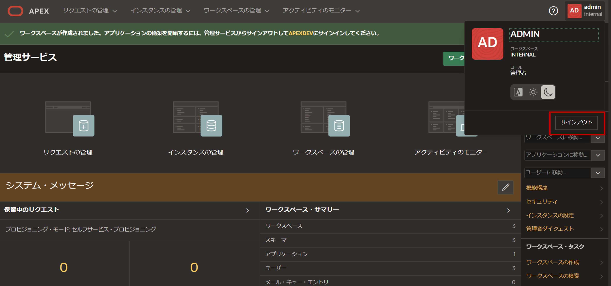

 

# 3. APEXコンソールの起動

上記で作成したワークスペース、ユーザーを利用して、Oracle APEX のコンソール画面にログインしてみましょう

1. 先程作成したワークスペース、ユーザー、パスワードを指定し、サインイン します。

    <table>
     <tr>
      <td>データベース・ユーザー</td>
      <td>APEXDEV</td>
     </tr>
     <t
      <td>パスワード</td>
      <td>Welcome12345#</td>
     </tr>
     <tr>
      <td>ワークスペース名</td>
      <td>APEXDEV</td>
     </tr>
    </table>

    

2. APEXコンソールが起動したことを確認します。
     ※ この画面のURLを記憶しておけば、次回よりAPEXコンソールに直接ログインできます

    

 

# 4. スプレッドシートから簡易アプリケーションの作成

手元のスプレッドシート（Excelシート、CSVファイル）から簡易アプリケーションを作成してみましょう

ここでは予めダウンロードして準備しておいたorders.csvファイルを利用して簡易アプリを作ります。

最初にデータベース内にテーブルを作成し、データを入れます。

1. APEXコンソールから **`アプリケーション・ビルダー`** を起動します
    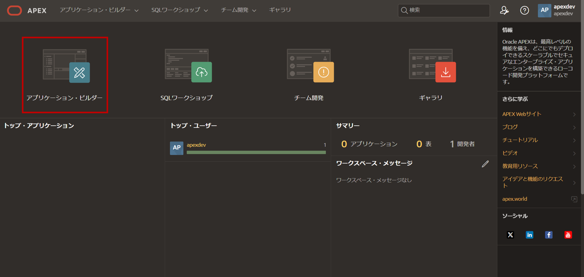

2. **`作成`** をクリックします
    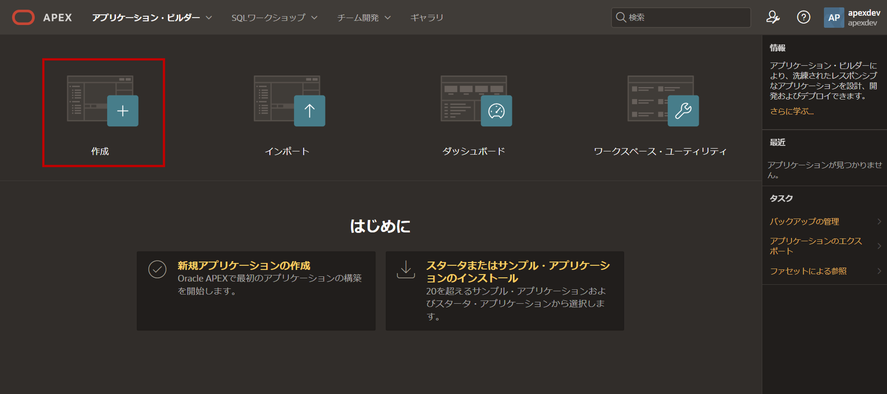

3. **`ファイルからのアプリケーションの作成`** をクリックします
    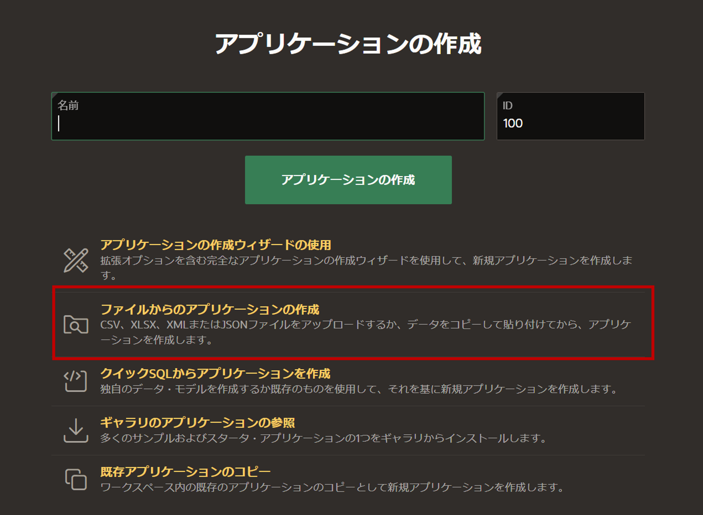

4. 事前に準備しておいた **`orders.csv`** をドラッグアンドドロップします

    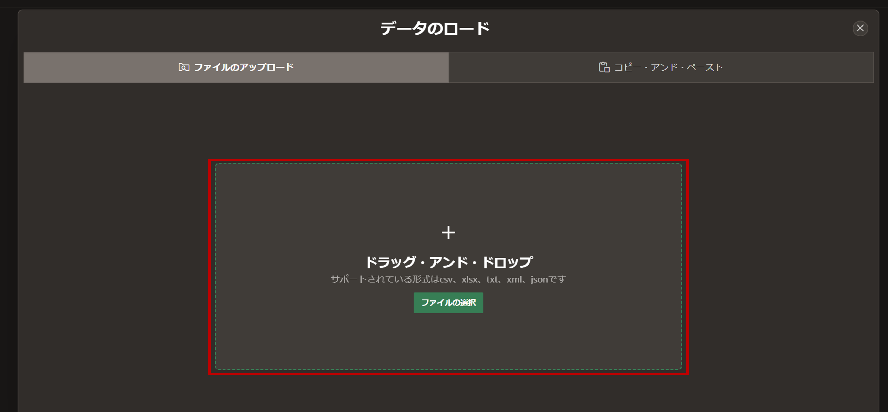

5. 表の名前を入力します（ここでは「ORDERS」とします）。※エラー表名は自動的に入力されます。

6. データのプレビューで文字化け等が発生していないことを確認します。

7. **`データのロード`** をクリックします。

    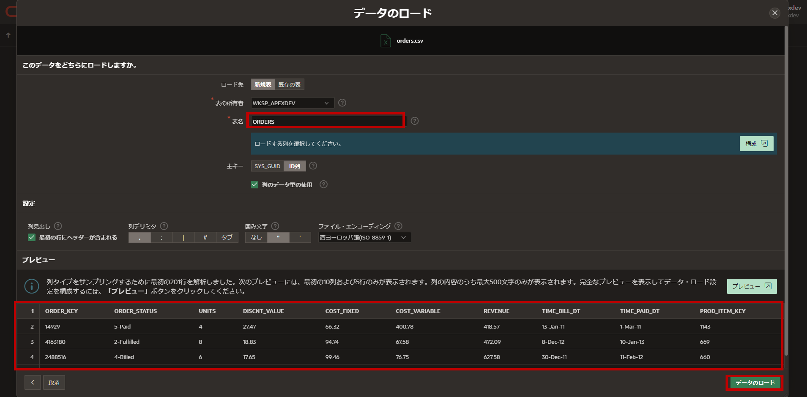

8. ロード完了のメッセージが表示されたら **`アプリケーションの作成`** をクリックします。
    ※この時点でDB上にORDERS表が作成されています

    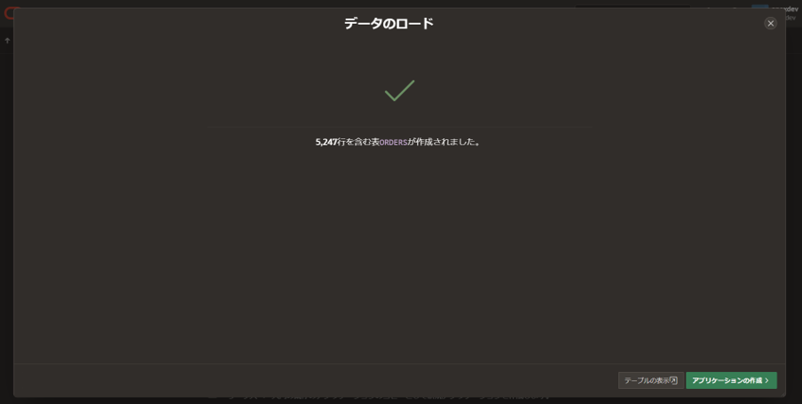

    次にCSVファイルから作成されたテーブルを元にしてアプリケーションを作成します。

9. アプリケーションに名前を付けます。今回はテーブル名と同じ **`Orders`** と入力します。

10. **`アプリケーションの作成`** をクリックします。
（ページの追加や外観の設定、セキュリティの設定等が実施できますが、このハンズオンでは全てデフォルトのまま進めます）

    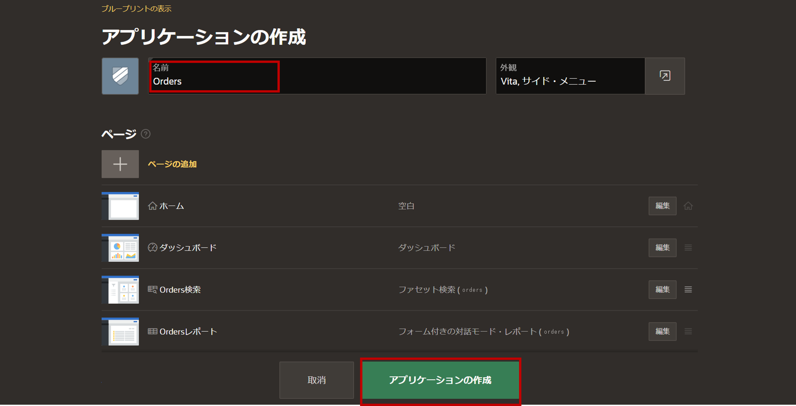

以上でアプリケーションの作成が完了しました。

 

# 5. アプリケーションの実行

実際にアプリケーションを起動してみます。

1. **`アプリケーションの実行`** をクリックします。
    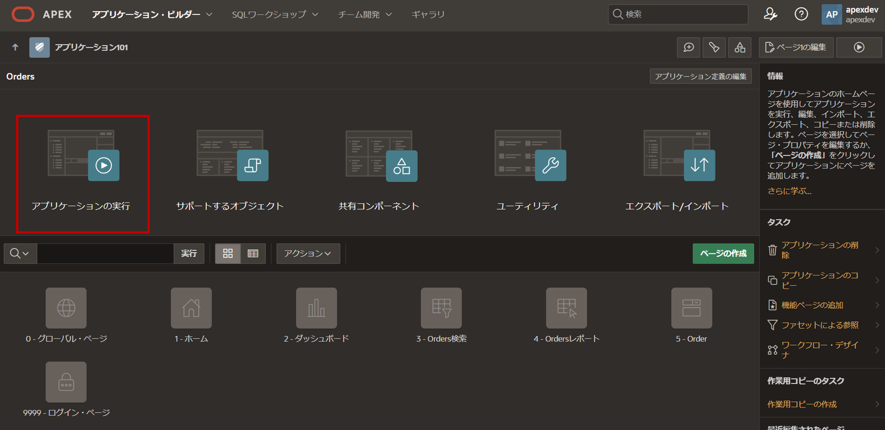

2. ログイン画面に ユーザー名・パスワード を入力し **`サインイン`** します。
    

* ログインが完了すると、画面下端に黒いメニューバーが表示され、ここからアプリケーションの改修作業を実施できます。尚、このメニューバーは、アプリケーション・ビルダーから「アプリケーションの実行」でアプリケーション実行した場合に表示されます。

* ログイン画面のURLを記憶しておくと、作成したアプリケーションを直接呼び出すことができます。直接呼び出した場合は、画面下端のメニューバーは表示されないので、このURLをアプリ利用者にお渡しいただければ、そのままアプリケーションとしてご利用いただくことができますね。

    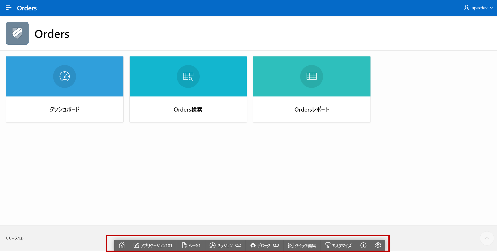

 

# 6. 実行確認

作成されたアプリケーションの画面イメージをみていきましょう。
    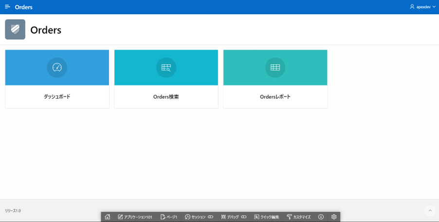

ログインするとトップ画面が表示され、デフォルトでホーム画面（トップ画面）、ダッシュボード画面、検索画面、管理画面（レポート）が表示されます。

今回はすべてデフォルトの設定で作成しましたが、 [アプリケーションの作成](#anchor4_10) の工程で、画面の構成を変えることができます。

各画面のイメージを順に確認していきましょう。

## - ダッシュボード

はじめに、ダッシュボードをクリックします。
ダッシュボードでは取り込んだデータをもとに、自動的にグラフとして出力されます。
    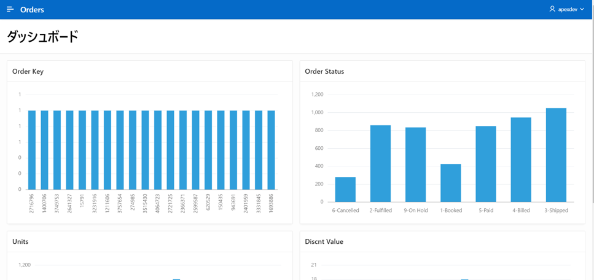

## - Orders検索

次に、Orders検索をクリックします。
こちらの機能では、取り込んだデータに対して、カテゴリ別に検索ができるようになっており、行単位でデータを絞り込むことができます。
    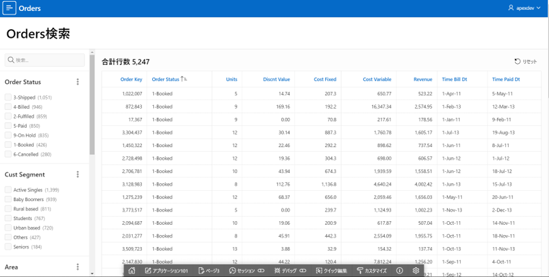

## - Ordersレポート

Ordersレポートからは、データを昇順・降順に並び替えることや、特定の列を非表示にすることができます。Orders検索との違いとしては、行単位ではなく列単位で表示を変更することができます。
    

 

# まとめ

たった10分で、データの検索や、レコードの修正＆削除、テーブル内の代表的な列についてダッシュボード的に傾向を確認するといった簡単なアプリケーションが作れます。

はい、たったこれだけです！これだけのステップで従来Excelで管理していたデータを、複数のユーザ、複数の部門で活用することができるようになります。

逆に、「え、これしか作れないの？」と思われた方。。。そんなことはありません。さらに作りこんでいくことはもちろん可能です！以下のまとめサイトから、チュートリアルやユーザ会の資料をご参照ください。

 

APEX情報まとめサイトは [こちら](https://apex.oracle.com/pls/apex/japancommunity/r/main/home) から

 
以上で、この章は終了です。  
次の章にお進みください。

 
[ページトップへ戻る](#anchor0)

