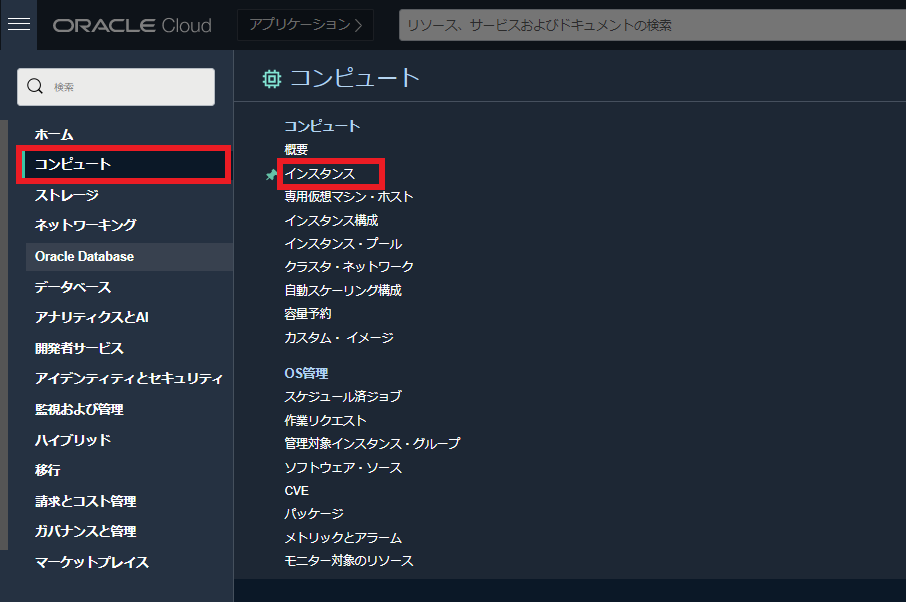
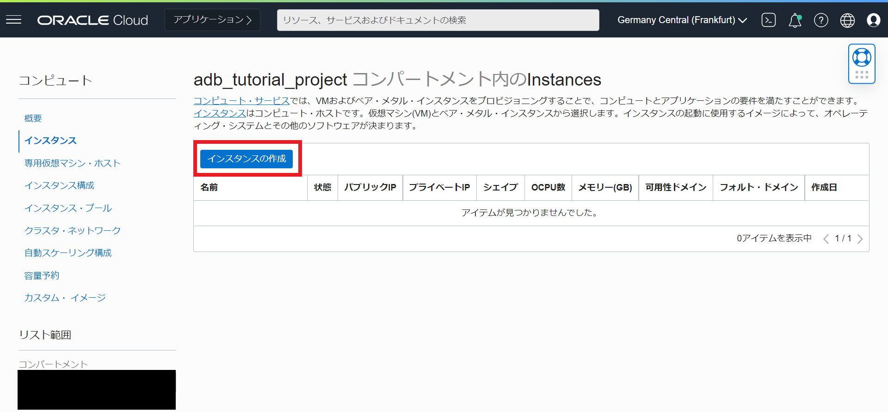
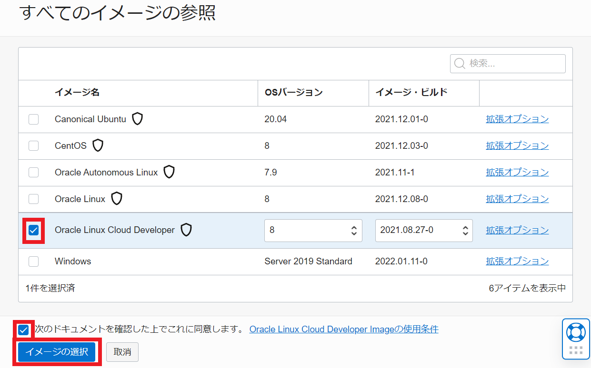
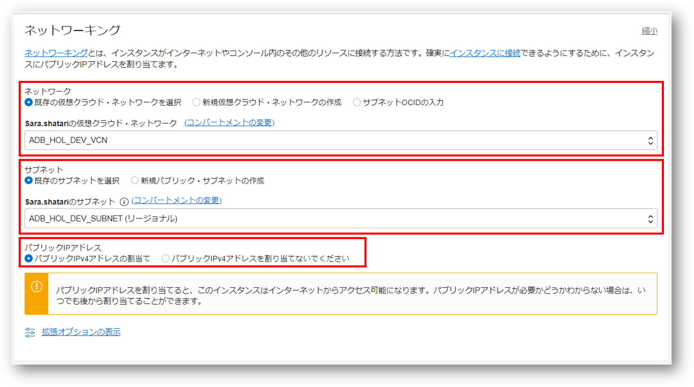
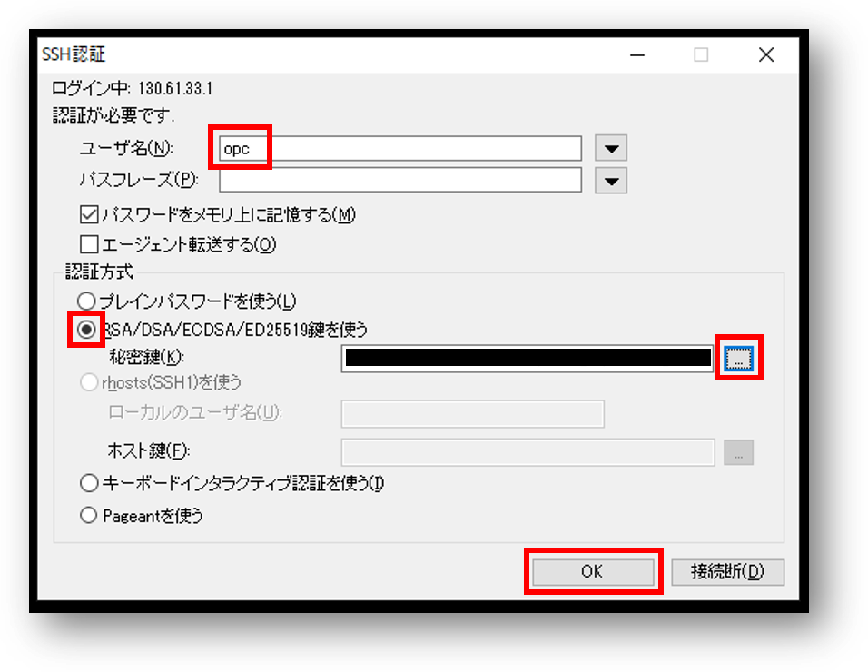
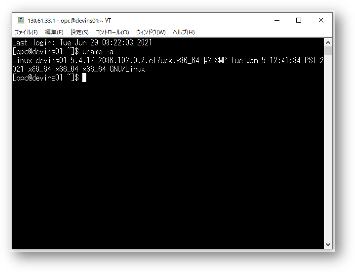

<a id="anchor0"></a>

# はじめに

後続のチュートリアルで利用する開発環境をセットアップしましょう。

Oracle Cloud Infrastructure（OCI） では様々な仮想マシンイメージを提供しています。
本ページではその中から、開発者向けのLinux仮想マシンである **`Oracle Linux Cloud Developer イメージ`** をセットアップする手順を記載しています。

**`Oracle Linux Cloud Developer イメージ`**は、Python、Node.js、Goといった言語や、Oracle Instant Clientなどの各種接続ドライバ、Oracle Cloud Infrastructure CLI(OCI CLI)といった各種ツールがプリインストールされており、アプリケーション開発は勿論、各種検証作業を実施する際にとても便利です。

尚、Oracle Linux Cloud Developer イメージの詳細については [こちら](https://docs.oracle.com/ja-jp/iaas/oracle-linux/developer/index.htm#x86-components){:target="_blank"} を参照ください。  
またOracle Cloud Infrastructureに仮想マシン作成する手順詳細に関しては本チュートリアル 入門編の [その3 - インスタンスを作成する](/beginners/creating-compute-instance/){:target="_blank"} の手順も併せてご確認ください。

<br>

**前提条件** 
* ADBインスタンスが構成済みであること
    <br>※ADBインタンスを作成方法については、[101:ADBインスタンスを作成してみよう](../adb101-provisioning){:target="_blank"} を参照ください。
* ADBインスタンスのクレデンシャル・ウォレットがダウンロード済みであること
    <br>※クレデンシャルウォレットのダウンロード方法については、[104: ウォレットを利用してADBに接続してみよう](../adb104-connect-using-wallet){:target="_blank"} の、[1. クレデンシャル・ウォレットのダウンロード](../adb104-connect-using-wallet#anchor1){:target="_blank"} をご確認ください。

<br>

**目次**

- [1. 仮想マシンの作成](#anchor1)
- [2. 仮想マシンへのアクセス](#anchor2)
- [3. 後続のハンズオンで利用するサンプルスクリプト一式を仮想マシン上に配置](#anchor3)
- [4. ADBに接続するための設定ファイルの編集](#anchor4)

<br>
**所要時間 :** 約30分

<a id="anchor1"></a>
<br>

# 1. 仮想マシンの作成

1. メニューバーから **`コンピュート`** を選択し、**`インスタンス`** をクリックします。
    

2. **`インスタンスの作成`** をクリックします。
    

3. インスタンス名を入力します。例 :  devIns01

4. **`配置、イメージとシェイプ、ネットワークキング`** の項目を入力していきます。

    * **`配置`**
    <br>仮想マシンを、リージョン内のどの可用性ドメイン（AD）に配置するかを指定します。
    任意の可用性ドメインを選択してください。  
    

    * **`イメージとシェイプ`**
    <br>イメージ：**`Oracle Linux Cloud Developer`**
        <br>**`イメージの変更`** をクリックし、**`Oracle Linux Cloud Developer`**にチェックを入れます。
        <br>
      <br>シェイプ：**`VM.Standard.E4.Flex（仮想マシン）`**

    * **`ネットワーキング`**
      * ネットワーク：どの仮想クラウド・ネットワーク（VCN）上に配置するかを指定します。
    <br>既存のVCNを選択するか、新規のVCNの作成します。どちらでも結構です。ここでは、既存のVCN「ADB_HOL_DEV_VCN」を選択しています。
        * サブネット：任意の **`パブリック・サブネット`** を選択してください。
        <br>※インスタンスにssh接続するため、パブリック・サブネットである必要があります。
        * パブリックIPアドレスの割当てを選択
        <br>※パブリックIPアドレスの割当てを有効にしないと、インスタンスにssh接続することができません。
        <br>

      >**Note**
      >
      >用意したコンパートメントに仮想クラウド・ネットワーク（VCN）が存在しない場合、VCNが自動的に作成されます。
      > 


6. SSHキーを追加します。
  <br>SSHキーはこちらの画面で生成する・既存の公開キーを選択することが可能です。
  <br>生成する場合は **`秘密キーの保存`** と **`公開キーの保存`** を必ずクリックしてください。（後から生成することはできません）
  <br>お手持ちのSSHキーを使いたい場合は、**`公開キー・ファイル(.pub)のアップロード`** または **`公開キーの貼付け`** を選択し、アップロードまたは貼り付けしてください。
  <br>※ SSHキーの作成方法の詳細は [こちら](https://docs.oracle.com/ja-jp/iaas/Content/Compute/Tasks/managingkeypairs.htm){:target="_blank"} を参照ください
  <br>※ 集合ハンズオン・セミナーの場合は講師から指示される鍵を使用してください。
    


7. 最後に **`作成`** をクリックします。（オレンジ色の **`プロビジョニング中`** から緑色の **`起動中`** に変われば作成完了です。数分かかります）

<br>

<a id="anchor2"></a>

# 2. 仮想マシンへのアクセス

上記で作成した仮想マシンにSSHで接続してみましょう。ここではTera Termの利用を前提に記載しています。

1. 仮想マシンのパブリックIPアドレスを確認します。
    

2. Tera Term を起動し、以下の記載例を参考に各項目を入力し、OK をクリックします。
  * ホスト：**`先程のステップで確認したパブリックIPアドレス`**
  * TCPポート：**`22`** (デフォルト)
  * サービス：**`SSH`**
    
    <br>※ 初めて接続するホストの場合、セキュリティ警告が表示されることがあります。問題がなければ「続行」をクリックしてください。

3. 以下の記載例を参考に各項目を入力し、OK をクリックします。
  * ユーザー：**`opc`**
  * パスフレーズ：（秘密鍵にパスフレーズが設定されている場合は指定してください）
    <br>※集合ハンズオンセミナーの場合はパスフレーズは設定していないので、未入力にします。
  * 秘密鍵：インスタンスを作成する際に使用した公開鍵と対になる **`秘密鍵`**
    <br>※ 集合ハンズオンセミナーの場合は講師から指示される鍵を使用してください。<br>
    

4. ログインできたことを確認します。（次のようになればOKです。このまま次のステップに進んでください）<br>
    

<br>

<a id="anchor3"></a>

# 3. 後続のハンズオンで利用するサンプルスクリプト一式を仮想マシン上に配置

次に後続のハンズオンで利用するファイルを仮想マシン上に用意・配置します。


1. 必要なファイルをまとめたlabs.zipというファイルをこちらでご用意しています。
ログインした仮想マシン上で次のコマンドを実行します。

    ```sh
    wget https://oracle-japan.github.io../ocitutorials/adb/adb-data/labs.zip
    ```

2. labs.zip がダウンロードされたことを確認します。（ファイルが存在すればOKです。）

    ```sh
    ls
    ```
    >
    >**補足**
    >
    >上記の方法で上手くダウンロードできなかった方は、手元のPCにダウンロードしてからアップロードする方法をお試しください。
    >
    > <br>※ここではTera Termを前提に記載しています。
    >   
    >    1. 下記のリンクより、labs.zipを手元のPCにダウンロードします。
    >       +  [labs.zip をダウンロード](../adb-data/labs.zip)
    >
    >
    >    2. labs.zipをTera Termのウィンドウ画面上にドラッグ・アンド・ドロップします。
    >
    >    3. Tera Termでは転送先に指定するディレクトリパスを指定できますが、特に指定せずそのまま **`OK`** をクリックします。
    >     <br>
    >     
    >
    >       ※ Tera Termではなく、手元の端末から仮想マシンにサインインしている方は次のコマンドをご利用ください。
    ><br>手元の環境にダウンロードしてきたファイルを、ssh接続先の仮想マシンにアップロードするコマンドです。
    >       ```sh
    >       scp -i [秘密鍵のパス] [転送したファイルのパス] opc@[転送先のPublic IP]:[転送先での保存先のパス]
    >       ```
    >
<br>


3. アップロードしたlabs.zipをoracleユーザの配下に移動します。

    ```sh
    sudo mv labs.zip /home/oracle/labs.zip
    ```

4. zipファイルを解凍します

    ```sh
    sudo unzip /home/oracle/labs.zip -d /home/oracle
    ```

5. ファイルの所有者を変更します。次のコマンドを順に実行しましょう。

    ```sh
    sudo chown oracle:oinstall /home/oracle/labs.zip
    ```
    ```sh
    sudo chown -R oracle:oinstall /home/oracle/labs
    ```

6. 展開後のファイルを確認してください。(nodeやpythonといったディレクトリやファイルが存在していればOKです)

    ```sh
    sudo ls /home/oracle/labs
    ```


<br>

<a id="anchor4"></a>

# 4. ADBに接続するための設定ファイルの編集

ADBに接続するためには、クレデンシャル・ウォレット（Credential.zipファイル）を仮想マシン上に配置する必要があります。
クレデンシャルウォレットのダウンロード方法については、[101: ウォレットを利用してADBに接続してみよう](../adb104-connect-using-wallet){:target="_blank"} の、[1. クレデンシャル・ウォレットのダウンロード](../adb104-connect-using-wallet#anchor1){:target="_blank"} をご確認ください。

1. 仮想マシンにopcユーザでログインします。

2. クレデンシャル・ファイルを仮想マシン上にアップロードします。

    ※ここではTeratermを前提に記載しています。

    2-1. Tera Term を起動し、仮想マシンにopcユーザでログインします。

    2-2. クレデンシャル・ファイル（wallet_atp01.zip）をTera Termのウィンドウ画面上にドラッグ・アンド・ドロップします。

    2-3. Tera Termでは転送先に指定するディレクトリパスを指定できますが、特に指定せずそのまま **`OK`** をクリックします。

    

    2-4. opcユーザのホームディレクトリを確認し、Wallet_atp01.zip が転送されたことを確認します。（ファイルが存在すればOKです。）

      ```sh
      ls
      ```

3. 先ほどアップロードしたクレデンシャル・ファイルをoracleユーザの配下に移動し、ファイルの所有者をoracleユーザに変更します。
   <br>（本ハンズオンラボでは特に指定のない限りoracleユーザを利用して各種操作を体験いただきます。）
   <br>次のコマンドを順に実行しましょう。

    ```sh
    sudo mv Wallet_atp01.zip /home/oracle/labs/wallets_atp01/.
    ```
    ```sh
    sudo chown oracle:oinstall /home/oracle/labs/wallets_atp01/Wallet_atp01.zip
    ```

4. oracleユーザにスイッチします。
   <br>次のコマンドを順に実行しましょう。

    ```sh
    sudo -s
    ```
    ```sh
    su - oracle
    ```
    （一旦rootユーザにスイッチしてから、oracleユーザにスイッチしています）

5. zipファイルをディレクトリ「wallet_atp01」の下に展開します。

    ```sh
    unzip  /home/oracle/labs/wallets_atp01/Wallet_atp01.zip -d ~/labs/wallets_atp01
    ```
6. TNS_ADMIN環境変数をディレクトリ「wallet_atp01」に設定します。
<br>TNS_ADMINは、ウォレットの格納場所を表す環境変数です。アップロードしてきたクレデンシャルウォレットの格納場所を設定します。

    ```sh
    export TNS_ADMIN=/home/oracle/labs/wallets_atp01
    ```

    >**Note**
    >
    >アプリ毎に接続するインスタンスを切り替えたい場合は、インスタンス毎に wallets_atp01 といったようにディレクトリを定義し、アプリ毎に環境変数TNS_ADMINのパスを切り替えると簡単です。

7. $HOME/wallets ディレクトリに移動します。

    ```sh
    cd ~/labs/wallets_atp01/
    ```
8. 解凍されたファイルの中にある sqlnet.ora ファイルの環境変数 WALLET_LOCATION を編集します。
<br>sqlnet.oraファイルでは、クライアントとなるマシンからADBサーバへ接続する際に使用する、サーバーのアドレスやリスナーのポート番号を解決するための方法を指定しています。
<br>sqlnet.oraに含まれるWALLET_LOCATIONには、クレデンシャルウォレットの格納場所を指定します。この格納場所はすでにTNS_ADMINに設定済みであるため、格納先のパスを指定するDIRECTORYに環境変数TNS_ADMINを参照するように設定します。

    編集前：
    ```sh
    WALLET_LOCATION = (SOURCE = (METHOD = file) (METHOD_DATA = (DIRECTORY="?/network/admin")))
    ```
    編集後：
    ```sh
    WALLET_LOCATION = (SOURCE = (METHOD = file) (METHOD_DATA = (DIRECTORY=$TNS_ADMIN)))
    ```

    編集方法の一例として、viを使用した操作方法は次の通りです。

    8-1. sqlnet.ora をviで開く。

    ```sh
    vi sqlnet.ora
    ```
    8-2. 次の操作方法を参考に、WALLET_LOCATION の値を編集します。


      >**viの操作方法**
      >
      ><table>
      ><tr>
      ><th>キー入力</th>
      ><th>動作</th>
      ></tr>
      ><tr>
      ><td>上下左右キー</td>
      ><td>カーソルの場所を移動する</td>
      ></tr>
      ><tr>
      ><td>i</td>
      ><td>カーソルの場所から編集する（InsertModeに入る）</td>
      ></tr>
      ><tr>
      ><td>ESCキー</td>
      ><td>InsertModeを抜ける</td>
      ></tr>
      ><tr>
      ><td>x</td>
      ><td>カーソルの場所を一文字消す</td>
      ></tr>
      ><tr>
      ><td>:wq</td>
      ><td>ファイルを保存して閉じる</td>
      ></tr>
      ><tr>
      ><td>:q</td>
      ><td>ファイルを閉じる（それまでの編集は破棄される）</td>
      ></tr>
      ><tr>
      ><td>:q!</td>
      ><td>強制的に終了する</td>
      ></tr>
      ></table>
<br>

  >**Note**
  >
  >上記は接続端末としてTeratermを利用しましたが、OCIに付属するCloud Shellを使用して設定ファイルの編集をすることも可能です。
  >Cloud ShellはOracle CloudコンソールからアクセスできるWebブラウザ・ベースのターミナルです。こちらを利用すると、ブラウザだけで仮想マシンにアクセスできますので、是非お試しください。
  ><br>手順は、本ハンズオンガイドの [104: ウォレットを利用してADBに接続してみよう](../adb104-connect-using-wallet){:target="_blank"} の、[2. 設定ファイルの編集](../adb104-connect-using-wallet#anchor2){:target="_blank"} をご確認ください。


<br>
以上で、この章は終了です。  
次の章にお進みください。

  >**Note**
  >
  >設定ファイルの編集が完了した後に、ADBインスタンスに接続する手順は本ハンズオンガイドの [104: ウォレットを利用してADBに接続してみよう](../adb104-connect-using-wallet){:target="_blank"} の、[3. ADBに接続](../adb104-connect-using-wallet#anchor3){:target="_blank"} をご確認ください。

<br>
[ページトップへ戻る](#anchor0)

