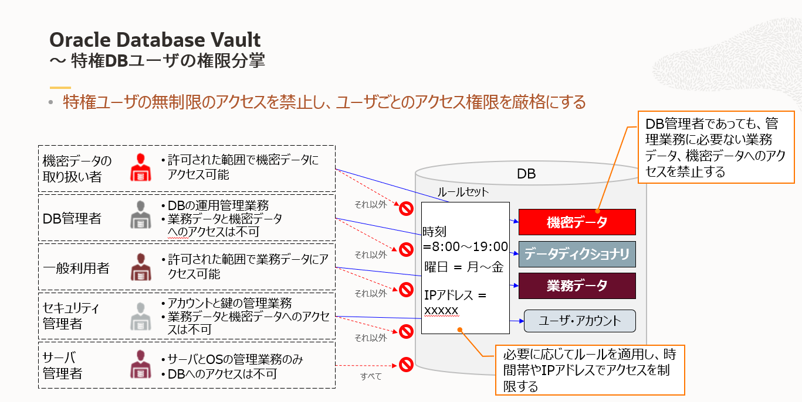
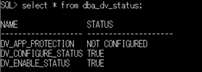
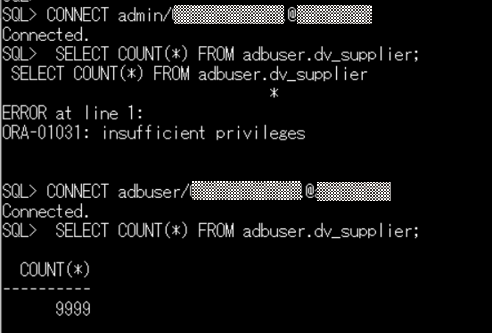

<a id="anchor0"></a>

# はじめに

Autonomous Databaseの特権ユーザであるADMINユーザはデータベースの管理だけでなくデータベースの全データを参照することができます。しかし、セキュリティ面でそれを許可したくない場合もあります。
   
**Oracle Database Vault**は職務分掌と最小権限の原則を実施し、アクセスポリシーを作成する専用ユーザとアカウント管理専用ユーザを設け、特権ユーザからそれらの管理権限を分離します。  
それにより、特権ユーザであってもアクセスポリシーの操作やアカウント管理操作ができず、許可された場合のみしか別アカウントのデータへのアクセスができなくなります。

   

Oracle Database Vaultの詳細については、[Oracle Database Vaultホームページ](https://www.oracle.com/jp/database/technologies/security/db-vault.html)や[ドキュメント](https://docs.oracle.com/cd/F19136_01/dvadm/index.html)をご覧ください。  

本文書では、Autonomous DatabaseでOracle Database Vaultを有効化し、特権ユーザであるADMINユーザが他のユーザのデータにアクセスできないように設定をしてみます。

**目次 :**
+ [1.テスト用の表を作成](#1テスト用の表を作成)
+ [2.Oracle Database Vaultの有効化](#2-oracle-database-vaultの有効化)
+ [3.特権ユーザーの権限はく奪](#3-特権ユーザーの権限はく奪)
+ [4.アクセス制御の設定](#4-アクセス制御の設定)
+ [5.動作確認](#5-動作確認)
+ [6.Oracle Database Vaultの無効化](#6-oracle-database-vaultの無効化)

**前提条件 :**
 + テスト用の表を作成するスキーマは任意のスキーマでも構いませんが、ここでは、[「101:ADBインスタンスを作成してみよう」](/adb/adb101-provisioning/) で作成したユーザADBUSERを利用しています。
 + SQLコマンドを実行するユーザインタフェースは、接続の切り替えが容易なので、SQL\*Plusを利用しています。Databasee Actionsでも実行可能ですが、ユーザでの接続をログインに読み替え、ログインしなおす必要があります。なお、 SQL\*Plusの環境は、[「204:マーケットプレイスからの仮想マシンのセットアップ方法」](/adb/adb204-setup-VM/)で作成できます。
 + チュートリアルの便宜上Autonomous Databaseへの接続文字列は「atp01_low」、各ユーザのパスワードはすべて「Welcome12345#」とします。
 + 使用パッケージの引数についての説明は記載していません。詳細はドキュメント[『Oracle Database Vault管理者ガイド』](https://docs.oracle.com/cd/F19136_01/dvadm/index.html)（リンクは19c版です）をご参照くださいますようお願いいたします。


**所要時間 :** 約20分

<BR>

# 1.テスト用の表を作成

サンプルスキーマのSSBスキーマのSUPPLIER表の一部を利用して、[「101:ADBインスタンスを作成してみよう」](/adb/adb101-provisioning/) で作成したADBUSERスキーマにテスト用の表を作成します。  

SQL*Plusを起動して以下を実行してください。

```sql
-- ADBUSERで接続する
CONNECT adbuser/Welcome12345#@atp01_low
-- SSB.SUPPLIER表から新しくDV_SUPPLIER表を作成する
CREATE TABLE adbuser.dv_supplier AS SELECT * FROM ssb.supplier WHERE ROWNUM<10000;
```

Oracle Data Vaultを有効化する前にまず、特権ユーザであるADMINユーザでADBUSERのDV_SUPPLIER表にアクセスできることをSQLで確認します。  


```sql 
--ADMINで接続する
CONNECT admin/Welcome12345#@atp01_low
--ADBUSERスキーマのDV_SUPPLIER表の件数を確認
SELECT COUNT(*) FROM adbuser.dv_supplier;
```
以下のような結果になり、特権ユーザであるADMINユーザが他スキーマADBUSERの持ち物であるDV_SUPPLIER表を参照できることが確認できました。

   

<BR>


# 2. Oracle Database Vaultの有効化
続けて、ADMINユーザでOracle Database Vaultを有効化するためのSQLを実行していきます。

## 構成に必要なスキーマの作成
Oracle Database Vaultを利用するためにはOracle Database Vaultに関わる操作を行うスキーマ（DV所有者）とアカウントを管理する専用スキーマ（アカウント管理者）の2つを作成する必要があります。職務分掌の第一歩です。

ではユーザを作成しましょう。  
スキーマ名は任意ですが、**Database Vault構成後は変更ができませんので**ご注意ください。ここではDV所有者を「mydvowner」、アカウント管理者を「mydvacctmgr」とします。

```sql
--adminで接続
CONNECT admin/Welcome12345#@atp01_low
-- DV所有者スキーマ作成
CREATE USER mydvowner IDENTIFIED BY "Welcome12345#";
-- アカウント管理者スキーマ作成
CREATE USER mydvacctmgr IDENTIFIED BY "Welcome12345#";
```

## Oracle Database Vaultの構成と有効化
2つのスキーマを作成した後に、Oracle Database Vaultの構成と有効化を行います。  
Autonomous Databaseでは、提供されているDBMS_CLOUD_MACADMパッケージを利用します。
まず構成コマンドを実行しますが、**<font color="RED">この構成コマンドが実行できるのは1回のみです。また設定したユーザは削除しないでください。</font>**

```sql
--adminで接続
CONNECT admin/Welcome12345#@atp01_low
--Database Vaultの構成（スキーマの設定：第1引数がDV所有者、第2引数がアカウント管理者を指定） 
EXEC DBMS_CLOUD_MACADM.CONFIGURE_DATABASE_VAULT('mydvowner','mydvacctmgr');
```

構成コマンドにより、先に作成した2つのスキーマに必要な権限がまとめられたロール（DV所有者にはDV_OWNERロール、アカウント管理者にはDV_ACCTMGRロール）が付与されます。  
次に有効化のコマンドを実行します。  

```sql
--adminで接続
CONNECT admin/Welcome12345#@atp01_low
--Database Vaultの有効化
EXEC DBMS_CLOUD_MACADM.ENABLE_DATABASE_VAULT;
```


有効化のコマンドが完了した後ログアウトし、Autonomous Databaseを再起動します。  
Oracle Database Vaultの有効化、無効化を反映させるためにはAutonomous Databaseの再起動が必要なためです。  
管理コンソールで、「More actions」プルダウンメニューから「再起動」を選択してください。　　

   


## Database Vaultの有効化の確認
再起動を完了後、設定が有効化されていることをデータベースのディクショナリビューで確認します。  

Database Vaultの構成や有効化の状態は「DBA_DV_STATUS」というディクショナリビューで確認します。

```sql
-- adminで接続
CONNECT admin/Welcome12345#@atp01_low
-- DBA_DV_STATUSディクショナリビューを検索する
col status for a30
SELECT * FROM dba_dv_status;
```

有効化されていると、NAME列で構成の状況を示す"DV_CONFIGURE_STATUS"と有効化の状況を示す"DV_ENABLE_STATUS"のSTATUS列の値がTRUEになります。

   


なお、Oracle Database Vaultのデータディクショナリ・ビューの情報は[『Oracle Database Vault管理者ガイド』](https://docs.oracle.com/cd/F19136_01/dvadm/oracle-database-vault-data-dictionary-views.html#GUID-C0CEF4FC-DB4C-4AD5-9671-C0861A647183)でご確認いただけます。

<BR>


# 3. 特権ユーザーの権限はく奪
特権ユーザであるADMINユーザはDatabase Vault所有者のロール(DV_OWNER)もアカウント管理専用ユーザのロール(DV_ACCTMGR)もデフォルトで持っています。  
ADMINユーザからそれらをはく奪します。

```sql
--ADMINで接続する
CONNECT admin/Welcome12345#@atp01_low
--アカウント管理用の権限をはく奪
REVOKE dv_acctmgr FROM admin;
--DV所有者用の権限をはく奪
REVOKE  dv_owner FROM admin;
```

実際にADMINユーザでTESTUSERという名前のユーザ作成を試し、アカウント管理ができなくなっていることを確認してみましょう。

```sql
--アカウント管理が可能か確認するためにユーザを作成する
CREATE USER testuser IDENTIFIED BY  "Welcome12345#";
```

結果は次のようなORA-1031エラーになるはずです。


これはdc_acctmgrロールのはく奪によりアカウントを管理する権限がなくなったためです。作成だけでなく、ユーザの変更（ALTER USER文）や削除（DROP USER文）も同様のエラーになります。またDatabase Vaultの操作権限もはく奪していますので、手順4以降で実行するDatabase Vaultの操作もADMINユーザで実行すると次のエラーになります。


<BR>


# 4. アクセス制御の設定

スキーマのオブジェクト（データ）をOracle Database Vaultで保護するためには、次のステップが必要です。

+ 「レルム」という論理的なグループを作成する
+ 「レルム」に保護したいオブジェクトやスキーマを追加する
+ 「レルム」に対してアクセスできるユーザを認可する

上記の操作はOracle Database Vaultの所有者でDBMS_MACADMパッケージを利用して実行します。2で利用したDBMS_CLOUD_MACADMと名前が似ているので注意してください。

## レルムの作成
SQL*PlusでOracle Database Vaultの所有者であるmydvownerユーザで接続し、レルムを作成します。  


```sql
--MYDVOWNERユーザで接続する
CONNECT mydvowner/Welcome12345#@atp1_low
--レルムを作成する
BEGIN
   DBMS_MACADM.CREATE_REALM (
	   realm_name => 'ADBUSER Realm',
	   description => 'Realm for ADBUSER',
	   enabled => DBMS_MACUTL.G_YES,
	   audit_options => DBMS_MACUTL.G_REALM_AUDIT_OFF,
	   realm_type => 1);
END;
/
```

## オブジェクトの追加
レルムの作成が完了したあと、そのレルムにアクセスを制御したいオブジェクトを追加します。  


```sql
--MYDVOWNERユーザで接続する
CONNECT mydvowner/Welcome12345#@atp1_low
--レルムにADBUSERスキーマのオブジェクト（表）を追加する
BEGIN
   DBMS_MACADM.ADD_OBJECT_TO_REALM (
	   realm_name => 'ADBUSER Realm',
	   object_owner => 'ADBUSER',
	   object_name => '%',
	   object_type => 'TABLE');
END;
/
```

## アクセスを許可するユーザの設定
これでADBUSERスキーマの表を保護するレルムが作成できました。しかし、このままだと所有者のADBUSERユーザもアクセスできません。 

ADBUSERユーザに対しアクセスの認可を与えます。

```sql
--mydvownerユーザで接続する
CONNECT mydvowner/Welcome12345#@atp1_low
--レルムにアクセスできるユーザを指定して認可を与える
BEGIN
    DBMS_MACADM.ADD_AUTH_TO_REALM(
		realm_name=> 'ADBUSER Realm',
		grantee => 'ADBUSER',
		auth_options => DBMS_MACUTL.G_REALM_AUTH_OWNER);
END;
/
```

<BR>


# 5. 動作確認
では、設定が有効かADMINユーザとADBUSERユーザでADBUSERスキーマの表に再度アクセスしてみましょう。


``` sql
--ADMINで接続
CONNECT admin/Welcome12345#@atp01_low

--ADBUSERのDV_SUPPLIER表の件数を検索
SELECT COUNT(*) FROM adbuser.dv_supplier;

--ADBUSERで接続
CONNECT adbuser/Welcome12345#@atp01_low

--ADBUSERのDV_SUPPLIER表の件数を検索
SELECT COUNT(*) FROM adbuser.dv_supplier;
```

以下のような結果になります。

     

Oracle Database Vaultの設定を行う前はADMINユーザはADBUSERユーザの表を参照できていましたが、今回はORA-01031:insufficient privileges(権限が不足しています）のエラーとなりました。

一方、認可を与えたADBUSERユーザではアクセスできることが確認できますね。

設定をすぐに有効化せず、テストできるシミュレーション・モードも提供されています。シミュレーション・モードの場合は、違反するSQLはエラーにはならず、シミュレーション・ログに記録されます。

<BR>


# 6. Oracle Database Vaultの無効化

Oracle Database Vaultを無効にします。Oracle Database Vaultの所有者であるmydvownerユーザで実行することにご注意ください。

```sql
--mvdvownerユーザで接続
CONNECT mvdvowner/Welcome12345#@atp01_low

--Database Vaultを無効化
EXECUTE DBMS_CLOUD_MACADM.DISABLE_DATABASE_VAULT;
```

その後、Autonomous Databaseを再起動することで無効化の設定が反映されます。
ADMINユーザで有効化のときと同じように確認しましょう。

```sql
--再度ADMINでログイン
CONNECT admin/Welcome12345#@atp01_low
--Oracle Database Vaultの構成、設定の確認
-- SQL*Plusのcolumnコマンドで表示を見やすく設定
column status for a30  
SELECT * FROM dba_dv_status;
```
    


DV_ENABLE_STATUSの値がFALSEになっていることが確認できます。ADMINユーザでADBUSERのDV_SUPPLIER表にアクセスすることもできるようになります。

次にADMINユーザにはく奪したロールを戻します。


```sql
--MYDVOWNERで接続
CONNECT mydvowner/Welcome12345#@atp1_low;
--DV_OWNERをADMINに付与
GRANT dv_owner TO admin WITH ADMIN OPTION;
--MVDVACCTMGRで接続
CONNECT mydvacctmgr/Welcome12345#@atp1_low
--DV_ACCTMGRをADMINに付与
GRANT dv_acctmgr TO admin WITH ADMIN OPTION;
```

ロールをADMINユーザに戻さない場合、ADMINユーザでDatabase Vaultの無効化/有効化の操作はできません。その場合、次にDatabase Vaultを有効化/無効化するときのコマンドはADMINユーザではなくDatabase Vault所有者であるmydvownerユーザで実行する必要があります。  
**<font color="RED">もし、Database Vault所有者がパスワード忘れやパスワード有効切れでログインできなくなると、Database Vaultの無効化を含む操作ができなくなりますので、Database Vault所有者の取り扱いには十分に注意するようにしてください。</font>**  
なお、再有効化した場合、作成したレルム"ADBUSER Realm"を削除していないため、再有効化直後からADMINユーザはADBUSERのDV_SUPPLIER表にアクセスできなくなります。レルムを削除したい場合は以下で可能です。

```sql
--MYDVOWNERで接続
CONNECT mydvowner/Welcome12345#@atp1_low;
--作成したレルムを削除
EXECUTE DBMS_MACADM.DELETE_REALM (realm_name => 'ADBUSER Realm');
```

<BR>

# おわりに

Oracle Database Vault で特権ユーザーであっても機密データにアクセスすることが防止できることをご確認いただきました。  
また、ここでは扱いませんでしたが、文レベルやユーザプロパティ（ロケーション、IPアドレスなど）別の制御や時間帯を指定するなどもできます。  
詳細は『Oracle Database Vault管理者ガイド』の「6.コマンド・ルールの構成」、「7.ファクタの構成」の章でご確認ください。（チュートリアルもございます)
  
要件にあわせてOracle Database Vaultの柔軟で強力なアクセス制御をご利用ください。

<BR>

# 参考資料
+ 『Oracle Autonomous Databaseサーバーレスの使用』  
 "[Autonomous DatabaseでのOracle Database Vaultの使用](https://docs.oracle.com/cd/E83857_01/paas/autonomous-database/serverless/adbsb/autonomous-database-vault.html#GUID-70F233AF-458F-44B7-9418-F9AF70CFDD15)" 


+ Oracle Database 19c
『[Oracle Database Vault管理者ガイド](https://docs.oracle.com/cd/F19136_01/dvadm/index.html )』


<BR>

[ページトップへ戻る](#anchor0)