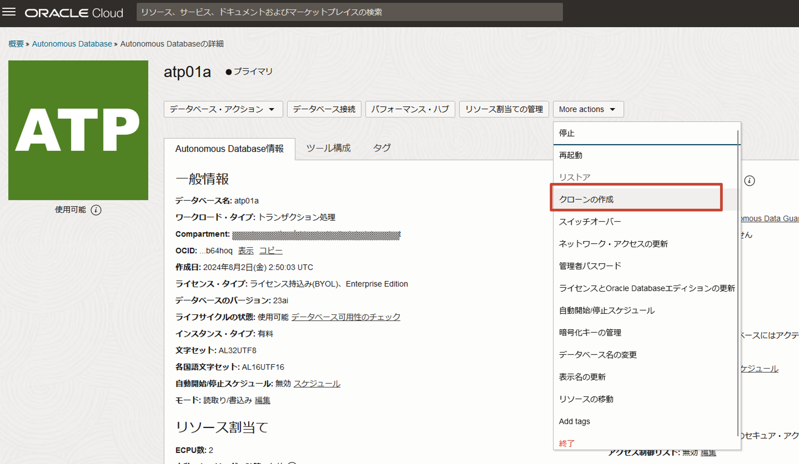
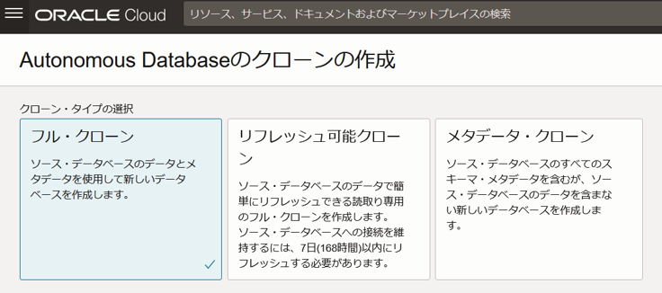
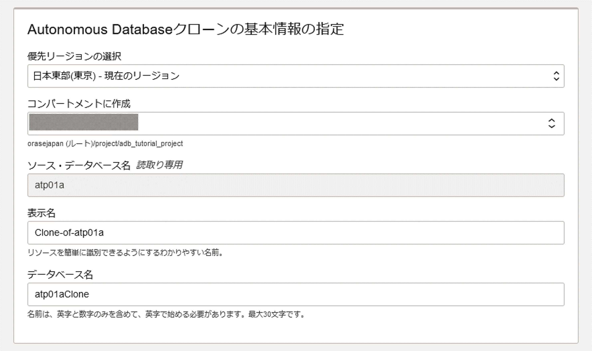
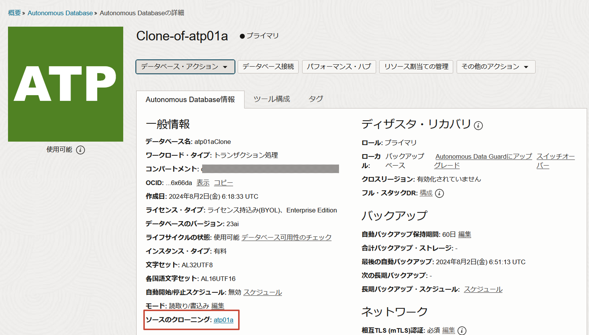
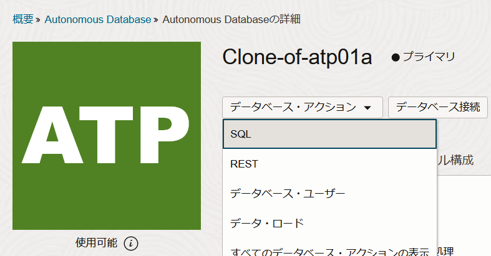
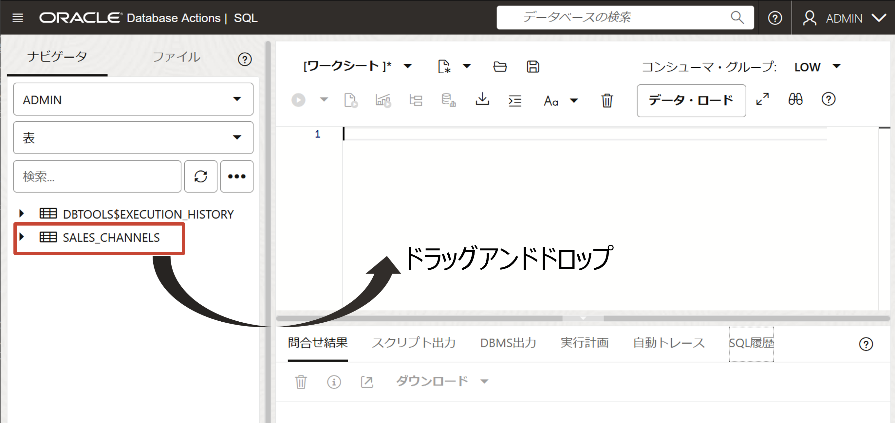
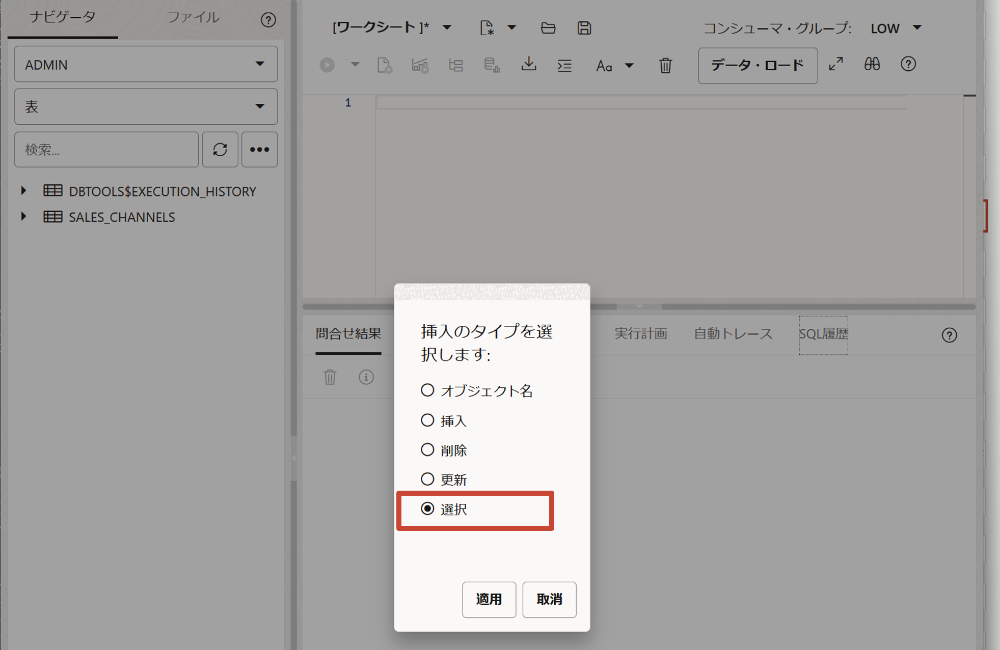
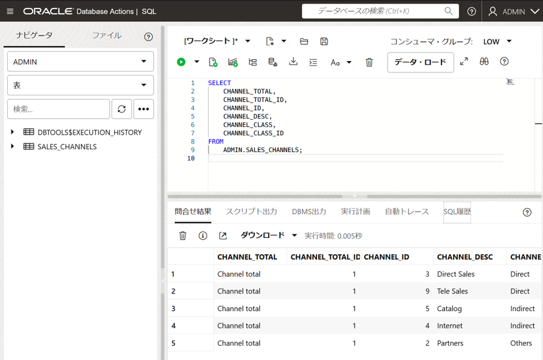

# はじめに

Autonomous Databaseのクローン機能を利用することにより、テスト/検証/分析用途の環境を素早く簡単に作成することができます。  
ソース・データベースはオンライン、オフラインのどちらでも構わず、作成するクローンのタイプは次の3種類からの選択が可能です。

| クローンのタイプ    | 説明 |
| -------           | ------- |
| **フル・クローン** | ソース・データベースの**メタデータとデータ**を含むデータベース全体のクローンを作成します。  |
| **メタデータ・クローン** |ソース・データベースの表や索引などのスキーマ定義やオブジェクト構成情報といった**メタデータのみ**のクローンを作成します。**データは含みません**。|
| **リフレッシュ可能クローン** | クローン作成後もソース・データベースの変更をリフレッシュで反映することができる**更新可能な**データベース全体のクローンを作成します。（クローン作成後または前回のリフレッシュから1週間以内のリフレッシュが必要）|
    
また、クローンは、サブスクライブしている任意のリージョンの任意のコンパートメント内に作成でき、ソースデータベースと異なるネットワーク（VCN・サブネット）に配置できます。バージョン・コア数・ストレージ容量などを含むスペックなどの変更も可能です。  

本チュートリアルでは、フル・クローンのタイプでクローンを作成します。

**所要時間 :** 約20分

**前提条件 :**

* 以下のチュートリアルが完了していること
  * [101:ADBインスタンスを作成してみよう](/adb/adb101-provisioning){:target="_blank"} で、ADBインスタンスが構成済みであること
  * [102:ADBにデータをロードしよう(Database Actions)](/adb/adb102-dataload){:target="_blank"} でADMINユーザーでSALES_CHANNELS表が作成されていること
* チュートリアルの便宜上インスタンス名はatp01とします。
* SQLコマンドを実行するユーザー・インタフェースは、Database Actionsを使用します。

**目次：**
- [1. クローン環境を作成してみよう](#1-クローン環境を作成してみよう)
- [2. クローン環境を確認してみよう](#4-作成したクローン環境を確認してみよう)

 

# 1. クローン環境を作成してみよう

ソース・データベースのインスタンス詳細画面から **「クローンを作成」** をクリックします。

  

 クローンの作成画面が表示されますので、下記を参考に設定していきます。

## クローン・タイプの選択  
 今回は**フル・クローン**を選択します。ソース・データベースのメタデータとデータが複製されます。

  

 

## ソースのクローニング
 フル・クローンまたはメタデータ・クローンの場合、クローンのソースを選択するオプションがあります。
  
  * **データベースインスタンスからのクローニング** : 実行中のデータベースのクローンが作成されます。  
  * **バックアップからのクローニング** : バックアップリストからバックアップを指定してクローン、もしくは、過去の特定時点を指定してクローンします。
  
  今回は**データベース・インスタンスからのクローニング**を選択し、実行中のデータベースのクローンを作成します。

  

## Autonomous Databaseクローンの基本情報の指定
クローンを作成するリージョン、コンパートメントおよびクローンの名前を指定します。
  + リージョン : **任意のリージョンから指定**
  + コンパートメント：**任意のコンパートメントを指定**
  + ソース・データベース名：**atp01** ※ソース・データベース名が自動入力され変更は不可
  + 表示名：**Clone-of-atp01** ※任意の名前で指定が可能です。
  + データベース名：**atp01Clone**　※任意の名前で指定が可能です。

  

## ワークロード・タイプの選択
ソース・データベースと異なるワークロード・タイプの選択も可能です。ただし、次の表のとおりソース・データベースによって選択できるタイプが制限されるのでご注意ください。

| ソース |  クローン |
| ---   | -----     |
| ADW   |  ADW/ATP  |
| ATP   |  ADW/ATP  |
| AJD   | ADW/ATP/AJD/APEX Service |
| APEX Service | ADW/ATP/APEX Service |

今回はソース・データベースと同じ**トランザクション処理**を選択します。

  

  
## そのほかのクローン・データベースの設定

  クローン・データベースの構成について必要な項目を設定していきます。  
  今回は以下のように指定します。各項目については[2. ADBインスタンスを作成してみよう](/adb/adb101-provisioning/#2-adb%E3%82%A4%E3%83%B3%E3%82%B9%E3%82%BF%E3%83%B3%E3%82%B9%E3%82%92%E4%BD%9C%E6%88%90%E3%81%97%E3%81%A6%E3%81%BF%E3%82%88%E3%81%86)の記載例をご確認ください。

+ **データベースの構成**
  + データベース・バージョンの選択 : **23ai** ※ソースのバージョンよりも上である必要があります。
  + ECPU数 : **2**
  + ストレージ、ストレージ単位サイズ : **20GB** ※指定できる最小ストレージは、ソース データベースの実際の使用領域を次の GB に切り上げた値です。
  + 自動スケーリングの計算 : **なし**
  + ストレージの自動スケーリング : **なし**
      
+ **バックアップ保持**
  + 自動バックアップ保持期間(日) : **60**
  
+ **管理者資格証明の作成**
  + ユーザー名 : **ADMIN**
  + パスワード : **Welcome12345#**

+ **ネットワーク・アクセスの選択**
  + アクセス・タイプ : **すべての場所からのセキュア・アクセス**　
  
+ **ライセンスとOracle Databaseエディションの選択** : **ライセンス込み**
   
+ **運用上の通知およびお知らせ用の連絡先**
  + 連絡先の電子メール : **なし**
      
+ **拡張オプションの表示** : **指定なし**

最後に「**Autonomous Databaseのクローンを作成**」をクリックすると、プロビジョニングが始まります。 
プロビジョニングが完了後、指定したコンパートメント内にクローン環境が作成されていることをご確認ください。クローンの場合、詳細の**ソースのクローニング** でソースのADBインスタンスのリンクが表示されます。

 

   

# 2. 作成したクローン環境を確認してみよう

正しくフル・クローンされているか確認するため、作成したクローン環境にDatabase ActionsのSQLを使って、ADMINユーザーのSALES_CHANNEL表の存在とデータを検索します。
クローンした環境でも付属ツールを利用することが可能です（クローン作成のときに拡張オプションでソースと異なるようにツールの構成の変更もできます）。

ADBインスタンスの詳細の**データベース・アクション**から**SQL**を選択します。

  

左側のナビゲータでSALES_CHANNELS表が表示され、メタデータがクローンされていることが確認できます。  
次にデータがクローンされているかを確認します。SALES_CHANNELS表をワークシートにドラッグアンドドロップをすると、挿入のタイプが選択できます。

  

選択を選んで適用をクリックすると、SQLが入力されます。そのまま実行してSALES_CHANNELS表を検索します。

  

  

データが検索され、メタデータとデータが正しくクローンされていることが確認できました。

# おわりに
本チュートリアルでは簡単に既存のAutonomous Databaseからクローンを作成できることを体感いただきました。今回はフル・クローンでしたが、クローンのタイプにメタデータ・クローンを選択すると同様の手順でメタデータ・クローンの作成が可能です。リフレッシュ可能クローンは [218 : リフレッシュ可能クローンを活用しよう](/adb/adb218-refreshable-clone){:target="_blank"} で手順をご確認ください。

 
以上で、この章は終了です。  
次の章にお進みください。

# 参考資料
+ [Cloning and Moving an Autonomous Database](https://docs.oracle.com/en-us/iaas/autonomous-database-serverless/doc/clone-autonomous-database.html)

# Tips

+ **データベースインスタンスからのクローニングとバックアップからのクローニングで違いはありますか？**

  バックアップからのクローニングは、オブジェクトストレージからデータをリストアする必要があるため、アクティブなデータベースインスタンスからのクローニングに比べ、時間がかかります。また、バックアップから作成できるクローンタイプはフル・クローンおよびメタデータ・クローンのみです。バックアップから更新可能クローンを作成することができませんのでご注意ください。

+ **どのタイミングでクローンが作成されるのでしょうか?**

  ターゲット・インスタンスにはソース・インスタンスの断面と変更ログを転送しクローンが作成されます。また変更ログは可能な限り最新の断面となるよう直近まで転送、適用することで、ソース・インスタンスを再現します。そのため、アクティブなデータベースを元に作成されたクローンは、ピンポイントに特定の状態のクローンを取得したいときには適切ではありません。そのようなクローンを作成したいときには、一旦ソースデータベースを停止させた状態でクローンを取得する、またはバックアップからのクローンの取得がよいでしょう。

+ **作成するクローンを制限することはできますか？**

  可能です。グループがAutonomous Databaseのクローン作成のみ可能でAutonomous Databaseの作成はできないようにクローン作成権限を制限したり、特定のタイプのクローン(フル・クローン、メタデータ・クローン、またはリフレッシュ可能クローン)のみを作成するように権限をさらに制限することもできます。詳細と例については、[「IAM Permissions and API Operations for Autonomous Database 」](https://docs.oracle.com/en/cloud/paas/autonomous-database/serverless/adbsb/autonomous-database-iam-policies.html#GUID-4FDA9343-A721-4D9A-A48D-A2B7896E6085)を参照してください。

+ **テナンシーをまたいだクローンはできますか？**

  可能です。ただし、CLIまたはREST APIでのみサポートされており、コンソールを使用した作成はできません。詳細は[「Cross Tenancy and Cross-Region Cloning」](https://docs.oracle.com/en/cloud/paas/autonomous-database/serverless/adbsb/autonomous-clone-cross-tenancy.html#GUID-98C63A6A-BA44-4757-9BE3-6636732EA1A2) を参照してください。

 
[ページトップへ戻る](#anchor0)
