<a id="anchor0"></a>

# はじめに

Autonomous Database(ADB)は、事前定義されたメンテナンス・ウィンドウの中でデータベースに自動的にパッチを適用します。ADBではこのパッチ適用によって性能劣化が生じない仕組みが実装されています。
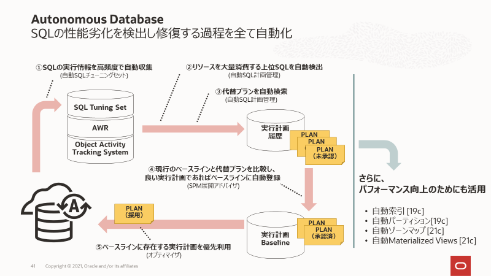

それでもアプリケーションの性能劣化に不安がある場合に利用できるのが、先行してパッチを適用できる早期パッチという機能です。パッチは毎週もしくは隔週で一斉に当てられますが、この早期パッチでは通常より1週早く同じパッチが当てられます。テスト環境用ADBを早期パッチで作成しておくことで、本番環境適用前にパッチ適用の影響テストを行うことができます。

また、ADBでは、Oracle Databaseオプション「Real Application Testing(RAT)」に含まれる機能の1つであるSQL Performance Analyzer(SPA)を使用することができます。
SPAを利用すると、システム変更前後のSQLワークロードの実行統計を比較して変更の影響を測定することができます。詳細はこちらをご覧ください。

[Real Application Testing 参考資料](https://www.oracle.com/jp/a/ocom/docs/jp-db-technight-content/oracle-tech-night-35-docs02.pdf){:target="_blank"}

[マニュアル：SQL Performance Analyzer](https://docs.oracle.com/cd/E82638_01/ratug/sql-performance-analyzer.html#GUID-8CE976A3-FB73-45FF-9B18-A6AB3F158A95){:target="_blank"}


本記事では、early patchとSPAを併用することで、本番環境へのパッチ適用の影響をテスト環境で事前に確認する手順をご紹介します。

**目次 :**
  + [1.環境の準備](#anchor1)
  + [2.SQLチューニングセット(STS)の作成](#anchor2)
  + [3.テスト環境用ADBのクローニング](#anchor3)
  + [4.STSの分析、レポートの作成](#anchor4)
  + [5.パッチ適用の事前通知（参考）](#anchor5)
  + [6.クリーンアップ（参考）](#anchor6)
  + [7.おわりに](#anchor7)

**前提条件**
+ ADBインスタンスが構成済みであること
    <br>※ADBインタンスの作成方法については、
    [101:ADBインスタンスを作成してみよう](/adb/adb101-provisioning){:target="_blank"} を参照ください。

<BR>

**所要時間 :** 約60分

<BR>

<a id="anchor1"></a>

# 1. 環境の準備

## 1-1. 本番環境用ADBの作成
まずは本番環境用ADBである**ATPprod**を作成します。ADBの構成は以下になります。なお、本記事ではADBをはじめとする各リソースは全てAshburnリージョンで作成します。(Tokyo/Osakaリージョンでも実施可能です)

+ **ワークロード・タイプ**：トランザクション処理
+ **デプロイメント・タイプ**：サーバーレス
+ **ECPU数**：2
+ **ストレージ(TB)**：1
+ **ネットワーク・アクセスの選択**：すべての場所からのセキュア・アクセス

## 1-2. テスト用スキーマ`MYSH`の作成
`ADMIN`ユーザーでATPprodに接続し、次のSQLを実行しサンプルスキーマ`MYSH`を作成します。
```sql
CREATE USER MYSH IDENTIFIED BY <PASSWORD>;
GRANT DWROLE TO MYSH;
GRANT UNLIMITED TABLESPACE TO MYSH;
```

## 1-3. サンプルスキーマ(`SH`)からテーブルのコピー
次のSQL文を実行し、サンプルスキーマ(`SH`)の`CHANNELS`表と`SALES`表をコピーします。
```sql
create table MYSH.CHANNELS as select * from SH.CHANNELS;
create table MYSH.COUNTRIES as select * from SH.COUNTRIES;
create table MYSH.SALES as select * from SH.SALES;
select count(1) from MYSH.CHANNELS;
select count(1) from MYSH.COUNTRIES;
select count(1) from MYSH.SALES;
```

<BR>

<a id="anchor2"></a>

# 2. SQLチューニングセット(STS)の作成

SPAのSQLワークロードのインプットには実行SQLと関連情報をひとまとめにしたSQLチューニングセット（STS）というデータベースオブジェクトを使用します。今回は、本番環境でSTSを作成し、いくつかのSQLワークロードをキャプチャ後、テスト環境となるクローンを作成、それからSPAで本番環境とテスト環境におけるパフォーマンスの比較を行います。  
なお、データベースをアップグレードさせる際にパフォーマンスとアプリケーションとの互換性に影響があるか分析する、という目的でもSTSとSPAは有効に使えます。

## 2-1. ワークロードの実行
`MYSH`ユーザーでATPprodに接続し、比較するワークロードとして次のSQLを実行します。

```sql
select count(1) from countries;
select count(1) from channels;
select count(1) from sales;
select * from countries;
select * from channels;
select * from channels where channel_id = 3;
select * from sales where cust_id = 512 and prod_id = 119;
insert into channels (CHANNEL_ID, CHANNEL_DESC, CHANNEL_CLASS, CHANNEL_CLASS_ID, CHANNEL_TOTAL, CHANNEL_TOTAL_ID) values(1, 'Sample 1 desc', 'Sample 1 class', 11, 'Channel total', 1);
update channels set CHANNEL_DESC='New desc' where CHANNEL_ID=1;
delete from channels where channel_id = 3;
commit;
```

## 2-2. STSの作成
`ADMIN`ユーザーでATPprodに接続し、次のステートメントを実行しSTSを作成します。STSの作成や操作にはDBMS_SQLTUNEパッケージを利用します。
```sql
EXEC DBMS_SQLTUNE.CREATE_SQLSET(sqlset_name => 'mysh_sts_test');
```

> **Note**
>
> ORA-13753: 'SQL Tuning Set "mysh_sts_test" already exists for user "ADMIN".'が発生する場合、次のSQLを実行して作成したSTSを削除できます。
>
>```sql
>EXEC DBMS_SQLTUNE.DROP_SQLSET('mysh_sts_test');
>```

## 2-3. SQLのキャプチャ
キャプチャするSQLはbasic_filterオプションでフィルタリングすることが可能です。以下の例ではスキーマをMYSHに限定し、さらにSPAやSTSに関わるSQLを除外しています。
```sql
DECLARE
    l_cursor  DBMS_SQLTUNE.SQLSET_CURSOR;
BEGIN
    OPEN l_cursor FOR
    SELECT VALUE(a) FROM   TABLE(
        DBMS_SQLTUNE.SELECT_CURSOR_CACHE(
        basic_filter=> 'upper(SQL_TEXT) not like ''%SQL_ANALYZE%''
        and upper(SQL_TEXT) not like ''%BEGIN%''
        and upper(SQL_TEXT) not like ''%DBMS_SQLTUNE%''
        and upper(parsing_schema_name) = ''MYSH''',
        attribute_list => 'ALL')) a;
    DBMS_SQLTUNE.load_sqlset(sqlset_name=>
        'mysh_sts_test',populate_cursor => l_cursor);
END;
/
```

このPL/SQLは何度実行しても構いません。実行の際にメモリ中にあるSQLから条件にあったものをSTSにロードします。呼び出しているパッケージに関しては、下記のマニュアルが参考になります。  
[マニュアル：Oracle Database SQLチューニング・ガイド:SQLチューニング・セットのロード](https://docs.oracle.com/cd/E82638_01/tgsql/managing-sql-tuning-sets.html#GUID-4E5240CD-B021-4728-89A9-95F5B81CBC59){:target="_blank"}

[マニュアル：Database PL/SQLパッケージ・プロシージャおよびタイプ・リファレンス:DBMS_SQLTUNEのサブプログラム・グループ](https://docs.oracle.com/cd/E82638_01/arpls/DBMS_SQLTUNE.html#GUID-8DF08AC5-A337-46B3-A30F-6B2511C4153C){:target="_blank"}

> **Note**
>
> ここで紹介したパッケージとは別の方法として、DBMS_SQLTUNE.CAPTURE_CURSOR_CACHE_SQLSETパッケージを使用して、特定の期間にキャッシュを複数回ポーリングしてカーソルキャッシュからSQL群をSTSにロードする方法もあります。
>
> [こちらの記事](https://qiita.com/ora_gonsuke777/items/d2965a105feebac9f25a){:target="_blank"}をご参照ください。

## 2-4. キャプチャされたSQLステートメントの表示
STSの中にデータが入力されたので、次のSQLを実行し、キャプチャされたSQLステートメントを照会します。
```sql
SELECT sql_id, sql_text
FROM   dba_sqlset_statements
WHERE  sqlset_name = 'mysh_sts_test'
ORDER BY 1;
```

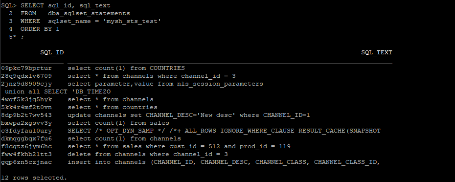

キャッシュから条件にあったものをすべてロードするため、『2-1. ワークロードの実行』で実行したSQLステートメント10個に加えて、キャッシュにあった別のselect文も2つ格納されています。

これで、STSのキャプチャは完了です。

<br>

<a id="anchor3"></a>

# 3. テスト環境用ADBのクローニング

OCIコンソールからテスト環境用ADBとしてATPprodのクローン**ATPpatchtest**を作成します。この際、以下のように『拡張オプションの表示』ボタンをクリックし、『メンテナンス』をクリックします。ここでパッチ・レベルを設定することができます。ATPpatchtestはパッチ・レベルを**早期**に設定し、作成します。

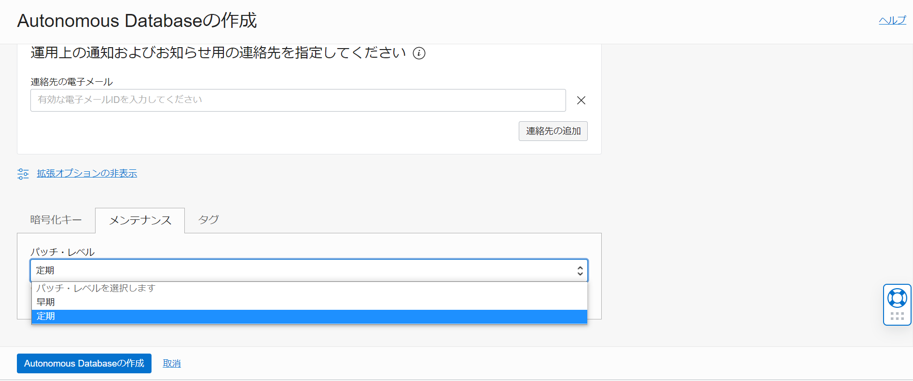

> **Note**
>
> 今回はSQLワークロード取得後のクローンなので不要ですが、取得後のクローンではない、または別の環境でテストをする場合はステージングテーブルの作成・STSの転送が必要です。詳しい手順は[6. STSの転送（参考）](#anchor6)をご参照ください。

<BR>

<a id="anchor4"></a>

# 4. STSの分析、レポートの作成

続いてテスト環境用ADBでSTSの分析を行っていきます。

## 4-1. SQL Performance Analyzer(SPA)タスクの作成
`ADMIN`ユーザーでATPpatchtestに接続します。まずはSPAタスクを作成し、比較するためのSQL試行を行います。SQL試行後、それぞれの性能統計を比較しレポートを作成します。SPAの操作はDBMS_SPAパッケージを使用します。
```sql
VARIABLE spa_task VARCHAR2(64);
EXEC :spa_task := DBMS_SQLPA.CREATE_ANALYSIS_TASK(sqlset_owner => 'ADMIN', sqlset_name => 'mysh_sts_test');
PRINT :spa_task
```

## 4-2. 本番環境用のSQL試行
キャプチャした本番環境のワークロードの情報をそのまま比較に利用します。`execution_type`を`CONVERT SQLSET`として指定することでSTSから実行計画や実行統計を抽出し、テスト結果として利用することができます。
```sql
BEGIN
    DBMS_SQLPA.EXECUTE_ANALYSIS_TASK(
    task_name => :spa_task,
    execution_type => 'CONVERT SQLSET' ,
    execution_name => 'analysis_prod');
END;
/
```

## 4-3. テスト環境用のSQL試行
次は本番環境で取得したワークロードをテスト環境で実行し結果を取得します。execution_typeをTEST EXECUTEとして指定します。これにより、STS内の全てのSQLステートメントが実行され、その実行計画と統計が収集されます。
```sql
BEGIN
    DBMS_SQLPA.execute_analysis_task(
    task_name       => :spa_task,
    execution_type  => 'TEST EXECUTE',
    execution_name  => 'analysis_patchtest');
END;
/
```

## 4-4. 分析タスクの実行 - 比較
生成した2つのバージョンのSQLパフォーマンスデータを分析および比較します。今回はexecution_typeをCOMPARE PERFORMANCEとして指定します。
```sql
BEGIN
    DBMS_SQLPA.EXECUTE_ANALYSIS_TASK(
        task_name        => :spa_task,
        execution_type   => 'COMPARE PERFORMANCE', 
        execution_params => dbms_advisor.arglist(
                        'execution_name1', 
                        'analysis_prod', 
                        'execution_name2', 
                        'analysis_patchtest',
                        'workload_impact_threshold', 0, 
                        'sql_impact_threshold', 0));
END;
/
```

## 4-5. レポートの生成
これで全ての分析タスクが完了しました。次のステートメントを実行し、レポートの生成を行います。
```sql
SET PAGESIZE 0
SET LINESIZE 1000
SET LONG 1000000
SET LONGCHUNKSIZE 1000000
SET TRIMSPOOL ON
SET TRIM ON

SPOOL sts_prod_patchtest_execute_comparison_report.html
SELECT DBMS_SQLPA.report_analysis_task(:spa_task, 'ACTIVE', 'ALL') FROM dual;
SPOOL OFF
```

レポートが生成されたら、コンピュートインスタンスからレポートをダウンロードし、任意のブラウザで比較結果を確認します。

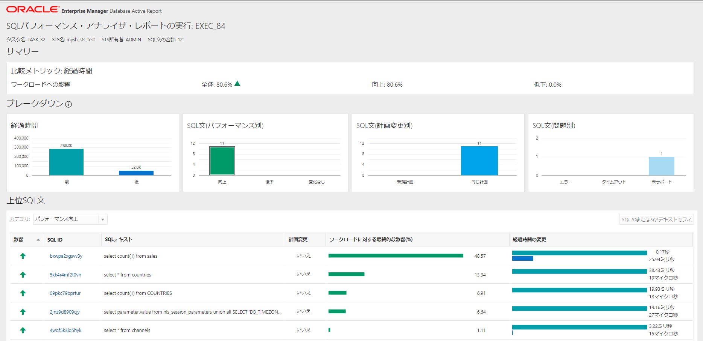

上の画像のように、STSに格納されたSQLステートメントの経過時間・パフォーマンス・計画の変更・問題について表示されます。計画変更別のところを見ると実行計画は変わっていないことがわかります。ADBの自動パッチ適用では、SQL Plan Management(SPM)が自動的に有効になるので、実行計画の劣化は受けません。

<BR>

<a id="anchor5"></a>

# 5. パッチ適用の事前通知（参考）

`OCI Events`を利用すれば、ADBでメンテナンスが開始される時間の通知を設定することができます。以下でその手順をご紹介します。

## 5-1. トピックの作成
1. OCIのコンソール画面から『開発者サービス』をクリックし、アプリケーション統合の『通知』をクリックします。
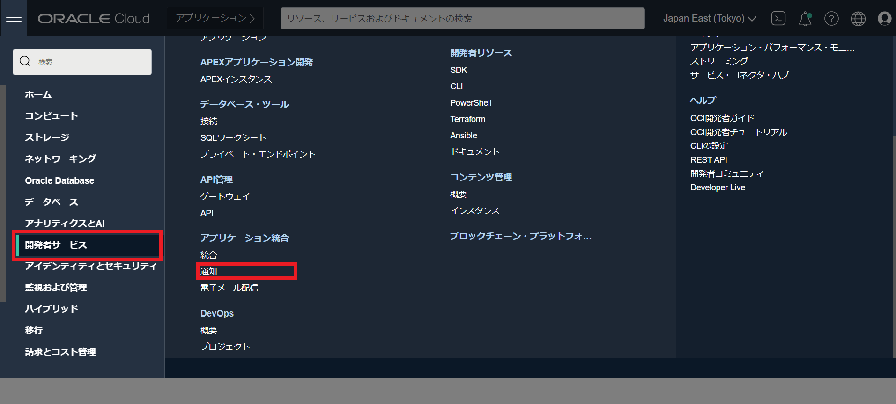

1. 『トピックの作成』をクリックし、以下のように名前を入力します。今回は**mail_notification**とします。


1. 作成したmail_notificationの詳細画面の『サブスクリプションの作成』をクリックします。
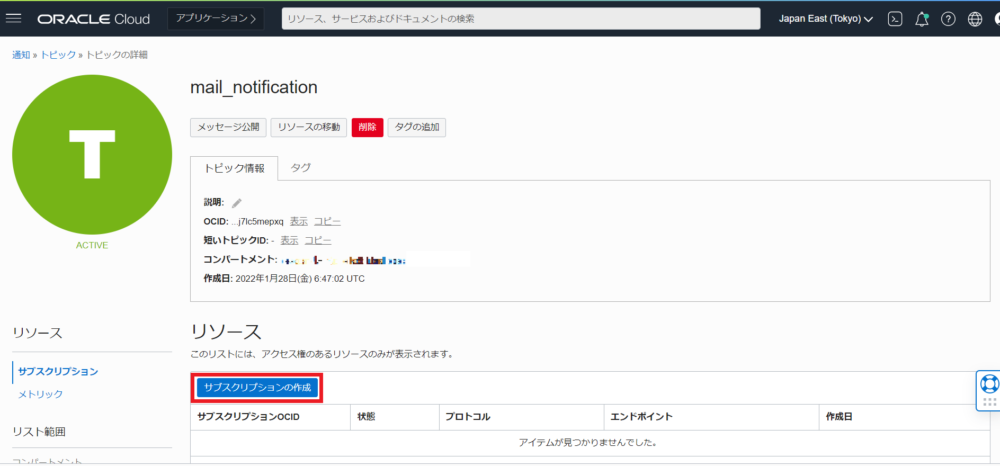

1. 通知先として設定するメールアドレスを入力します。


## 5-2. ルールの作成
1. OCIのコンソール画面から『監視および管理』をクリックし、イベント・サービスの『ルール』をクリックします。
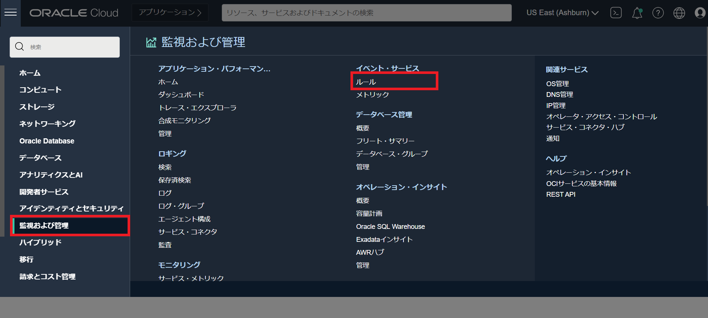

1. 『ルールの作成』をクリックし、表示名・ルール条件・アクションを設定します。今回は以下で作成します。
+ **表示名：** ADB_maintenance_notification
+ **条件：** イベント・タイプ
+ **サービス名：** Database
+ **イベント・タイプ：** Autonomous Database - Information
+ **アクション・タイプ：** 通知
+ **通知コンパートメント：** （ADBを作成したコンパートメントを指定）
+ **トピック：** mail_notification（指定したコンパートメント内のトピックを選択できます）
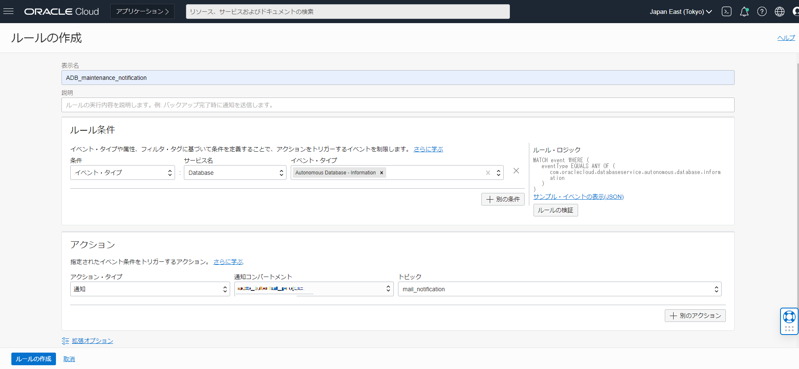
> **Note**
>
> Autonomous Databaseにおけるイベント・タイプ一覧は以下になります。（2022/1時点）
>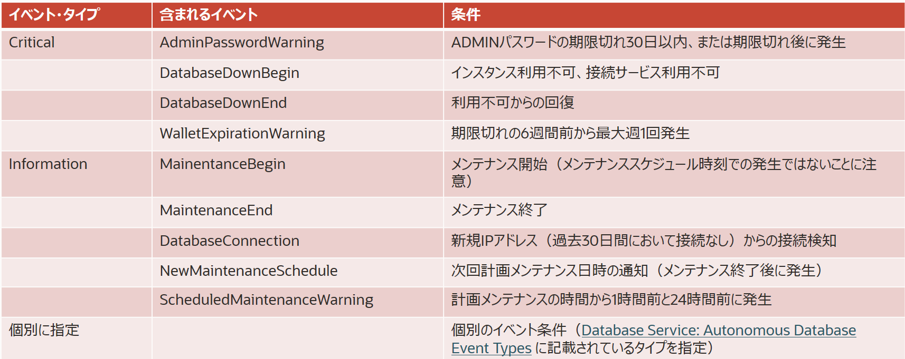

## 5-3. ADBインスタンスの指定
この状態では、このルールを作成したリージョン内のADBインスタンス全てのInformationイベントに関する通知が届きます。特定のADBインスタンスに対して通知を設定したい場合は、ルールに属性を追加します。
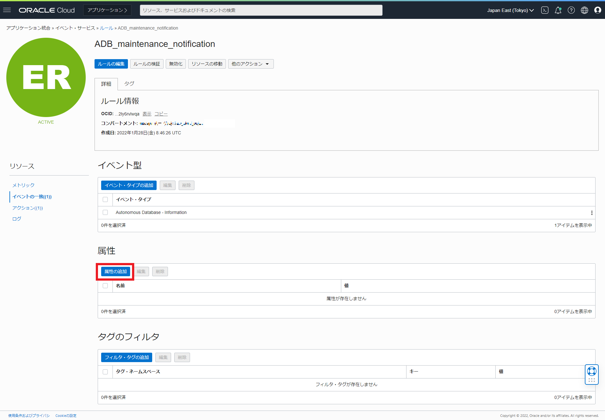

以下の項目を入力します。
+ **属性名：** dbName
+ **属性値：** ATPpatchtest（通知設定をしたいADBインスタンス名）


<BR>

これで設定は完了です。以下は実際に設定したメールアドレスに届いたメンテナンス通知です。
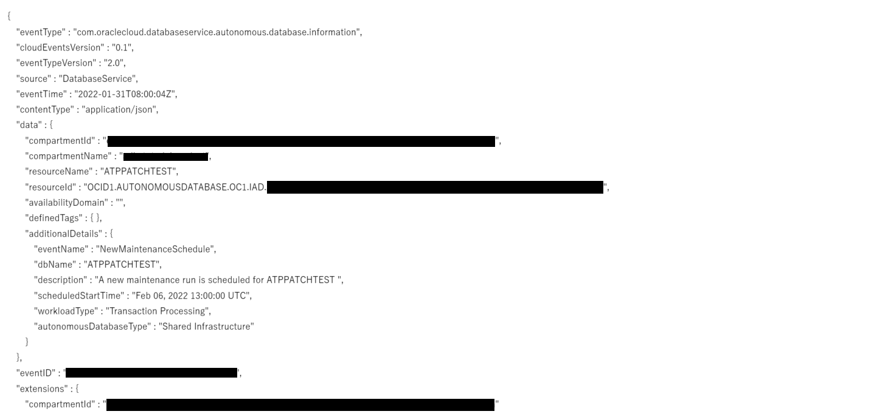

<BR>

<a id="anchor6"></a>

# 6. STSの転送（参考） 

STSの別のデータベースへの転送は、STSの内容をステージングテーブルに出力し、それをエクスポート、インポートすることで行います。今回は全てのADBインスタンスからアクセスできるOCIオブジェクト・ストレージを中間場所として利用します。

## 6-1. ステージングテーブルの作成
`ADMIN`ユーザーでATPprodに接続し、次のSQLを実行しSTSを格納するためのステージングテーブルを作成します。なおこのステージングテーブルは、`MYSH`スキーマで作成されます。
```sql
DROP TABLE MYSH.STG_TABLE PURGE;
BEGIN
    DBMS_SQLTUNE.CREATE_STGTAB_SQLSET (
        table_name => 'STG_TABLE',
        schema_name => 'MYSH',
        tablespace_name =>'DATA'
    );
END;
/
```

## 6-2. STSをステージングテーブルにパック
続いて次のステートメントを実行し、STSをステージングテーブルにパックします。
```sql
BEGIN
    DBMS_SQLTUNE.PACK_STGTAB_SQLSET (
        sqlset_name => 'mysh_sts_test',
        sqlset_owner => 'ADMIN', 
        staging_table_name => 'STG_TABLE',
        staging_schema_owner => 'MYSH'
    );
END;
/
```

ステージングテーブルの中身を確認してみます。
```sql
select distinct(sql_id) from MYSH.STG_TABLE order by 1;
```


『2-4. キャプチャされたSQLステートメントの表示』で確認したものと同じ12個のSQL_IDが表示されました。

## 6-3. 本番環境ADBで資格情報（クレデンシャル）の作成
続いて`expdp`を使用してオブジェクト・ストレージにエクスポートします。最初に認証トークンを使用してADBインスタンスに資格情報を作成し、ADBインスタンスがバケットに直接アクセスしてエクスポートできるようにする必要があります。

こちらの手順については、[「クラウド・ストレージからデータをロードしてみよう」](/adb/adb102-dataload/#anchor2){:target="_blank"}から、**「1. OCIオブジェクトストレージへのアクセス情報を取得」**を参考に実施してください。

```sql
BEGIN
  DBMS_CLOUD.CREATE_CREDENTIAL(
    credential_name => 'ATPprod_CRED',
    username => '<USERNAME>',
    password => '<AUTH TOKEN>'
  );
END;
/
```

作成した資格情報をデフォルトに変更します。
```sql
ALTER DATABASE PROPERTY SET DEFAULT_CREDENTIAL = 'ADMIN.ATPprod_CRED';
```

## 6-4. オブジェクト・ストレージのバケットの作成
dmpファイルを格納する先であるバケットを作成しておきます。手順については、[OCIオブジェクトストレージへのデータアップロード](/adb/adb102-dataload/#2-2-oci%E3%82%AA%E3%83%96%E3%82%B8%E3%82%A7%E3%82%AF%E3%83%88%E3%82%B9%E3%83%88%E3%83%AC%E3%83%BC%E3%82%B8%E3%81%B8%E3%81%AE%E3%83%87%E3%83%BC%E3%82%BF%E3%82%A2%E3%83%83%E3%83%97%E3%83%AD%E3%83%BC%E3%83%89){:target="_blank"}をご参照ください。今回バケットはAshburnリージョンで作成しています。

## 6-5. ステージングテーブルのエクスポート
`expdp`を使用してエクスポートを実行します。SPAでワークロードを実行するときに、試行モードをTEST EXECUTEにする場合、スキーマ全体のエクスポートが必要です。
```sql
expdp admin/<PASSWORD>@atpprod_high \
    schemas=MYSH \
    dumpfile=default_credential:https://objectstorage.us-ashburn-1.oraclecloud.com/n/<COMPARTMENT>/b/<BUCKET>/o/mysh_sts.dmp \
    parallel=2 \
    encryption_pwd_prompt=yes \
    logfile=export_mysh_sts.log \
    directory=data_pump_dir
```

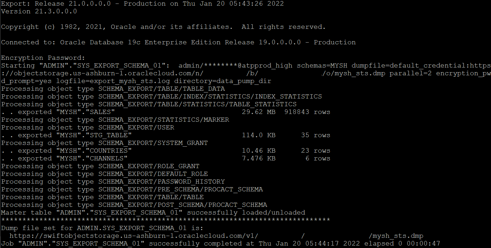

OCIコンソールからバケット内のエクスポートされたダンプファイルを確認します。

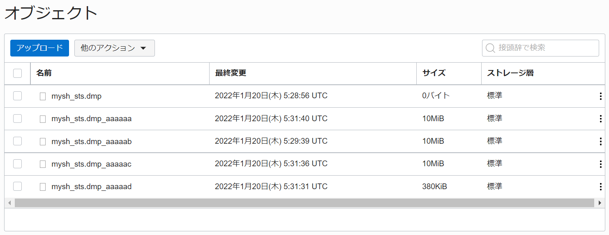

## 6-6. テスト環境ADBで資格情報（クレデンシャル）の作成
`ADMIN`ユーザーでATPpatchtestに接続し、『3-3. 本番環境ADBで資格情報（クレデンシャル）の作成』と同様の手順で資格情報を作成します。

## 6-7. ダンプファイルのインポート
`impdp`を使用してインポートを実行します。
```sql
impdp admin/<PASSWORD>@atppatchtest_high \
    directory=data_pump_dir \
    credential=atppatchtest_CRED \
    dumpfile= https://objectstorage.us-ashburn-1.oraclecloud.com/n/<COMPARTMENT>/b/<BUCKET>/o/mysh_sts.dmp \
    parallel=2 \
    encryption_pwd_prompt=yes \
    transform=segment_attributes:n \
    transform=dwcs_cvt_iots:y transform=constraint_use_default_index:y \
    exclude=cluster,indextype,db_link
```

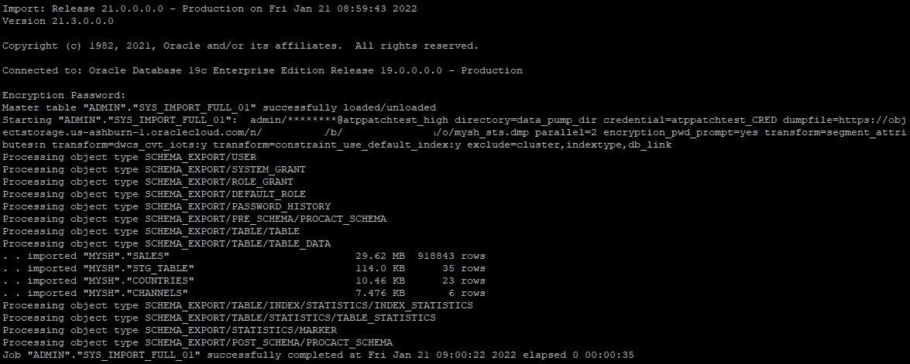
STSを削除する必要がある場合、以下を実行することで削除できます。
```sql
EXEC DBMS_SQLTUNE.DROP_SQLSET('mysh_sts_test');
```

## 6-8. ステージングテーブルのアンパック
STSがステージングテーブルにパックされている状態なので、アンパックして戻す必要があります。  
`ADMIN`ユーザーでATPpatchtestに接続し、次のステートメントを実行します。
```sql
BEGIN
    DBMS_SQLTUNE.UNPACK_STGTAB_SQLSET (
        sqlset_name => 'mysh_sts_test',
        sqlset_owner => 'ADMIN',
        replace => TRUE,
        staging_table_name => 'STG_TABLE',
        staging_schema_owner => 'MYSH'
    );
END;
/
```

ここで、エラー`ORA-13757: "SQL Tuning Set" "mysh_sts_test" owned by user "ADMIN" is active.`というエラーが発生した場合、次のステートメントを実行し、STSのタスクを検索し削除します。その後、STSを削除し再度作成し直します。
```sql
select description, created, owner
from DBA_SQLSET_REFERENCES
where sqlset_name = 'mysh_sts_test';

EXEC DBMS_SQLTUNE.DROP_TUNING_TASK('TASK_53');

EXEC DBMS_SQLTUNE.DROP_SQLSET('mysh_sts_test');
```

これ以降の手順は、[4. STSの分析、レポートの作成](#anchor4) と同様になります。

<BR>

<a id="anchor6"></a>

# おわりに
本記事では、Autonomous Databaseの特徴の一つである自動パッチ適用が、アプリケーションに影響がないかSPAを使用して事前にテストする方法をご紹介しました。繰り返しになりますが、基本的にはパッチ適用はSQL Plan Management(SPM)という機能で実行計画に影響がないよう行われますが、不安な場合はこの方法で1週間前に確認することができます。

<BR>

# 参考資料
* [共有ExadataインフラストラクチャでのAutonomous Databaseのメンテナンス更新](https://docs.oracle.com/ja-jp/iaas/Content/Database/Concepts/adbsmaintenance.htm){:target="_blank"}

* [SQLチューニング・セットのロード](https://docs.oracle.com/cd/E82638_01/tgsql/managing-sql-tuning-sets.html#GUID-4E5240CD-B021-4728-89A9-95F5B81CBC59){:target="_blank"}

* [DBMS_SQLTUNEのサブプログラム・グループ](https://docs.oracle.com/cd/E82638_01/arpls/DBMS_SQLTUNE.html#GUID-8DF08AC5-A337-46B3-A30F-6B2511C4153C){:target="_blank"}


<BR>
以上でこの章は終了です。次の章にお進みください。

<BR>

[ページトップへ戻る](#anchor0)