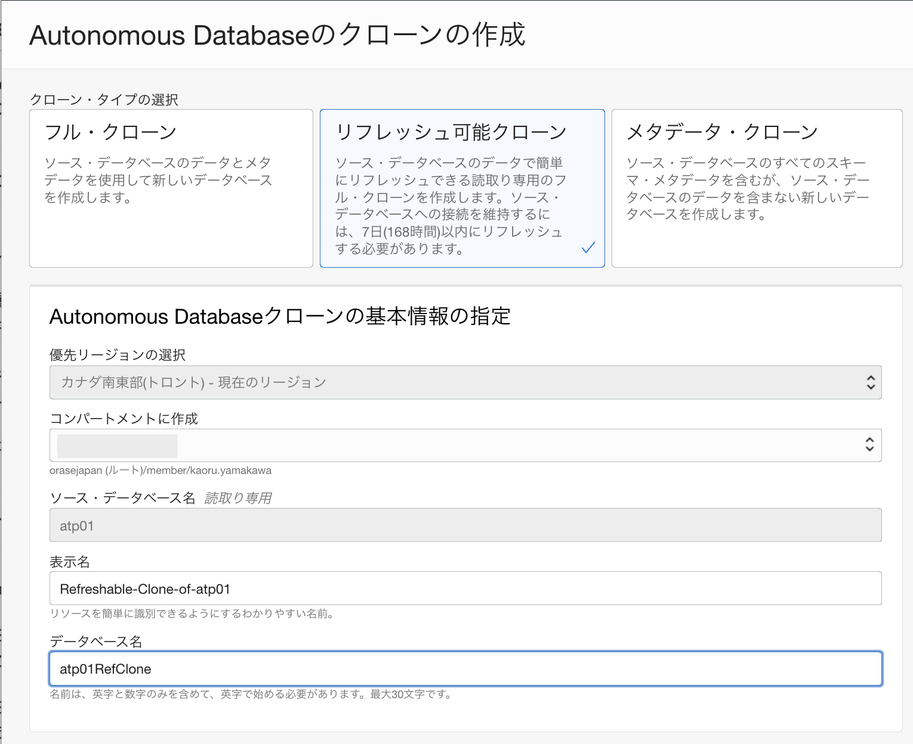
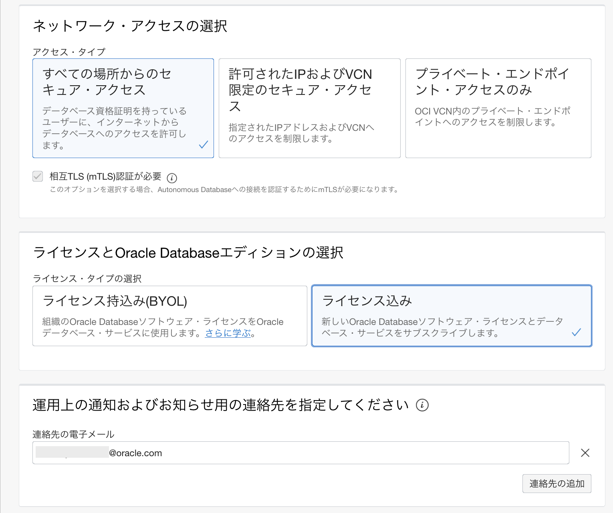
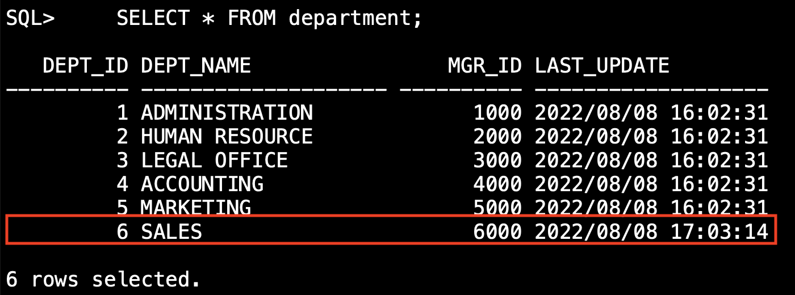
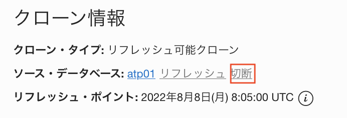
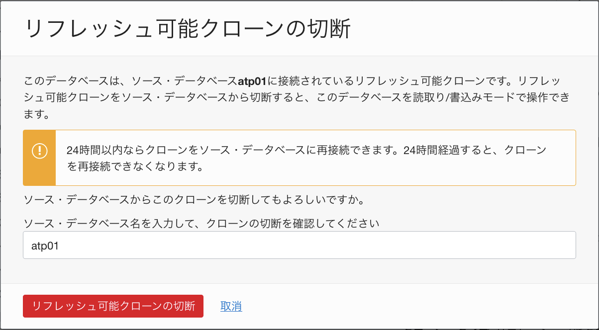
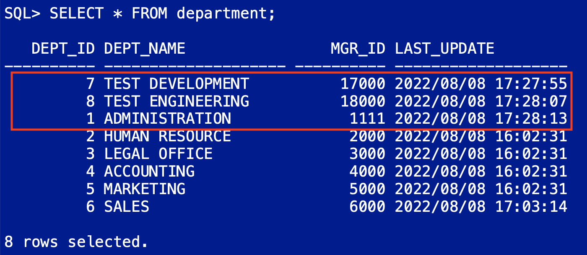
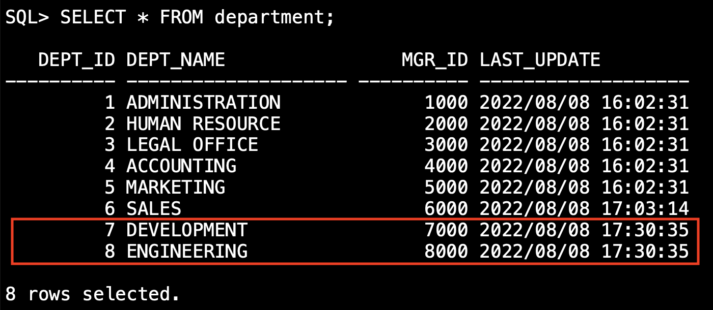
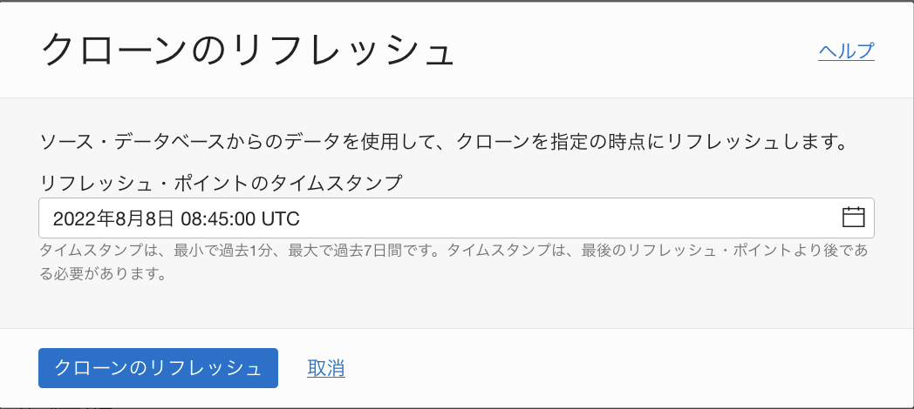

<a id="anchor0"></a>

Autonomous Databaseのリフレッシュ可能クローンを利用すると、本番環境のデータを用いてリフレッシュすることができる、更新可能なテスト/検証/分析用途の環境を簡単に作成することができます。<br>
本章では、リフレッシュ可能クローンの作成方法と動作について確認します。

**所要時間 :** 約30分

**前提条件 :**

* ADBインスタンスが構成済みであること
   <br>※ADBインタンスを作成方法については、本チュートリアルの [101:ADBインスタンスを作成してみよう](../adb101-provisioning){:target="_blank"} を参照ください。
* 構成済みのADBインスタンスへの接続が可能であること


**目次：**

- [1. ADBにおけるリフレッシュ可能クローンの概要](#anchor1)
- [2. 事前準備](#anchor2)
- [3. リフレッシュ可能クローンを作成してみよう](#anchor3)
- [4. 作成したリフレッシュ可能クローンを確認してみよう](#anchor4)
- [5. リフレッシュ可能クローンのリフレッシュ動作を確認してみよう](#anchor5)
- [6. リフレッシュ可能クローンをソース・データベースから切断してみよう](#anchor6)
- [7. リフレッシュ可能クローンをソース・データベースに再接続してみよう](#anchor7)


<br>

<a id="anchor1"></a>

# 1. ADBにおけるリフレッシュ可能クローンの概要

ADBのリフレッシュ可能クローンは、コンソールまたはAPIを使用して作成することができます。
<br>リフレッシュ可能クローンを使用することで、リフレッシュ操作によってソース・データベースの変更内容を反映することが可能なADBのクローンを作成できます。
<br>
<br>
ADBのリフレッシュ可能クローンは以下のような特徴があります。
<br>
* 実行中のAutonomous Databaseから作成可能（バックアップからの作成は不可）
* ソースとなるAutonomous Databaseと異なるコンパートメントに作成可能
* ソースとなるAutonomous Databaseに接続している間は読み取り専用データベースとして利用可能
* コンソールまたはAPIを使用したリフレッシュ操作により、ソース・データベースの変更内容を反映可能
* リフレッシュ中は利用不可（ソース・データベースはリフレッシュ中も利用可能）
* リフレッシュ可能期間は、クローン作成後または前回のリフレッシュから1週間以内
* 1週間以上リフレッシュしなかった場合はリフレッシュできなくなる
* リフレッシュ可能期間を超えた場合は、そのまま読み取り専用DBとして利用するかソース・データベースから切断して通常の読み取り/書き込み可能なDBとして利用する
* ソースとなるAutonomous Databaseから一時的に切断し、再接続することが可能
* 切断後は読み取り/書き込み可能
* 再接続操作は切断後24時間以内のみ可能
* 再接続すると切断中のクローンに対する更新内容は破棄される
* 再接続後は切断前と同様に、リフレッシュ操作によりソース・データベースの変更内容を反映可能
<br>

リフレッシュ可能クローンに関する詳細な情報は[マニュアル](https://docs.oracle.com/en-us/iaas/autonomous-database-serverless/doc/clone-autonomous-database.html)を参照ください。

<br>

<a id="anchor2"></a>

# 2. 事前準備

実際にリフレッシュ可能クローンを作成する前に、ソース・データベースとなるAutonomous Databaseに対してサンプルスクリプトを実行し、データを挿入します。
<br>ここではある会社の部門の情報を含む、DEPARTMENT表という簡単な表を作成していきます。


1. 次の手順に従って、SQL*Plusを使用してリフレッシュ可能クローンのソースとなるADBに接続します。

    1-1. SQL*Plusがインストールされている仮想マシンにssh接続します。
      <br>仮想マシンの作成およびセットアップ方法は[こちら](../adb204-setup-VM/)

    1-2. 下記のコマンドを参考に、oracleユーザに切り替えます。
    
    ```sh
    sudo -s
    ```
    ```sh
    su - oracle
    ```
    （一旦rootユーザにスイッチしてから、oracleユーザにスイッチしています）

    1-3. 下記のコマンドを参考に、SQL*PlusからADBに接続します。

    ```sh
    sqlplus [username]/[password]@[接続サービス名]
    ```

    本チュートリアルを参考にADBインスタンスを作成された方は、次のようなコマンドになります。

    ```sh
    sqlplus admin/Welcome12345#@atp01_low
    ```

    SQL*Plusを使用したADBへの接続方法の詳細については、[104: クレデンシャル・ウォレットを利用して接続してみよう](../adb104-connect-using-wallet/) をご確認ください。

2. 次のサンプルスクリプトを実行し、DEPARTMENT表を作成します。

    こちらのスクリプトをコピーし、SQL*Plusにペーストします。

    ```sql
    DROP TABLE department CASCADE CONSTRAINTS PURGE;
    
    CREATE TABLE department (
      dept_id NUMBER(10) PRIMARY KEY,
      dept_name VARCHAR2(20) NOT NULL,
      mgr_id NUMBER(10) NOT NULL,
      last_update DATE NOT NULL
    );

    INSERT INTO department VALUES (1, 'ADMINISTRATION', 1000, sysdate);
    INSERT INTO department VALUES (2, 'HUMAN RESOURCE', 2000, sysdate);
    INSERT INTO department VALUES (3, 'LEGAL OFFICE', 3000, sysdate);
    INSERT INTO department VALUES (4, 'ACCOUNTING', 4000, sysdate);
    INSERT INTO department VALUES (5, 'MARKETING', 5000, sysdate);
    COMMIT;
    ```

3. 次のSELECT文を実行し、表が正しく作成されているかを確認します。

    ```sql
    ALTER SESSION SET NLS_DATE_FORMAT = 'YYYY/MM/DD HH24:MI:SS';
    SELECT * FROM department;
    ```
      
    次のような結果になっていればOKです。

    

4. SQL*Plusを終了します。

    ```sql
    exit
    ```

<br>

<a id="anchor3"></a>

# 3. リフレッシュ可能クローンを作成してみよう

ADB（atp01）のリフレッシュ可能クローンを作成します。

1. ソースとなるAutunomous Databaseの詳細画面から「クローンを作成」をクリックします。

  

2. クローンの作成画面が表示されます。

    作成するクローンの設定を行います。<br>
    下記を参考に設定してみましょう。

  * クローン・タイプ：**リフレッシュ可能クローン**
  <br>ソース・データベースのメタデータとデータが複製され、ソース・データベースのデータでリフレッシュ可能な読み取り専用のフルクローンを作成します。

  * Autonomous Databaseクローンの基本情報の指定
    * コンパートメント：**任意のコンパートメントを指定**
    * ソース・データベース名：**atp01（変更できません）**
    * 表示名：**Refreshable-Clone-of-atp01**（任意の名前でOKです）
    * データベース名：**atp01RefClone**（任意の名前でOKです）

    
  
  * データベースの構成
    * ECPU数：**2**（任意の値でOKです）

    

  * ネットワーク・アクセスの選択：**すべての場所からのセキュア・アクセス**
  * ライセンス・タイプの選択：**ライセンス込み**
  * 連絡先の電子メール：**任意のメールアドレス**

     

  最後に「**Autonomous Databaseのクローンの作成**」をクリックすると、プロビジョニングが始まります。
  <br>指定したコンパートメント内にリフレッシュ可能クローンが作成されていることをご確認ください。

  <br>

<a id="anchor4"></a>

# 4. リフレッシュ可能クローンを確認してみよう

作成したリフレッシュ可能クローンに接続してみましょう。
<br>また、正しくクローンされているかを確認するために、リフレッシュ可能クローン内にソース・データベースに作成したDEPARTMENT表が存在し、DEPARTMENT表内にソース・データベースと同じデータが入っていることを確認します。

1. 次の手順に従って、リフレッシュ可能クローンに接続してみましょう。

    詳細は、[104: クレデンシャル・ウォレットを利用して接続してみよう](../adb104-connect-using-wallet/) の [1. クレデンシャル・ウォレットのダウンロード](../adb104-connect-using-wallet/#anchor1) を参照ください。

    1-1. リフレッシュ可能クローンのウォレットをダウンロードします。
      <br>OCIコンソールからリフレッシュ可能クローンの詳細画面に移動します。
      <br>手順は次の通りです：
      <br>**「DB接続」→インスタンスタイプのウォレットをダウンロード→ウォレットに設定するパスワードを入力**

    1-2. リフレッシュ可能クローンへの接続に使用するクライアントの設定ファイルを編集します。
    <br>設定ファイルの編集方法についての詳細は、次のリンク先をご確認ください：
     
      + 接続用の仮想マシン上で編集する方法
        [204: マーケットプレイスからの仮想マシンのセットアップ方法](../adb204-setup-VM/#4-adb%E3%81%AB%E6%8E%A5%E7%B6%9A%E3%81%99%E3%82%8B%E3%81%9F%E3%82%81%E3%81%AE%E8%A8%AD%E5%AE%9A%E3%83%95%E3%82%A1%E3%82%A4%E3%83%AB%E3%81%AE%E7%B7%A8%E9%9B%86)
        
    > **補足**
    >
    > １つの接続用の仮想マシンから複数のAutonomous Databaseに接続する場合は、それぞれのウォレットごとにディレクトリを作成し、どのAutonomous Databaseに接続したいかによって環境変数TNS_ADMINが参照するウォレットの場所を切り替えるとスムーズに接続することができます。
    >
    > または、**リージョナル・ウォレット**というクレデンシャルウォレットを活用するとより簡単に接続することが可能になります。
    > リージョナル・ウォレットには、同一コンパートメント内のすべてのADBに関する資格情報が含まれているため、DBを切り替えるたびにウォレットの場所などを意識することなくご利用いただけます。
    >ADBの資格証明に関する詳細な情報は[こちら](https://docs.oracle.com/ja-jp/iaas/Content/Database/Tasks/adbconnecting.htm#credentials)を参照ください。
    >

2. 先ほど同様に、SQL*Plusを使用してリフレッシュ可能クローンに接続します。

    ```sh
    sqlplus [username]/[password]@[接続サービス名]
    ```

    本チュートリアルを参考にリフレッシュ可能クローンを作成された方は、次のようなコマンドになります。

    ```sh
    sqlplus admin/Welcome12345#@atp01RefClone_low
    ```

    ※接続サービス名にご注意ください。ソース・データベースと名称が異なります。

3. 次のSELECT文を使用し、先ほどソース・データベースで作成したDEPARTMENT表の内容が表示されることを確認します。

    ```sh
    ALTER SESSION SET NLS_DATE_FORMAT = 'YYYY/MM/DD HH24:MI:SS';
    SELECT * FROM department;
    ```

    次のような結果になっていればOKです。

    

    リフレッシュ可能クローンを作成すると、メタデータだけでなくデータもクローンされていることが確認できました。

4. SQL*Plusを終了します。

    ```sql
    exit
    ```

<br>

<a id="anchor5"></a>

# 5. リフレッシュ可能クローンのリフレッシュ動作を確認してみよう

ソース・データベースにデータを追加し、リフレッシュ操作を行なって、ソース・データベースの変更内容がリフレッシュ可能クローンに反映されることを確認します。

1. SQL*Plusからソース・データベースに接続します。

    ```sh
    sqlplus [username]/[password]@[接続サービス名]
    ```

    本チュートリアルを参考にADBインスタンスを作成された方は、次のようなコマンドになります。

    ```sh
    sqlplus admin/Welcome12345#@atp01_low
    ```

2. 次のSQL文を実行し、ソース・データベースのDEPARTMENT表にデータを追加します。

    ```sql
    INSERT INTO department VALUES (6, 'SALES', 6000, sysdate);
    COMMIT;
    ```

3. 次のSELECT文を実行し、データが正しく追加されているかを確認します。

    ```sql
    ALTER SESSION SET NLS_DATE_FORMAT = 'YYYY/MM/DD HH24:MI:SS';
    SELECT * FROM department;
    ```
      
    次のような結果になっていればOKです。

    

4. SQL*Plusを終了します。

    ```sql
    exit
    ```

5. リフレッシュ可能クローンのリフレッシュを実行します。

    リフレッシュ可能クローンの詳細画面から「クローンのリフレッシュ」をクリックします。
  
    

   リフレッシュ・ポイントのタイムスタンプを入力する画面が表示されます。<br> 
   現在時刻の1分前の時刻をUTCで入力し、「**クローンのリフレッシュ**」をクリックします。

    

6. SQL*Plusからリフレッシュ可能クローンに接続します。

    ```sh
    sqlplus [username]/[password]@[接続サービス名]
    ```

    本チュートリアルを参考にリフレッシュ可能クローンを作成された方は、次のようなコマンドになります。

    ```sh
    sqlplus admin/Welcome12345#@atp01RefClone_low
    ```

    ※接続サービス名にご注意ください。ソース・データベースと名称が異なります。

7. 次のSELECT文を実行し、ソース・データベースの変更内容がリフレッシュ可能クローンに反映されていることを確認します。

    ```sql
    ALTER SESSION SET NLS_DATE_FORMAT = 'YYYY/MM/DD HH24:MI:SS';
    SELECT * FROM department;
    ```

    次のような結果になっていればOKです。

    

    リフレッシュ操作によって、ソース・データベースの変更内容がリフレッシュ可能クローンに反映されていることが確認できました。


8. SQL*Plusを終了します。

    ```sql
    exit
    ```

<br>

<a id="anchor6"></a>


# 6. リフレッシュ可能クローンをソース・データベースから切断してみよう

リフレッシュ可能クローンをソース・データベースから切断し、読み書き可能になったリフレッシュ可能クローンのデータを変更します。

1. リフレッシュ可能クローンをソース・データベースから切断します。

    リフレッシュ可能クローンの詳細画面から「切断」をクリックします。

    
	
   リフレッシュ可能クローンの切断の画面が表示されます。
 
   ソース・データベース名を入力し、「**リフレッシュ可能クローンの切断**」をクリックします。

    

2. SQL*Plusからリフレッシュ可能クローンに接続します。

    ```sh
    sqlplus [username]/[password]@[接続サービス名]
    ```

    本チュートリアルを参考にリフレッシュ可能クローンを作成された方は、次のようなコマンドになります。

    ```sh
    sqlplus admin/Welcome12345#@atp01RefClone_low
    ```

3. 次のSQL文を実行し、リフレッシュ可能クローンのDEPARTMENT表にデータを追加します。

    ```sql
    INSERT INTO department VALUES (7, 'TEST DEVELOPMENT', 17000, sysdate);
    INSERT INTO department VALUES (8, 'TEST ENGINEERING', 18000, sysdate);
	UPDATE department SET mgr_id = 1111, last_update = sysdate WHERE dept_id = 1;
    COMMIT;
    ```

4. 次のSELECT文を実行し、リフレッシュ可能クローンのDEPARTMENT表のデータが正しく追加、変更されているかを確認します。

    ```sql
    ALTER SESSION SET NLS_DATE_FORMAT = 'YYYY/MM/DD HH24:MI:SS';
    SELECT * FROM department;
    ```
      
    次のような結果になっていればOKです。

    

    リフレッシュ可能クローンをソース・データベースから切断すると、読み書き可能（更新可能）になることが確認できました

5. SQL*Plusを終了します。

    ```sql
    exit
    ```

<br>

<a id="anchor7"></a>

# 7. リフレッシュ可能クローンをソース・データベースに再接続してみよう

リフレッシュ可能クローンをソース・データベースに再接続し、リフレッシュ操作を行なって、ソース・データベースの変更内容をリフレッシュ可能クローンに反映します。

1. SQL*Plusからソース・データベースに接続します。

    ```sh
    sqlplus [username]/[password]@[接続サービス名]
    ```

    本チュートリアルを参考にADBインスタンスを作成された方は、次のようなコマンドになります。

    ```sh
    sqlplus admin/Welcome12345#@atp01_low
    ```

2. 次のSQL文を実行し、ソース・データベースのDEPARTMENT表にデータを追加します。

    ```sql
    INSERT INTO department VALUES (7, 'DEVELOPMENT', 7000, sysdate);
    INSERT INTO department VALUES (8, 'ENGINEERING', 8000, sysdate);
    COMMIT;
    ```

3. 次のSELECT文を実行し、ソース・データベースのDEPARTMENT表にデータが正しく追加されているかを確認します。

    ```sql
    ALTER SESSION SET NLS_DATE_FORMAT = 'YYYY/MM/DD HH24:MI:SS';
    SELECT * FROM department;
    ```
      
    次のような結果になっていればOKです。

    

4. SQL*Plusを終了します。

    ```sql
    exit
    ```
	  
5. リフレッシュ可能クローンをソース・データベースに再接続します。

    リフレッシュ可能クローンの詳細画面から「リフレッシュ可能クローンの再接続」をクリックします。

    
	
    リフレッシュ可能クローンの再接続の画面が表示されます。<br>
    ソース・データベース名を入力し、「**リフレッシュ可能クローンの再接続**」をクリックします。

    
	
6. SQL*Plusからリフレッシュ可能クローンに接続します。

    ```sh
    sqlplus [username]/[password]@[接続サービス名]
    ```

    本チュートリアルを参考にリフレッシュ可能クローンを作成された方は、次のようなコマンドになります。

    ```sh
    sqlplus admin/Welcome12345#@atp01RefClone_low
    ```

7. 次のSELECT文を実行し、リフレッシュ可能クローンのDEPARTMENT表の内容を確認します。

    ```sql
    ALTER SESSION SET NLS_DATE_FORMAT = 'YYYY/MM/DD HH24:MI:SS';
    SELECT * FROM department;
    ```

    次のような結果になっていればOKです。

    

    リフレッシュ可能クローンをソース・データベースに再接続すると、リフレッシュ可能クローンの内容はソース・データベースから切断した時点の状態になっていることが確認できました。

8. SQL*Plusを終了します。

    ```sql
    exit
    ```

9. リフレッシュ可能クローンのリフレッシュを実行します。

    リフレッシュ可能クローンの詳細画面から「クローンのリフレッシュ」をクリックします。
  
    

    リフレッシュ・ポイントのタイムスタンプを入力する画面が表示されます。<br>
    現在時刻の1分前の時刻をUTCで入力し、「**クローンのリフレッシュ**」をクリックします。

    

10. SQL*Plusからリフレッシュ可能クローンに接続します。

    ```sh
    sqlplus [username]/[password]@[接続サービス名]
    ```

    本チュートリアルを参考にリフレッシュ可能クローンを作成された方は、次のようなコマンドになります。

    ```sh
    sqlplus admin/Welcome12345#@atp01RefClone_low
    ```

    ※接続サービス名にご注意ください。ソース・データベースと名称が異なります。

11. 次のSELECT文を実行し、ソース・データベースの変更内容がリフレッシュ可能クローンに反映されていることを確認します。

    ```sql
    ALTER SESSION SET NLS_DATE_FORMAT = 'YYYY/MM/DD HH24:MI:SS';
    SELECT * FROM department;
    ```

    次のような結果になっていればOKです。

    

    再接続後のリフレッシュ操作によって、ソース・データベースの変更内容がリフレッシュ可能クローンに反映されていることが確認できました。

12. SQL*Plusを終了します。

    ```sql
    exit
    ```

<br>
以上で、この章は終了です。  
次の章にお進みください。

<br>
[ページトップへ戻る](#anchor0)
