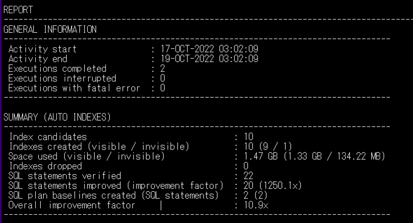
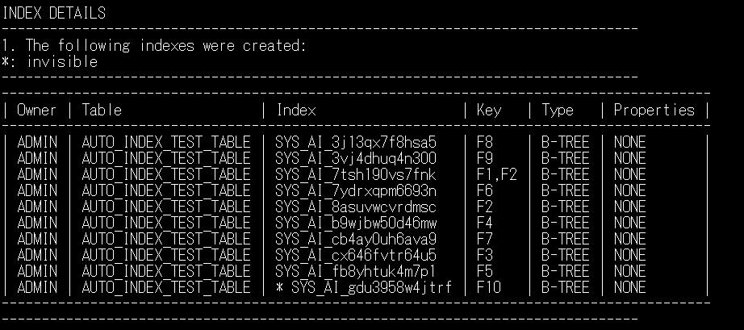
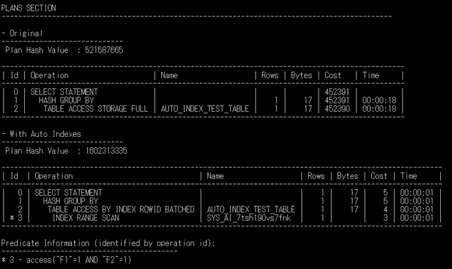
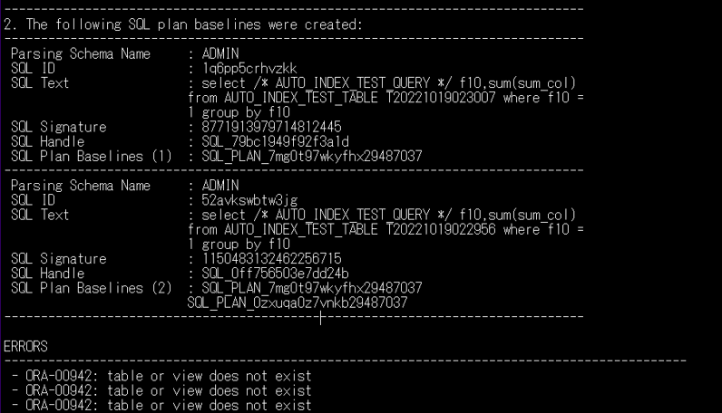

<a id="anchor0"></a>

# はじめに
索引を手動で作成するには、データモデル、アプリケーションの動作、データベース内のデータの特性などに関する専門的な知識が必要です。
以前は、DBAがどの索引を作成するかの選択を担当しており、修正や保守を行っていました。しかし、データベースが変更されても保守しきれないこともあり、不要な索引を使用することが性能上の障害となる可能性がありました。<br>
Autonomous Databaseではワークロードを監視して、自動的に索引の作成や削除などの管理を行う機能であるAutomatic Indexingが利用できます。
<br>
本記事では、ATPを作成したのちAutomatic Indexingを利用してみます。

<br>

**前提条件：**
+ ATPインスタンスが構成済みであること
    <br>※ATPンタンスの作成方法については、[ADBインスタンスを作成してみよう](../adb101-provisioning) を参照してください。
- **ワークロード・タイプ：** トランザクション処理
- **ECPU数：** 4
- **ストレージ：** 1024
- **CPU Auto Scaling：** 無効

それ以外の項目については、ご自身の環境や目的に合わせて選択してください。

<br>

**目次：**
- [1. スキーマ作成とAutomatic Indexingの有効化](#anchor1)
- [2. ワークロードの実行](#anchor2)
- [3. 自動索引のレポートを確認する](#anchor3)
- [4. 自動索引の削除とAutomatic Indexingの無効化](#anchor4)
- [おわりに](#おわりに)

<br>

**所要時間 :** 約1時間

<a id="anchor1"></a>


# 1. スキーマ作成とAutomatic Indexingの有効化
ここではテストスキーマを作成し、自動索引を有効化します。

## 1-1. SQL*PlusでADBに接続する

1. [SQL＊Plusを使った接続](../adb104-connect-using-wallet/#anchor3-1)を参考に、TeraTerm上でSQL＊Plusを用いて、ATPインスタンスに接続してください。<br>
接続する際のスキーマ名は**ADMIN**としてください。

    ここで、以前本チュートリアルを実施したことがある場合は、本章の4-1の手順2[自動索引の削除](../adb219-autoindexing/#anchor4-1-2)を行ってください。初めて行う場合は、次のステップに進んでください。

<br>

## 1-2. 索引作成の対象になる表の作成と登録
1. （本チュートリアルを初めて実施する場合は、次のステップに進んでください。)<br>すでに本チュートリアルを実施したことがあり、索引の作成の対象になる表が存在する場合は削除してください。

    ```sql
    declare
        ORA_00942 exception; pragma Exception_Init(ORA_00942, -00942);
    begin
        execute immediate 'drop table AUTO_INDEX_TEST_TABLE purge';
        exception when ORA_00942 then null;
    end;
    /
    ```

1. 表を作成し、自動索引を作成する準備をします。これは3分程度かかります。

    ```sql
    create table AUTO_INDEX_TEST_TABLE as
    select 1                sum_col,
        rownum              f1,
        mod(rownum,100000)  f2,
        mod(rownum,1000000) f3,
        mod(rownum,500000)  f4,
        mod(rownum,200000)  f5,
        mod(rownum,100000)  f6,
        mod(rownum,10000)   f7,
        mod(rownum,5000)    f8,
        mod(rownum,1000)    f9,
        mod(rownum,100)     f10,
        pad
    from   (select dbms_random.string('u',1000) pad from dual connect by level<=100) a,
        (select 1 c from dual connect by level<=100000) b;

    -- 統計情報は上記の表の作成時に生成されますが、統計情報を確実に最新のものにするため、以下を実行します。。
    -- 自動索引は、統計情報が古くなった表に対する新しい索引を考慮しません。

    exec dbms_stats.gather_table_stats('ADMIN','AUTO_INDEX_TEST_TABLE')
    ```

## 1-3. Autonomous Indexingの有効化
1. 自動索引にはモードに種類があり、**IMPLEMENT**, **REPORT ONLY**, **OFF**の3つとなっております。ここではモードをIMPLEMENTに設定して、自動索引を有効化します。

    ```sql
    exec dbms_auto_index.configure('AUTO_INDEX_MODE', 'IMPLEMENT')
    ```
<br>
DBMS_AUTO_INDEXパッケージの詳細については、[Database Administrator’s Guide, 21.7.3 Configuring Automatic Indexing in an Oracle Database](https://docs.oracle.com/en/database/oracle/oracle-database/19/admin/managing-indexes.html#GUID-A8B4BB05-2711-497A-8276-127076DAA518)をご確認ください。
<br>

    >**参考**
    >
    >現在Automatic Indexingが無効か有効かを確認するSQL文は、以下のようになります。無効の場合はAUTO_INDEX_MODEがOFFになっています。
    >```sql
    >set linesize 250
    >column parameter_name for a35
    >column parameter_value  for a20
    >column last_modified  for a30
    >column modified_by  for a15
    >select * from dba_auto_index_config;
    >```
<br>  

<a id="anchor2"></a>

# 2. ワークロードの実行

Automatic IndexingはワークロードのSQL文を実行し、新しい索引のパフォーマンスの効果を測定します。ここでは、このテストが動作するようにワークロードを生成します。

## 2-1. ワークロードの実行
1. ワークロードをAUTO_INDEX_TEST_TABLEの表で実行します。このSQL文では様々な条件を使用し、そのうちのいくつかは索引アクセスの恩恵を受けます。自動索引は、新しいワークロードのSQL文をなるべく早くテストし、少なくとも30日間は再度テストしません。SQL文を早くテストするため、以前本チュートリアルを実施した場合でも、以下のPL/SQLブロックで実行するたびに一意のSQL文を生成します。これは、タイムスタンプを組み込んだ表の別名を使って実行するためです。<br>
このワークロード用のSQL文は自動索引を作成させるために、複数回実行する必要があります。

    ```sql
    set serveroutput on
    declare
        qry varchar2(1000);
        talias  varchar2(30);
        n1  number;
        n2  number;
    begin
        for i in 1..10
        loop
            talias := 'T'||to_char(sysdate,'YYYYMMDDHH24MISS');
            qry := 'select /* AUTO_INDEX_TEST_QUERY */ f10,sum(sum_col) from AUTO_INDEX_TEST_TABLE '||talias||' where f'||i||' = 1 group by f10';
            execute immediate qry into n1,n2;
            execute immediate qry into n1,n2;
            execute immediate qry into n1,n2;
            dbms_output.put_line('QRY = '||qry);
            dbms_output.put_line('SUM = '||n2);
        end loop;
        qry := 'select /* AUTO_INDEX_TEST_QUERY */ f10,sum(sum_col) from AUTO_INDEX_TEST_TABLE '||talias||' where f1 = 1 and f2 = 1 group by f10';
        execute immediate qry into n1,n2;
        execute immediate qry into n1,n2;
        execute immediate qry into n1,n2;
        dbms_output.put_line('QRY = '||qry);
        qry := 'select /* AUTO_INDEX_TEST_QUERY */ f10,sum(sum_col) from AUTO_INDEX_TEST_TABLE '||talias||' where f1 = 1 and f2 = 1 group by f10';
        execute immediate qry into n1,n2;
        execute immediate qry into n1,n2;
        execute immediate qry into n1,n2;
        dbms_output.put_line('QRY = '||qry);
    end;
    /
    set serveroutput off
    ```
<br>

## 2-2. ワークロードの完了を待つ
Autonomous Databaseは、定期的（15分ごと）にAuto STS Capture Taskというメンテナンス・タスクで、ワークロードのSQL文をSYS_AUTO_STSというSQLチューニングセットに格納します。
このSQLチューニングセットは自動SQLチューニングセット（Automatic SQL Tuining Set(ASTS)）と呼ばれ、Automatic Indexingプロセスの対象となります。このプロセスはすべて自動で管理されており、新しい索引が表示されるのを待ちます。ワークロードが実行されるとどうなるのか、もう少し詳しく見てみましょう。

1. 次の文を使用して、Auto STS Capture Taskがいつ実行されたかを確認します。ワークロードのクエリが実行された後、Auto STS Capture Taskが実行されるまで待ちます。これには最大で15分かかります。

    ```sql
    select current_timestamp now from dual;

    select task_name,
            status,
            enabled,
            interval,
            last_schedule_time, 
            systimestamp-last_schedule_time ago 
    from dba_autotask_schedule_control 
    where dbid = sys_context('userenv','con_dbid') 
    and   task_name like '%STS%';
    ```

1. 上記のクエリを何回か実行し、"LAST_SCHEDULE_TIME"の列を見て、Auto STS Capture Taskが実行された時刻が変化するのを待ちます。あるいは"AGO"の列の値を見て、数秒前にタスクが実行されたことが表示されるまで待ちます。間隔は900秒なので、最大で15分待つ必要があります。

    

    上記画像に記載の時刻は例です。

1. しばらく待つと、自動SQLチューニングセットにワークロードのSQL文が格納されます。以下のクエリで確認できます。なお、以前本チュートリアルを実施したことがあれば、最新のSQL文だけでなく以前のワークロードのSQL文も表示されます。

    ```sql
    select sql_text 
    from   dba_sqlset_statements 
    where  sql_text like '%AUTO_INDEX_TEST_QUERY%'
    and    sqlset_name = 'SYS_AUTO_STS';
    ```
    

<br>

<a id="anchor3"></a>

# 3. 自動索引のレポートを確認する

Automatic Indexingのプロセスはすべて自動で管理されるため、ワークロードのSQL文がキャプチャされた後、新しい索引が作成されるのを待ちます。
その後に自動索引のレポートを確認します。

## 3-1. Automatic Indexingの完了を待つ
1. Automatic IndexingのプロセスはAuto Index Taskというタスクで実行されます。以下のクエリを使用して、Auto Index Taskが最近実行されたかどうかを確認できます。
ワークロードのクエリが取り込まれた後、タスクが実行されるまで待つ必要があります。これには最大で15分かかります。

    ```sql
    select current_timestamp now from dual;

    select task_name,
            status,
            enabled,
            interval,
            last_schedule_time, 
            systimestamp-last_schedule_time ago 
    from dba_autotask_schedule_control 
    where dbid = sys_context('userenv','con_dbid') 
    and   task_name = 'Auto Index Task';
    ```
<br>

## 3-2. 自動索引のレポートの作成
1. レポートの作成は、最後に実行されたAuto Index Taskを対象にするか、または対象の期間を指定して実行することができます。
この例では最後に実行されたAuto Index Taskを対象に、すべてのセクションの詳細まで含むレポートを生成します。
    ```sql
    set linesize 300
    set trims on
    set pagesize 1000
    set long 10000000
    column report format a120
    var rep clob

    exec :rep := dbms_auto_index.report_last_activity(section=>'ALL',level=>'ALL') 
    spool report
    select :rep report from dual;
    spool off
    ```
1. 次は期間を指定した例です。この場合は2日間をさかのぼって見ることができます。

    ```sql
    set linesize 300
    set trims on
    set pagesize 1000
    set long 10000000
    column report_hist format a120
    var rep clob

    exec :rep := dbms_auto_index.report_activity(activity_start=>sysdate-2,section=>'ALL',level=>'ALL') 
    spool report_hist
    select :rep report from dual;
    spool off
    ```
<br>

## 3-3. 自動索引のレポートを見る
1. レポートの概要は、次のようになります。

    

    結果は測定されたワークロードのパフォーマンスに依存し、相対的なSQL文のパフォーマンスは時間の経過とともに変化する可能性があるため、レポートによって相違がある場合があります。

    上記のレポートでは、例えば以下のことが確認できます。

    ・10個の索引（上記画像のSUMMARYの1行目)の候補が挙がっています。Automatic Indexingでは、クエリの条件で使用される表の列が特定されます。これらの列は索引の作成の候補となります。一般に、Automatic Indexingでは多くの候補を生成します。

    ・ワークロードのうちの20個のクエリ(上記画像のSUMMARYの下から3行目)で、新しい索引による性能の向上が見られます。

    ・ワークロードのクエリによっては、新しいAutomatic Indexingが原因でパフォーマンスが低下する可能性があります。これを防止するために、SQL文の実行計画のベースラインが2つ(上記画像のSUMMARYの下から2行目)作成されています。

1. 作成された索引はレポートに記載されます。

    

    自動索引の索引名はSYS_AI_～から始まります。

1. 詳細のレポートではSQL文の実行計画など、個々のSQL文のパフォーマンスの向上が一覧で表示されます。

    

    

1. レポートにはSQL文の実行計画のベースラインの詳細と、エラーのセクションが含まれています。最終セクションで ORA-00942: table or view does not exist のエラーが発生することがよくあります。これは正常で、表やビューに対するワークロードのクエリが読み込まれた後に対象となる表やビューが削除されたことを表しています。

    

<br>

<a id="anchor4"></a>

# 4. 自動索引の削除とAutomatic Indexingの無効化

## 4-1. 自動索引の削除
1. 以下のクエリを使用し、作成された自動索引を確認することができます。

    ```sql
    set linesize 250 trims on
    column column_name format a20
    column table_name format a25
    column table_owner format a30
    column index_name format a30

    break on index_name
    SELECT c.index_name,c.table_name,c.column_name,c.column_position, i.visibility, i.status
    FROM   user_ind_columns c , user_indexes i
    WHERE  c.index_name = i.index_name
    AND    i.auto = 'YES'
    ORDER BY c.table_name,c.index_name,c.column_position;
    ```
<a id="anchor4-1-2"></a>
1. 作成された自動索引をすべて削除します。自動索引の削除にDROP INDEX文は使用できません。DBMS_AUTO_INDEXパッケージを使用する必要があります。allow_recreateをTRUEに設定すると（3番目のパラメータ）、ワークロードにメリットがある場合、同じ列索引を再び作成できます。本チュートリアルを再度実施する場合、このコマンドを実行する必要があります。ここでFALSEを使用しても、後からTRUEに変更できます。

    ```sql
    exec dbms_auto_index.drop_auto_indexes('ADMIN',null,true)
    ```
    >**補足**
    >
    >なお、個別で自動索引を指定して削除することも可能です。[PL/SQLパッケージおよびタイプ・リファレンス, 30 DBMS_AUTO_INDEDX](https://docs.oracle.com/cd/F19136_01/arpls/DBMS_AUTO_INDEX.html)をご確認ください。

<br>

## 4-2. Automatic Indexingを無効化する
1. Automatic Indexingを無効化します。
    ```sql
    exec dbms_auto_index.configure('AUTO_INDEX_MODE', 'OFF')
    ```

<a id="おわりに"></a>

# おわりに
本チュートリアルでは、Automatic Indexingの利用方法を紹介しました。
専門的な知識がなくても、効率的に索引の管理ができることが体験できました。この機能を使うことで、性能向上が期待できる索引の自動作成、および不要な索引を使用することによる性能上の障害を防ぐことが可能になります。

<br>

# 参考資料
+ LiveLabs [Automatic Indexing for Oracle Autonomous Database](https://apexapps.oracle.com/pls/apex/r/dbpm/livelabs/run-workshop?p210_wid=3328&p210_wec=&session=16116036714220)

    このLivelabsのLab5: View Automatic Indexing Detailsでは、本チュートリアルでは行わなかったスキーマ指定の方法や、作成された自動索引の詳細確認、Automatic Indexingのアクション詳細確認にも触れています。

+ [Database Administrator’s Guide, 21.7 Managing Automatic Indexes](https://docs.oracle.com/en/database/oracle/oracle-database/19/admin/managing-indexes.html#GUID-D1285CD5-95C0-4E74-8F26-A02018EA7999)


以上で、この章は終了です。  
次の章にお進みください。

<br>

[ページトップへ戻る](#anchor0)
