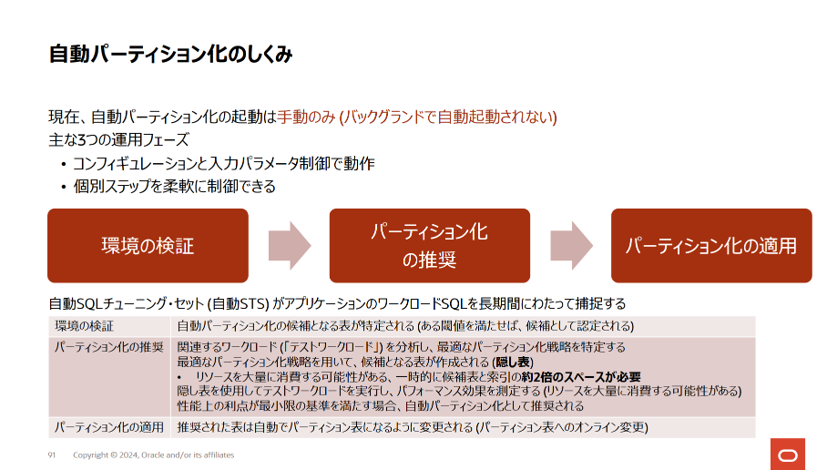
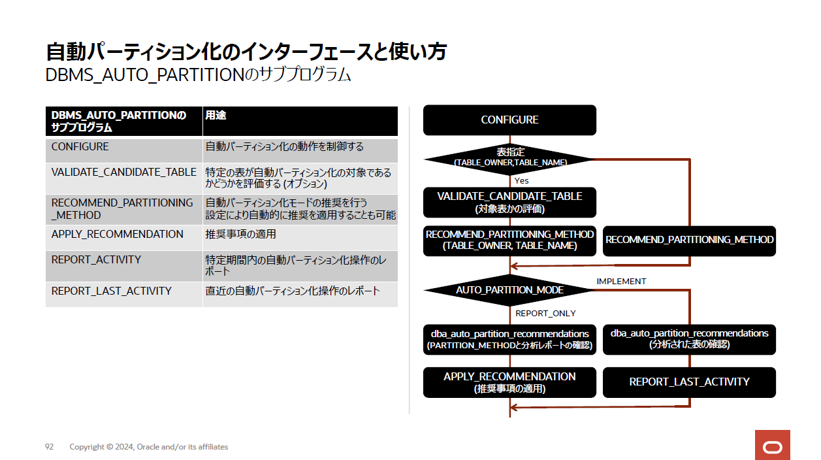
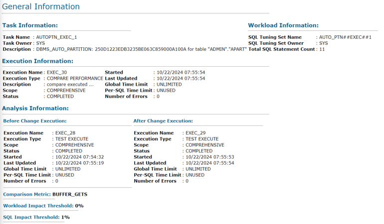
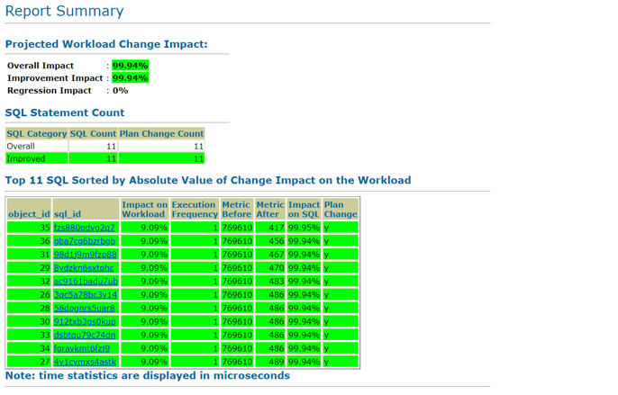
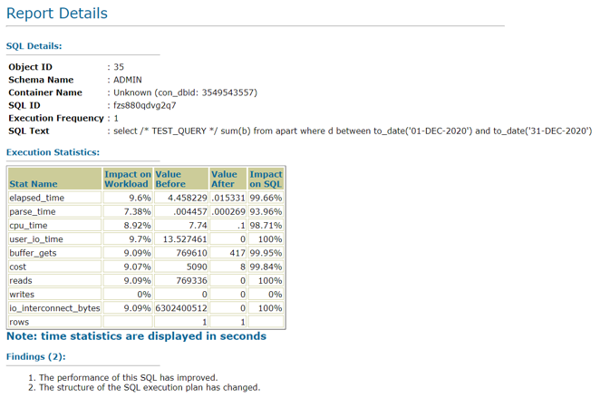

<a id="anchor0"></a>

# はじめに
自動パーティション化は、Autonomous Databaseで提供されている自動的に表や索引をパーティション化することができる機能です。
APIとして**DBMS_AUTO_PARTITION**パッケージが提供されており、3つの運用フェーズを手動で実行します。

   

   
   
本チュートリアルでは、非パーティション表を作成し、それを対象に自動パーティション化を実行します。

**前提条件 :**
 + バージョンが19cのAutonomous Databaseインスタンスが構成済みであること  
   ADBインタンスの作成方法については、[「101:ADBインスタンスを作成してみよう」](../adb101-provisioning){:target="_blank"} を参照ください。
 + Always FreeまたはDeveloper ADBインスタンスを利用すること  
     自動パーティション化の対象は表のサイズがAlways Free/DeveloperADBインスタンスでは5GB以上、商用ADBインスタンスでは64GB以上である必要があります。商用ADBインスタンスの場合は5GBを64GBに置き換えてください。
  + SQLコマンドを実行するユーザー・インタフェースはSQL\*Plusを利用すること  
    環境は、[「204:開発者向け仮想マシンのセットアップ方法」](../adb204-setup-VM/){:target="_blank"} で作成できます。また、ADBへの接続方法は [「104: クレデンシャル・ウォレットを利用して接続してみよう」](../adb104-connect-using-wallet){:target="_blank"} を参照ください。
 + ユーザーはADMINユーザーで実行すること  
    Autonomous Databaseへの接続文字列は「atpdev01_medium」、各ユーザのパスワードはすべて「Welcome12345#」とします。
 
**所要時間 :** 約30分（Developerインスタンスの場合）

<BR>

# 1. 環境の準備
まず、本チュートリアルで使用するAlways FreeインスタンスまたはDeveloperインスタンスを作成します。構成は以下のとおりです。

 + 表示名 : ATPDEV01
 + データベース名 : ATPDEV01
 + ワークロード・タイプ : トランザクション処理
 + デプロイメント・タイプ : サーバーレス
 + Always Freeの構成オプションのみを表示また開発者のどちらか：オン
 + データベース・バージョンの選択 : 19c
 + 管理者資格証明の作成 : Welcome12345#
 + ネットワーク・アクセスの選択 : 任意
 
<br>

# 2. 非パーティション表の作成
自動パーティショション化の対象となるサンプル表APARTを作成します。ADMINユーザーで接続し、次のスクリプトを実行します。

```sql
sqlplus admin/Welcome12345#@atpdev01_medium
-- 既存のAPART表があれば削除
drop table APART purge;
-- APART表の作成    
create table apart (
        a   number(10), 
        b   number(10), 
        c   number(10), 
        d   date, 
        pad varchar2(1000));

-- データを作成
insert /*+ APPEND */ into apart
with
r as ( select /*+ materialize */ dbms_random.string('x',500) str 
     from dual connect by level <= 2000 ),
d as ( select /*+ materialize */ to_date('01-JAN-2020') + mod(rownum,365) dte 
     from dual connect by level <= 2500 ),
m as ( select 1 
     from dual connect by level <= 2 )
select /*+ leading(m d r) use_nl(d r) */
rownum, rownum, rownum, dte, str
from m,d,r;
-- commit
commit;
```


実行後サイズを確認します。サイズは5GB以上である必要があります。

```sql
-- サイズの確認
select sum(bytes)/(1024*1024) size_in_megabytes from   user_segments where  segment_name = 'APART';
```


結果は以下でした。5GB以上であることが確認できました。
```sql
SQL> select sum(bytes)/(1024*1024) size_in_megabytes from   user_segments where  segment_name = 'APART';

SIZE_IN_MEGABYTES
-----------------
        6020.0625
```

> **Note:**  
> スクリプトの以下の部分の数値を大きくすると作成される表のサイズが大きくなります。後の操作で一時的に1.5倍程度領域を必要になることに注意して、必要に応じて適切なサイズになるよう調整してください。  
>※Always Free/Developerインスタンスはストレージの上限が20GBです。
>
> from dual connect by level <= **2** 
>

<br>

# 3. 自動パーティション化の対象になるかを検証
作成したAPART表が自動パーティション化の対象になるかを検証します。検証に合格するためには[こちらのドキュメントに記載されている条件](https://docs.oracle.com/cd/E83857_01/paas/autonomous-database/serverless/adbsb/ref-dbms_auto_partition-package.html#GUID-FFB58355-5A90-4506-AF5F-8615A0A3CCEF){:target="_blank"}を満たす必要があります。  
検証にはDBMS_AUTO_PARTITIONパッケージの**VALIDATE_CANDICATE_TABLE**ファンクションを利用します。

```sql
set serveroutput on

 declare
 ret varchar2(1000);
 begin
     ret := dbms_auto_partition.validate_candidate_table (table_owner=>user,table_name=>'APART');
     dbms_output.put_line(' ');
     dbms_output.put_line(' ');
     dbms_output.put_line('Auto partitioning validation: ' || ret);
 end;
 /
```

結果は次のとおりです。  
まだワークロードを実行していないので、SQLチューニングセットの情報がなく（5つ以上のクエリが必要）INVALIDになりました。

```
Auto partitioning validation: INVALID: table is referenced by 0 full table scan
queries in the SQL tuning set; 5 queries required

PL/SQL procedure successfully completed.
```

ワークロードはこれから実行するので問題ありませんが、サイズが不足している場合や統計情報が不備の場合も以下のようにINVALIDとなります。  
その場合はサイズの調整を行う、統計情報の取得を行うまたは自動取得されるまで待機します。

+ サイズが不足している場合のメッセージ  

```
Auto partitioning validation: INVALID: table is too small (0 GB actual, 5 GB required)

PL/SQL procedure successfully completed.
```

+ 統計情報が不足している場合のメッセージ

```
Auto partitioning validation: INVALID: table statistics are stale

PL/SQL procedure successfully completed.
```

<br>

# 4. ワークロードの実行
作成したAPART表にワークロードを実行します。以下のSQLを実行します。

```sql
 select /* TEST_QUERY */ sum(a) from apart where d between to_date('01-MAR-2020') and to_date('05-mar-2020');
 select /* TEST_QUERY */ sum(a) from apart where d = to_date('01-MAR-2020');
 select /* TEST_QUERY */ sum(b) from apart where d between to_date('01-JAN-2020') and to_date('05-JAN-2020');
 select /* TEST_QUERY */ sum(c) from apart where d between to_date('01-APR-2020') and to_date('05-APR-2020');
 select /* TEST_QUERY */ sum(a) from apart where d between to_date('01-JUN-2020') and to_date('02-JUN-2020');
 select /* TEST_QUERY */ sum(b) from apart where d between to_date('01-DEC-2020') and to_date('31-DEC-2020');
 select /* TEST_QUERY */ sum(a) from apart where d between to_date('01-AUG-2020') and to_date('31-AUG-2020');
 select /* TEST_QUERY */ sum(b) from apart where d between to_date('01-OCT-2020') and to_date('01-OCT-2020');
 select /* TEST_QUERY */ sum(c) from apart where d between to_date('01-FEB-2020') and to_date('05-FEB-2020');
 select /* TEST_QUERY */ sum(a) from apart where d between to_date('01-MAY-2020') and to_date('02-MAY-2020');
 select /* TEST_QUERY */ avg(a) from apart where d between to_date('01-JUL-2020') and to_date('02-JUL-2020');
 ```

Autonomous Databaseでは15分毎に定期的にワークロード情報をキャプチャするタスクが動作します。
実行したワークロードの情報が取得されたかどうかを最後に動作したタスクの時刻で確認します。

```sql
set line 200
col task_name for a30
col last_schedule_time for a40
-- 現在の時刻を確認(A)
select current_timestamp now from dual;
-- 最後に動作したタスクの時刻を確認(B)：LAST_SCHEDULE_TIMEがAの時刻を過ぎるまで繰り返して確認する
 select task_name,
        status,
        enabled,
        interval,
        last_schedule_time, 
        systimestamp-last_schedule_time ago 
 from dba_autotask_schedule_control 
 where dbid = sys_context('userenv','con_dbid') 
 and   task_name like '%STS%';
```

(B)のSQLを実行した結果です。LAST_SCHEDULE_TIME列の値が(A)の時刻を過ぎていればワークロード後にタスクが動作しています。

```sql
TASK_NAME                      STATUS     ENABL   INTERVAL LAST_SCHEDULE_TIME                       AGO
------------------------------ ---------- ----- ---------- ---------------------------------------- ---------------------------------------------------------------------------
Auto STS Capture Task          SUCCEEDED  TRUE         900 18-OCT-24 08.32.13.501 AM +00:00         +000000000 00:01:29.538015
sql
```

次に自動SQLチューニングセットに実行したワークロードのクエリが存在するか確認します。  
クエリのコメント/* TEST_QUERY */を利用してDBA_SQLSET_STATEMENTSビューを検索します。

```sql
select sql_text 
 from   dba_sqlset_statements 
 where  sql_text like '%TEST_QUERY%'
 and    sqlset_name = 'SYS_AUTO_STS';
```

以下のようにSQL_TEXT列で実行したクエリを確認できればOKです。

```sql
SQL_TEXT
--------------------------------------------------------------------------------
 select /* TEST_QUERY */ sum(a) from apart where d between to_date('01-JUN-2020
 select /* TEST_QUERY */ sum(c) from apart where d between to_date('01-APR-2020
select /* TEST_QUERY */ sum(a) from apart where d between to_date('01-MAR-2020'
 select /* TEST_QUERY */ avg(a) from apart where d between to_date('01-JUL-2020
:
11 rows selected.
```

<br>

# 5. 自動パーティション化の対象になるかを再検証
ワークロード情報が取得されていることを確認できたので、改めて自動パーティション化の対象になるかを検証します。
再度以下のSQLを実行します。

```sql
set serveroutput on

 declare
 ret varchar2(1000);
 begin
     ret := dbms_auto_partition.validate_candidate_table (table_owner=>user,table_name=>'APART');
     dbms_output.put_line(' ');
     dbms_output.put_line(' ');
     dbms_output.put_line('Auto partitioning validation: ' || ret);
 end;
 /
```

結果は次のとおりVALIDとなりました。

```
Auto partitioning validation: VALID

PL/SQL procedure successfully completed.
```

<br>

# 6.自動パーティション化の実行
検証が成功したので、自動パーティション化を実行します。  

## 6-1. 自動パーティション化の構成オプションの設定
まず自動パーティション化の構成を設定します。構成にはDBMS_AUTO_PARTITIONパッケージの**CONFIGURE**プロシージャを使用します。

```sql
-- 自動パーティション化の設定を構成
exec dbms_auto_partition.configure('AUTO_PARTITION_MODE','REPORT ONLY');
```

実行結果はこちらのようになります。

```sql
SQL> exec dbms_auto_partition.configure('AUTO_PARTITION_MODE','REPORT ONLY');

PL/SQL procedure successfully completed.
```

ここでは操作モードを設定するパラメータAUTO_PARTITION_MODEをREPORT_ONLYで設定しています。他の操作モードは以下があります。

+ IMPLEMENT   : 推奨事項の生成と推奨パーティション方法によるパーティション化を実施する
+ REPORT ONLY : 推奨事項の生成のみ（デフォルト）
+ OFF         : 新しい推奨事項の生成と推奨パーティション方法によるパーティション化実施を無効にする

そのほかのCONFIGUREプロシージャのパラメータは[こちら](https://docs.oracle.com/cd/E83857_01/paas/autonomous-database/serverless/adbsb/ref-dbms_auto_partition-package.html#GUID-D16AEDE8-FF7B-49A8-B58D-A47F2E73D4F1){:target="_blank"}を参照ください。


## 6-2 パーティション化の推奨事項の生成
次にパーティション化の推奨事項を生成するために、DBMS_AUTO_PARTITIONパッケージの**RECOMMENDED_PARTITION_METHOD**ファンクションを実行します。  
本チュートリアルでは表を指定してパーティション化をしますが、自動取得されているワークロードを対象にパーティション化対象になる表を検索し推奨事項を生成することも可能です。パラメータの詳細については[こちら](https://docs.oracle.com/cd/E83857_01/paas/autonomous-database/serverless/adbsb/ref-dbms_auto_partition-package.html#GUID-A07E1888-33A5-4883-BE09-550CF176385D){:target="_blank"}をご参照ください。

```sql
 set timing on
 set serveroutput on
 
 declare
   r raw(100);
   cursor c1 is
        select partition_method, partition_key, report
        from   dba_auto_partition_recommendations
        where recommendation_id = r;

 begin
  -- 推奨事項の生成
    r :=
       dbms_auto_partition.recommend_partition_method(
        table_owner    => 'ADMIN',  --対象の表を所有するスキーマ
        table_name     => 'APART',  -- 対象の表の名前
        report_type    => 'TEXT',   -- 生成するレポートの書式
        report_section => 'ALL',    -- レポートに含めるセクション
        report_level   => 'ALL');   -- レポートに含める情報のレベル

 for c in c1
 loop
  -- 推奨事項のRECOMMENDATION_ID、PARTITION_KEY、PARTITION_METHOD、PARTITION_KEYを表示
    dbms_output.put_line('=============================================');
    dbms_output.put_line('ID:     '||r);
    dbms_output.put_line('Method: '||c.partition_method);
    dbms_output.put_line('Key   : '||c.partition_key);
    dbms_output.put_line('=============================================');
 end loop;

 end;
 /
```

実行した結果はこちらのようになります。  

```
=============================================
ID:     250D1223EDB3235BE063C859000A100A
Method: LIST(SYS_OP_INTERVAL_HIGH_BOUND("D", INTERVAL '1' MONTH, TIMESTAMP '2020-01-01 00:00:00')) AUTOMATIC
Key   : D
=============================================
Elapsed: 00:02:54:63
```
  
RECOMMENDATION_IDと、パーティション方法はLIST AUTOMATIC、PARTITION_KEYはD列という推奨事項が生成されたことがわかります。  
RECOMMENDATION_IDは、あとで推奨事項を実装するときに使用します。

> **Note:**  
> 自動パーティション化では単一レベルのパーティション化と組み合わせた単一列のパーティション・キーが使用されます。また、推奨されるパーティション方法は以下からとなります。複数列パーティションやコンポジット・パーティションは含まれません。
> + AUTOMATIC INTERVAL
> + LIST AUTOMATIC
> + HASH
  
<br>

# 7. 推奨事項の確認
生成された推奨事項は都度、データベースに保存され、**DBA_AUTO_PARTITION_RECOMMENDATIONS**ビューで確認することができます。

## 7-1 推奨事項の表示
例えば、以下のスクリプトを実行すると最新の推奨事項のパーティション方法とパーティション・キーを表示させることができます。

```sql
set linesize 180
column partition_method format a100
column partition_key format a13
-- 最新の推奨事項のRECOMMENDATION_IDとパーティション方法とパーティション・キーを表示
select recommendation_id,partition_method,partition_key 
from dba_auto_partition_recommendations
where generate_timestamp = 
  (select max(generate_timestamp) 
   from   dba_auto_partition_recommendations);
```
  
結果は次のように表示されます。

```sql
RECOMMENDATION_ID                PARTITION_METHOD                                                                                     PARTITION_KEY
-------------------------------- ---------------------------------------------------------------------------------------------------- -------------
250D1223EDB3235BE063C859000A100A LIST(SYS_OP_INTERVAL_HIGH_BOUND("D", INTERVAL '1' MONTH, TIMESTAMP '2020-01-01 00:00:00')) AUTOMATIC D
```
 
## 7-2 推奨事項レポートのファイル出力
またDBMS_AUTO_PARTITIONパッケージの**REPORT_ACTIVITY**ファンクションと**REPORT_LAST_ACTIVITY**ファンクションを利用すると、期間や形式を選択してレポートをファイル出力することができます。指定できるパラメータについては[こちら](https://docs.oracle.com/cd/E83857_01/paas/autonomous-database/serverless/adbsb/ref-dbms_auto_partition-package.html#GUID-E5ADABC6-7EE8-40C4-82F4-FBBC70FF3167){:target="_blank"}をご参照ください。  
例えば、次のSQLは最新の推奨事項のレポートを出力します。

```sql
set trimspool on
set trim on
set pages 0
set linesize 1000
set long 1000000
set longchunksize 1000000
set heading off
set feedback off
-- spool <ファイル名>で結果をautoPartitionFInding.htmlに出力
spool autoPartitionFinding.html
-- HTML書式で出力するように指定。レポートのセクションや情報レベルの明示的な指定も別パラメータにより可能
select dbms_auto_partition.report_last_activity(type=>'HTML') from dual;
exit;
```

上記で出力されたファイルをブラウザで確認してみます。  
レポートの構成は次の通りです。レポートのセクションや情報レベルを明示的に指定しなかったため、デフォルト(セクション=ALL、レベル=TYPICAL)での出力となっています。

+ **General Information**：パーティション化分析で実施したパフォーマンス評価テストの情報

     

+ **Report Summary**：パーティション化によるワークロードに対するパフォーマンス影響のサマリ

     

+ **Report Details**：ワークロードの各SQLでパーティション化前後を比較したパフォーマンス情報

     
  
  Report Detailsでは、各SQLのパーティション化前後の実行計画も確認することができます。

     

## 7-3 推奨事項の実装で適用されるDDLの確認
生成された推奨事項の実装で適用されるDDLもDBA_AUTO_PARTITION_RECOMMENDATIONビューで確認することができます。確認したDDLは推奨事項の生成を行ったデータベースとは別のデータベースに推奨を適用する場合に利用します。
以下のSQLを実行します。

```sql
set long 100000
set pages 0

select modify_table_ddl 
from  dba_auto_partition_recommendations
where generate_timestamp = 
   (select max(generate_timestamp) 
    from   dba_auto_partition_recommendations)
order by recommendation_seq;
```

次のような結果を得ることができます。
```sql
MODIFY_TABLE_DDL
--------------------------------------------------------------------------------
begin
  -- DBMS_AUTO_PARTITION recommendation_ID '250D1223EDB3235BE063C859000A100A'
  --   for table "ADMIN"."APART"
  --   generated at 10/22/2024 07:55:19

  dbms_auto_partition.begin_apply(expected_number_of_partitions => 13);

  execute immediate
'alter table "ADMIN"."APART"
 modify partition by
LIST(SYS_OP_INTERVAL_HIGH_BOUND("D", INTERVAL ''1'' MONTH, TIMESTAMP ''2020-01-0
1 00:00:00'')) AUTOMATIC (PARTITION P_NULL VALUES(NULL))
 auto online parallel';

  dbms_auto_partition.end_apply;
exception when others then
  dbms_auto_partition.end_apply;
  raise;
end;
```

<br>

# 8. 推奨事項の適用
推奨されたパーティション化はRECOMMENDATION_IDを指定してDBMS_AUTO_PARTITIONパッケージの**APPLY_RECOMMENDATION**プロシージャで適用することができます。   

```sql
set timing on
-- RECOMMENDATION_IDを引数に設定
exec dbms_auto_partition.apply_recommendation('250D1223EDB3235BE063C859000A100A');
```
RECOMMENDATION_IDは["6-2 パーティション化の推奨事項の生成"](#6-2-パーティション化の推奨事項の生成)で使用したRECOMMEND_PARTITION_METHODファンクションの戻り値です。["7-1 推奨事項の表示"](#7-1-推奨事項の表示)のようにDBA_AUTO_PARTITION_RECOMMENDATIONSビューで確認することができます。

実行結果はこちらのようになります。
```sql
SQL> set timing on
SQL> exec dbms_auto_partition.apply_recommendation('250D1223EDB3235BE063C859000A100A');

PL/SQL procedure successfully completed.

Elapsed: 00:00:44.91
```
> **Note:**  
> 推奨事項の適用はオフピーク時/閑散期に実行することを推奨しています。パーティション化によるCPUやIOリソースの使用や、対象の表に行われているDML操作に応じて、表のサイズに1.5倍程度の空き領域が必要とされるためです。  

APART表がパーティション化されているどうかを次のSQLで確認します。
```sql
set trims on
set linesize 200
set pages 40
column table_name format a20
column column_name for a30
column apply_timestamp_start for a30
column apply_timestamp_end for a30
column partition_name format a20
column segment_name format a15

-- dba_part_tablesのauto列：自動パーティション化によるパーティション化を判別するための列
select t.auto,t.partitioning_type,c.column_name
from dba_part_tables t, dba_part_key_columns c
where t.owner='ADMIN' and t.table_name='APART'
and t.owner=c.owner and t.table_name=c.name;

-- USER_SEGMENTSビューでパーティション名とタイプ、サイズを確認
select segment_name,
       partition_name,
       segment_type,
       bytes/(1024*1024) mb
from   user_segments
where segment_name='APART'
order by partition_name;

-- パーティション化された日時を確認
select apply_timestamp_start,apply_timestamp_end 
from dba_auto_partition_recommendations
where table_owner='ADMIN' and table_name='APART';
```
  
実行結果は次のとおりです。APART表が13個のパーティションでパーティション化されていることが確認できました。
```sql

SQL> select t.auto,t.partitioning_type,c.column_name
  2  from dba_part_tables t, dba_part_key_columns c
  3  where t.owner='ADMIN' and t.table_name='APART'
  4  and t.owner=c.owner and t.table_name=c.name;

AUT PARTITION COLUMN_NAME
--- --------- ------------------------------
YES LIST      ORA_PART_KEY_FB21B1C06545B8BF

SQL> select segment_name,
  2         partition_name,
  3         segment_type,
  4         bytes/(1024*1024) mb
  5  from   user_segments
  6  where segment_name='APART'
  7  order by partition_name;

SEGMENT_NAME    PARTITION_NAME       SEGMENT_TYPE               MB
--------------- -------------------- ------------------ ----------
APART           P_NULL               TABLE PARTITION         .0625
APART           SYS_P897             TABLE PARTITION           456
APART           SYS_P898             TABLE PARTITION           528
APART           SYS_P899             TABLE PARTITION           512
APART           SYS_P900             TABLE PARTITION           440
APART           SYS_P901             TABLE PARTITION           528
APART           SYS_P902             TABLE PARTITION           527
APART           SYS_P903             TABLE PARTITION           496
APART           SYS_P904             TABLE PARTITION           528
APART           SYS_P905             TABLE PARTITION           512
APART           SYS_P906             TABLE PARTITION           528
APART           SYS_P907             TABLE PARTITION           512
APART           SYS_P908             TABLE PARTITION           531

SQL> select apply_timestamp_start,apply_timestamp_end
  2  from dba_auto_partition_recommendations
  3  where table_owner='ADMIN' and table_name='APART'

APPLY_TIMESTAMP_START          APPLY_TIMESTAMP_END
------------------------------ ------------------------------
28-OCT-24 06.03.57.295050 AM   28-OCT-24 06.04.33.073641 AM

```

<BR>

# おわりに
本チュートリアルでは自動パーティション化という機能をご紹介しました。  
ワークロードとスキーマを人が分析しなくても最適なパーティション方法を実装することができます。  
なお、実環境を対象にして自動パーティション化を使用するときには本番データベースではなく、クローンなど別のデータベースで自動パーティション化を使用することが推奨となります。パフォーマンス評価で内部に作成した補助表に対しワークロードを実行するため、CPUとIOリソースを大量に利用すること、また領域も一時的に表の1～1.5倍追加で必要となるからです。ご留意ください。

<BR>

# 参考資料

+ 『Oracle Autonomous Databaseサーバーレスの使用』["Autonomous Databaseでの自動パーティション化の管理"](https://docs.oracle.com/cd/E83857_01/paas/autonomous-database/serverless/adbsb/mdw-managing-automatic-partitioning-autonomous-database.html#GUID-03973BB7-BD09-4E5E-B47F-430D7CC949D6){:target="_blank"}

+ [津島博士のパフォーマンス講座 Oracle Partitioingの基本と最新情報](https://speakerdeck.com/oracle4engineer/technology-night78-oracle-partitioning){:target="_blank"}

+ [Livelabs:Automatic Partitioning in Autonomous Database](https://apexapps.oracle.com/pls/apex/dbpm/r/livelabs/view-workshop?wid=935){:target="_blank"}


以上でこの章は終了です。次の章にお進みください。
  
<BR>

[ページトップへ戻る](#anchor0)
