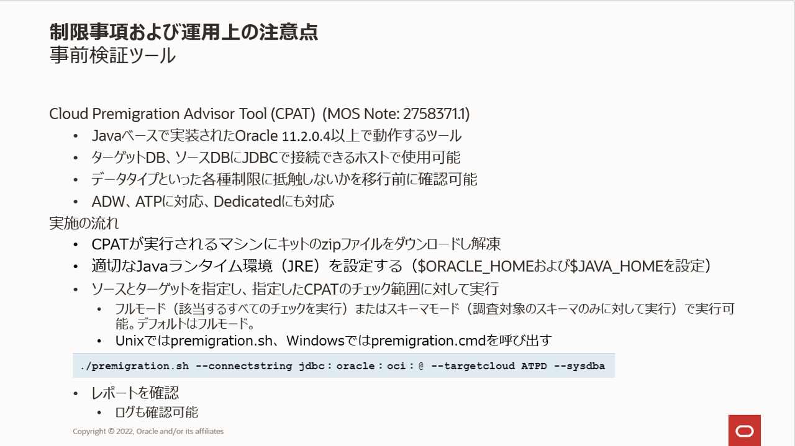
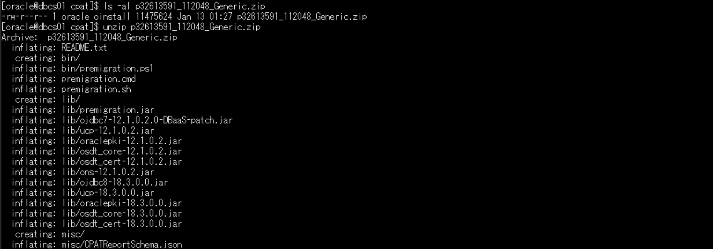
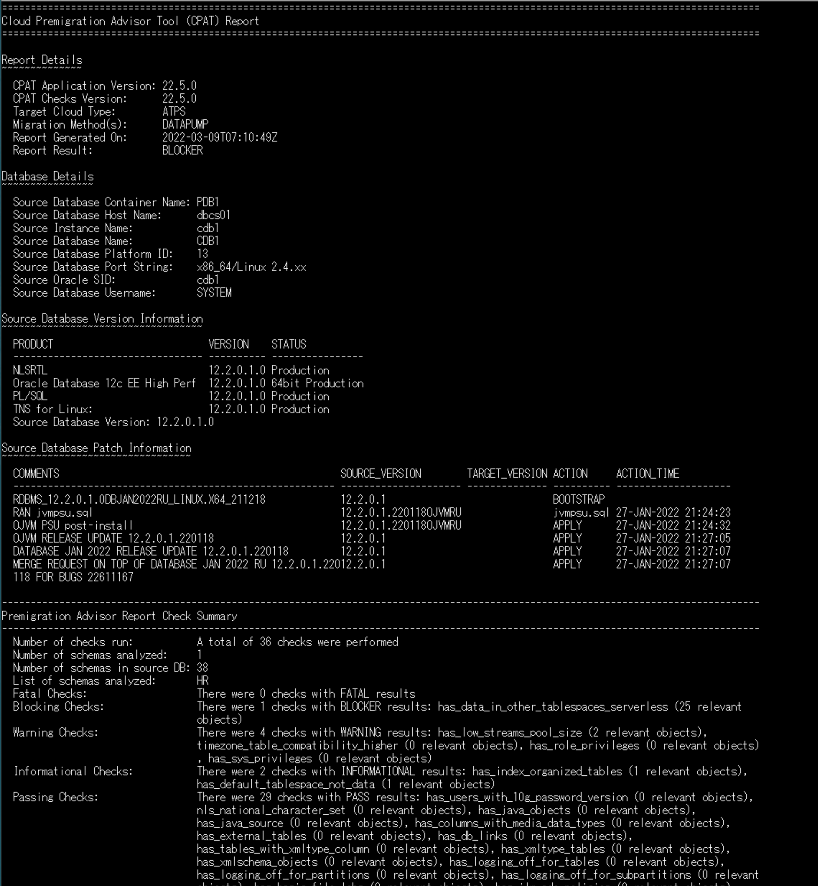
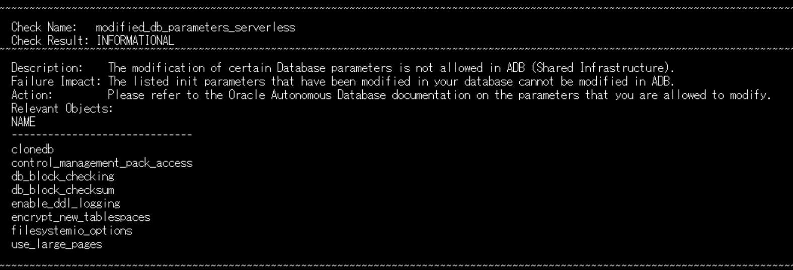

<a id="anchor0"></a>

# はじめに

Autonomous Databaseでは性能・可用性・セキュリティの観点から特定のデータベースオブジェクトの作成が制限されています。

具体的な制限事項は[マニュアル](https://docs.oracle.com/en/cloud/paas/autonomous-database/serverless/adbsb/migration-autonomous-database.html#GUID-F2471136-3BBA-462C-9E5B-12A144AD7D56)に記載がございますが、これら制限対象のオブジェクトを利用しているかなどを確認するために、オラクルはCloud Premigration Advisor Tool(CPAT)というツールを提供しています。


   


この章では先の[301: 移行元となるデータベースを作成しよう](../adb301-create-source-db)にて事前に作成しておいたDBCSインスタンスを利用して、CPATの使い方を紹介します。

<BR>

**目次 :**
  + [1.Cloud Premigration Advisor Tool(CPAT)とは？](#1-cloud-premigraiton-advisor-tool-cpat-%E3%81%A8%E3%81%AF)
  + [2.事前準備](#2-%E4%BA%8B%E5%89%8D%E6%BA%96%E5%82%99)
    + [2-1.CPATを実行するホストの準備](#2-1-cpat%E3%82%92%E5%AE%9F%E8%A1%8C%E3%81%99%E3%82%8B%E3%83%9B%E3%82%B9%E3%83%88%E3%81%AE%E6%BA%96%E5%82%99)
    + [2-2.ツールのダウンロード](#2-2-%E3%83%91%E3%83%83%E3%82%B1%E3%83%BC%E3%82%B8%E3%81%AE%E3%83%80%E3%82%A6%E3%83%B3%E3%83%AD%E3%83%BC%E3%83%89)
    + [2-3.環境変数の設定](#2-3-%E7%92%B0%E5%A2%83%E5%A4%89%E6%95%B0%E3%81%AE%E8%A8%AD%E5%AE%9A)
  + [3.実行と結果確認](#3-%E5%AE%9F%E8%A1%8C%E3%81%A8%E7%B5%90%E6%9E%9C%E7%A2%BA%E8%AA%8D)


<BR>

**前提条件 :**
 + My Oracle Supportへのログイン・アカウントを保有していること
 + [301: 移行元となるデータベースを作成しよう](../adb301-create-source-db)を完了していること

<BR>

**所要時間 :** 約30分

<BR>
----

# 1. Cloud Premigraiton Advisor Tool (CPAT) とは？
Oracle DatabaseインスタンスをOracleクラウドに移行する際に、問題になる可能性があるコンテンツや移行を妨げる可能性があるその他の要因をチェックするJavaベースのツールです。移行チェックのツールとして以前提供されていたスキーマ・アドバイザの後継となります。  
スキーマ・アドバイザはデータベースにPL/SQLパッケージのインストールが必要でしたが、CPATは読み取り専用でデータベースに対して変更を与えることはありません。
サポート対象となるOracle Databaseのバージョンは11.2.0.4以降です（2024/7時点）。
また、現時点では物理移行のチェックはサポートされておらず、デフォルトでDataPumpによる移行が想定されています。
 

<BR>  


# 2. 事前準備


## 2-1. CPATを実行するホストの準備
ソース、ターゲットにネットワーク接続できるホストを準備します。CPATはWindowsプラットフォーム、Unixプラットフォームのどちらでも実行することができますが、Javaベースのツールとなるため、Java実行環境(JRE)が必要となります。最小バージョンはJava7です。  
このチュートリアルでは作成済みのDBCSインスタンスをホストとして利用します。

## 2-2. ツールのダウンロード
CPATをダウンロードします。

1. 以下、My Oracle Supportにアクセスしダウンロードしてください。  
  [Cloud Premigration Advisor Tool (CPAT) Analyzes Databases for Suitability of Cloud Migration (Doc ID 2758371.1)](https://support.oracle.com/rs?type=doc&id=2758371.1)

2. ダウンロードしたファイルをホストに配置し解凍します。このチュートリアルではoracleユーザーでHOMEディレクトリにcpatディレクトリを作成して配置しています。
```
cd $HOME/cpat
ls -al p32613591_112048_Generic.zip 
unzip p32613591_112048_Generic.zip 
```



<BR>


## 2-3. 環境変数の設定
利用するJREのための環境変数を設定します。
DBCSインスタンスなど、Oracle Database製品がインストール済みの環境では、製品に含まれるJREがJava7以降であれば、ORACLE_HOMEを指定することでORACLE_HOME下のJREが利用できます。  
このチュートリアルでは、DBCSインスタンスのoracleユーザにORACLE_HOMEは設定済みなので確認を行います。
```
echo $ORACLE_HOME
```


Oracle Databases製品がインストールされていない環境ではJAVA_HOMEでJREを指定することで実行可能です。以下は設定例です。  
```
export JAVA_HOME=/usr/java/jre1.8.0_321-amd64
```

環境変数の設定が完了しましたら、CPATを実行してみましょう。Unixプラットフォームの場合はpremigration.shとなります。何も引数を指定せずに実行するとヘルプが表示されます。  


<br>

# 3. 実行と結果確認  

DBCSインスタンスのHRスキーマを移行対象に、移行先をAutonomous Database Transacation Processing(ATP-S) に指定して確認してみます。
以下を実行します。

```
./premigration.sh --connectstring jdbc:oracle:thin:@<ホスト>:<ポート>/<サービス名> --username <ユーザ名> --targetcloud ATPS --reportformat text --schemas <移行スキーマ名>
```


+ `--connectstring` 移行元となるデータベースへの接続。[101: Oracle Cloud で Oracle Database を使おう(DBCS)](https://oracle-japan.github.io/ocitutorials/basedb/dbcs101-create-db/)を参考にホスト(HOST)、ポート番号（PORT）、サービス名（SERVICE_NAME）をご確認ください。
+ `--targetcloud` ターゲットデータベースの指定。
  + Autonomous Databaseの場合DedicatedはATPD/ADWD、SharedはATPS/ADWSから選択します。このチュートリアルではATPSを指定しています。
  + Autonomous DatabaseではないPDBロックダウンの設定が行われていないクラウドデータベースの場合はdefaultを指定します。  
+ `--username` データベースに接続するユーザ名。管理者権限またはsysdba権限が必要です。  
+ `--reportformat` 出力ファイルの形式です。json,text,または両方(json text)を指定できます。デフォルトはjsonです。  
+ `--schemas`　移行対象のスキーマ名。空白区切りで複数指定可能。  
  
>`--connectstring`について  
チュートリアルではJDBC Thin接続を利用していますが、OCI接続の利用も可能です。jdbc:oracle:ociとし`--sysdba`を指定することでOS認証もサポートされます。詳細は[CPATのMy Oracle Supportドキュメント(Doc ID 2758371.1)](https://support.oracle.com/rs?type=doc&id=2758371.1)を参照ください。

<br>

実行結果はカレントディレクトリに出力されます。`--outdir`で出力ディレクトリを指定することも可能です。

```
view premigration_advisor_report.txt
```
<BR>
データベースの詳細情報の後、"Premigration Advisor Report Check Summary"として、実行された様々なチェックがBlocking、Warning、Informational、Passingに分類されて記載されます。

 

そのあと、各チェックごとにそのチェックの説明や結果の影響、対応策が記載されます。
<BR>
例えば、こちらではAutonomous Databaseでは索引構成表の作成は許可されていないため、COUNTRIES表は非索引構成表として作成しないといけないことを確認いただけます。  
  


`--targetcloud`をADWSにした場合は、先の[301: 移行元となるデータベースを作成しよう](../adb301-create-source-db)で作成したLONG型を有するNG_TAB_4ADW表がADBに移行できないことを、対応策と共に明示してくれます。  


`--schemas`を指定しない、または`--full`を指定することで、データベース全体を指定した確認も可能です。`--outfileprefix`を指定すると出力ファイル名の接頭辞を指定できます。

```text
 ./premigration.sh --connectstring jdbc:oracle:thin:@<ホスト名>:<ポート>:<サービス名> --username <ユーザ名> --targetcloud ATPS --full --reportformat text --outfileprefix <出力ファイルの接頭辞>
```


確認してみましょう。`--full`では`--schemas`にはないデータベースインスタンス全体にのみ適用できるチェックが含まれます。 
```
view full_advisor_premigration_advisor_report.txt
```


例えばmodified_db_parameter_serverlessは`--full`でのみ行われるチェックとなります。



>さらに正確な移行チェックのためにターゲットに接続しプロパティファイルを作成、指定することができます。[CPATのMy Oracle Supportドキュメント(Doc ID 2758371.1)](https://support.oracle.com/rs?type=doc&id=2758371.1)を参照ください。


<br>

# おわりに
このチュートリアルではAutonomous Databaseに移行する際に利用できる事前チェックツールを紹介しました。  
移行プロジェクトを開始される際の事前チェックにご利用ください。

<br/>

# 参考資料

* [Autonomous Database Cloud 技術詳細](https://speakerdeck.com/oracle4engineer/autonomous-database-cloud-ji-shu-xiang-xi)
* [マニュアル(ADB-Sの各種制限事項について)](https://docs.oracle.com/en/cloud/paas/autonomous-database/serverless/adbsb/migration-autonomous-database.html#GUID-F2471136-3BBA-462C-9E5B-12A144AD7D56)
* [	Cloud Premigration Advisor Tool (CPAT) Analyzes Databases for Suitability of Cloud Migration (Doc ID 2758371.1)](https://support.oracle.com/knowledge/Oracle%20Cloud/2758371_1.html)


<br/>
以上でこの章は終了です。次の章にお進みください。

