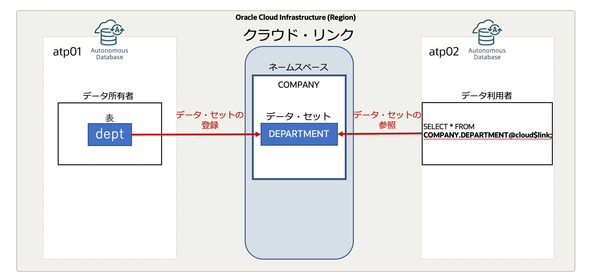

<a id="anchor0"></a>

# はじめに

クラウド・リンクを活用すると、クラウドベースの方法でAutonomous Database間のデータ共有を行うことができます。
本機能は、Autonomous Database間のネットワーク的な接続を設定することなく、データを共有するスコープとしてリージョン、テナント、コンパートメント、特定のAutonomous Databaseを指定して、データの読み取り専用リモートアクセスを提供することができます。

本チュートリアルでは、同じテナント内にある2つのAutonomous Database間でのクラウド・リンクによるデータ共有を行います。

   

**目次 :**
- [はじめに](#anchor0)
- [ユーザー作成と権限の付与](#anchor1)
- [検証用の表の作成とクラウド・リンクへの表の登録](#anchor2)
- [クラウド・リンクに登録されているデータセットの参照](#anchor3)
- [ 異なるAutonomous Databaseからクラウド・リンクに登録されているデータセットを参照](#anchor4)
- [注意点](#anchor5)
- [おわりに](#anchor6)
- [参考資料](#anchor7)

**前提条件**
+ ADBインスタンスを2つ(例：atp01, atp02)構成済みであること
    <br>※ADBインタンスの作成方法については、
    [101:ADBインスタンスを作成してみよう](../adb101-provisioning){:target="_blank"} を参照ください。

 
<BR>

**所要時間 :** 約30分

<BR>

<a id="anchor1"></a>

# 1. ユーザー作成と権限の付与

1. SQL*Plusからadminユーザーとしてatp01に接続します。
    ```
    sqlplus admin/Welcome12345#@atp01_low
    ```

2. クラウド・リンクの登録ユーザーである**cloud_links_register_user**を作成し、必要な権限を付与します。
    ```
    CREATE USER cloud_links_register_user IDENTIFIED BY Welcome12345#;
    ```

    ```
    GRANT CONNECT, RESOURCE, UNLIMITED TABLESPACE TO cloud_links_register_user;
    ```

    ```
    GRANT EXECUTE ON DBMS_CLOUD_LINK TO cloud_links_register_user;
    ```
3. **DBMS_CLOUD_LINK_ADMIN.GRANT_REGISTER**プロシージャを使用して、cloud_links_register_userユーザーに、クラウド・リンクにオブジェクトを登録するための権限を付与します。

    ```
    BEGIN
    DBMS_CLOUD_LINK_ADMIN.GRANT_REGISTER(
        username => 'CLOUD_LINKS_REGISTER_USER', -- ユーザー名
        scope    => 'MY$TENANCY'); -- スコープ
    END;
    /
    ```
    > **補足**
    >
    >scopeのパラメータには、ユーザーがどのスコープにアクセスできるようにするかを以下の値のいずれかで指定します。
    >* MY$REGION：ユーザーは、データセットを登録したAutonomous Databseと同じリージョン内の別のテナンシにもリモートデータアクセスを許可することができます。
    >* MY$TENANCY：ユーザーは、データセットを登録したAutonomous Databseと同じテナント内の全てのリソースにリモートデータアクセスを許可することができます。
    >* MY$COMPARTMENT：ユーザーは、データセットを登録したAutonomous Databseと同じコンパートメント内の全てのリソースにリモートデータアクセスを許可することができます。

4. 次にクラウド・リンクの参照ユーザーである**cloud_links_access_user**を作成し、下記のように必要な権限を付与します。
    ```
    CREATE USER cloud_links_access_user IDENTIFIED BY Welcome12345#;
    ```

    ```
    GRANT CONNECT, RESOURCE, UNLIMITED TABLESPACE TO cloud_links_access_user;
    ```

    ```
     GRANT EXECUTE ON DBMS_CLOUD_LINK TO cloud_links_access_user;
    ```
5. **DBMS_CLOUD_LINK_ADMIN.GRANT_READ**プロシージャを使用して、cloud_links_access_userユーザーに、クラウド・リンクに登録されているデータセットを参照するための権限を付与します。
    ```
    EXEC DBMS_CLOUD_LINK_ADMIN.GRANT_READ('CLOUD_LINKS_ACCESS_USER');
    ```
6. SQL*Plusを終了します。
    ```
    exit
    ```

<BR>

<a id="anchor2"></a>

# 2. 検証用の表の作成とクラウド・リンクへの表の登録

1.  cloud_links_register_userユーザーとしてatp01に接続します。
    ```
    sqlplus cloud_links_register_user/Welcome12345#@atp01_low
    ```
1. 検証用のdept表を作成し、データをINSERTします。
    ```
    CREATE TABLE dept (
      deptno NUMBER(2) CONSTRAINT PK_DEPT PRIMARY KEY,
      dname VARCHAR2(14),
      loc VARCHAR2(13)
    );

    INSERT INTO DEPT VALUES (10,'ACCOUNTING','NEW YORK');
    INSERT INTO DEPT VALUES (20,'RESEARCH','DALLAS');
    INSERT INTO DEPT VALUES (30,'SALES','CHICAGO');
    INSERT INTO DEPT VALUES (40,'OPERATIONS','BOSTON');

    COMMIT;
    ```
2. **DBMS_CLOUD_LINK.REGISTER**プロシージャを使用して、dept表をクラウド・リンクのネームスペース「COMPANY」に「DEPARTMENT」という名前のデータセットとして登録し、テナント内のデータベースにアクセスを許可します。

    ```
    BEGIN
     DBMS_CLOUD_LINK.REGISTER(
        schema_name    => 'CLOUD_LINKS_REGISTER_USER', -- ユーザー名
        schema_object  => 'DEPT', -- オブジェクト名
        namespace      => 'COMPANY', -- データセットを登録するネームスペース
        name           => 'DEPARTMENT', -- データセット名
        description    => 'Department information.', -- データセットの説明
        scope          => 'MY$TENANCY' -- データセットを共有するスコープ
      );
   END;
   /
    ```

    > **補足**
    >
    >scopeには、登録するデータセットをどの範囲に共有するかを以下の値のいずれかで指定します。複数の値をカンマ区切りで指定することも可能です。
    >* Database OCID：OCIDで指定した特定のAutonomous Databaseにデータセットへのアクセスを許可
    >* Compartment OCID：OCIDで指定した特定のコンパートメント内のデータベースにデータセットへのアクセスを許可
    >* Tenancy OCID：OCIDで指定した特定のテナント内のデータベースにデータセットへのアクセスを許可
    >* MY$REGION：データセットの所有者と同じリージョン内のデータベースにデータセットへのアクセスを許可
    >* MY$TENANCY：データセットの所有者と同じテナント内のデータベースにデータセットへのアクセスを許可
    >* MY$COMPARTMENT：データセットの所有者と同じコンパートメント内のデータベースにデータセットへのアクセスを許可
  
  1. SQL*Plusを終了します。
        ```
        exit
        ```
<br>

<a id="anchor3"></a>

# 3. クラウド・リンクに登録されているデータセットの参照
前章では、データセットをクラウド・リンクに登録しました。続いて、 cloud_links_access_userユーザーから、データセットを参照していきます。

1. cloud_links_access_userユーザーとしてatp01に接続します。
    ```
    sqlplus cloud_links_access_user/Welcome12345#@atp01_low
    ```
1. **DBMS_CLOUD_LINK.FIND**プロシージャを使用して、 "DEPARTMENT"を含むデータセットを確認します。
    ```
   set serveroutput on
   DECLARE
      result CLOB DEFAULT NULL;
   BEGIN
      DBMS_CLOUD_LINK.FIND('DEPARTMENT', result);
      DBMS_OUTPUT.PUT_LINE(result);
   END;
    /
    ```
1. 以下のように出力されます。ネームスペースCOMPANY内にDEPARTMENTという名前のデータセットが登録されていることが確認できます。
    ```
    [{"name":"DEPARTMENT","namespace":"COMPANY","description":"Department information."}]
    ```
1. データセットの内容を確認します。
クラウド・リンクに登録されているデータセットを参照するには、SELECT文のFROM句に
    **ネームスペース名.データセット名＠￰cloud$link**
を指定します。
    ```
    SELECT * FROM COMPANY.DEPARTMENT@cloud$link;
    ```
1. 以下のような結果が出力されます。
   ```
        DEPTNO DNAME          LOC
    ---------- -------------- -------------
            10 ACCOUNTING     NEW YORK
            20 RESEARCH       DALLAS
            30 SALES          CHICAGO
            40 OPERATIONS     BOSTON
   ```

<br>

<a id="anchor4"></a>

# 4. 異なるAutonomous Databaseからクラウド・リンクに登録されているデータセットを参照
データセットの登録を行なったAutonomous Databaseとは別のAutonomous Databaseから、クラウド・リンクを使用してデータを参照してみます。この章を行うにあたり、インスタンスがもう1つ必要となります。


1. adminユーザーとしてもう1つのADBインスタンス(atp02)に接続します。
    ```
    sqlplus admin/Welcome12345#@atp02_low
    ```
2. クラウド・リンクにアクセスするための**cloud_links_remote_access_user**ユーザーを作成し、必要な権限を付与します。
    ```
     CREATE USER cloud_links_remote_access_user IDENTIFIED BY Welcome12345#;
    ```

    ```
    GRANT CONNECT, RESOURCE, UNLIMITED TABLESPACE TO cloud_links_remote_access_user;
    ```

    ```
    GRANT EXECUTE ON DBMS_CLOUD_LINK TO cloud_links_remote_access_user;
    ```

3. **DBMS_CLOUD_LINK_ADMIN.GRANT_READ**プロシージャを使用して、cloud_links_remote_access_userユーザーに、クラウド・リンクに登録されているデータセットを参照するための権限を付与します。
    ```
    EXEC DBMS_CLOUD_LINK_ADMIN.GRANT_READ('CLOUD_LINKS_REMOTE_ACCESS_USER');
    ```
4. SQL*Plusを終了します。
    ```
    eixt
    ```
5. cloud_links_remote_access_userユーザーとしてatp02に接続します。
    ```
    sqlplus cloud_links_remote_access_user/Welcome12345#@atp02_low
    ```
6. **DBMS_CLOUD_LINK.FIND**プロシージャを使用して、データセットを確認します。
    ```
    set serveroutput on
    DECLARE
      result CLOB DEFAULT NULL;
    BEGIN
      DBMS_CLOUD_LINK.FIND('DEPARTMENT', result);
      DBMS_OUTPUT.PUT_LINE(result);
    END;
    /
    ```
7. 以下のように出力されます。
    ```
    [{"name":"DEPARTMENT","namespace":"COMPANY","description":"Department information."}]
    ```
8. データセットを登録したAutonomous Databaseとは別のAutonomous Databaseからも、データセットDEPARTMENTが確認できました。

9. データセットの内容を確認します。
    ```
    SELECT * FROM COMPANY.DEPARTMENT@cloud$link;
    ```
10. 以下のように出力されます。
    ```
            DEPTNO DNAME          LOC
    ---------- -------------- -------------
            10 ACCOUNTING     NEW YORK
            20 RESEARCH       DALLAS
            30 SALES          CHICAGO
            40 OPERATIONS     BOSTON
    ```
    データセットのデータを参照することができました。

<BR>
<a id="anchor5"></a>

# 注意点
尚、クラウド・リンクを使用する際の注意点は[マニュアル](https://docs.oracle.com/en/cloud/paas/autonomous-database/serverless/adbsb/autonomous-cloud-links.html#GUID-5CABFB6F-370D-4B9E-BC88-DB94D221CE53){:target="_blank"}をご参照ください。

<a id="anchor6"></a>

# おわりに
ここではAutonomous Databaseのクラウド・リンクについて、紹介しました。
クラウド・リンクを使用すると、データの読み取り専用リモートアクセスを提供することができます。ぜひ活用してみてください。

<BR/>

<a id="anchor7"></a>
# 参考資料

* [マニュアル](https://docs.oracle.com/en/cloud/paas/autonomous-database/serverless/adbsb/autonomous-cloud-links.html#GUID-918B48B3-0D1C-4CD5-AA04-380C043573B9){:target="_blank"}
* [ブログ記事](https://qiita.com/500InternalServerError/items/85d9dd89688edca45af0){:target="_blank"}

<BR/>
以上でこの章は終了です。次の章にお進みください。

<BR>

[ページトップへ戻る](#anchor0)