# はじめに
Autonomous Databaseはデータベースの様々な管理タスクをADB自身、もしくはOracleが行う自律型データベースですが、ユーザーが実行したり、ユーザーがOracleに実行の方法やタイミングの指示を出すタスクもあります。それがデータベースのパフォーマンス監視/アラート監視です。本記事ではADBインスタンスに対する監視設定をいくつかご紹介します。

**目次 :**
  + [1.技術概要](#1-技術概要)
  + [2.単体インスタンスの監視](#2-単体インスタンスの監視)
  + [3.複数のインスタンスをまとめて監視](#3-複数のインスタンスをまとめて監視)
  + [おわりに](#おわりに)

**前提条件**
+ ADBインスタンスが構成済みであること
    <br>※ADBインタンスの作成方法については、
    [101:ADBインスタンスを作成してみよう](/adb/adb101-provisioning){:target="_blank"} を参照ください。  
    なお本記事では、後続の章でCPU使用率が閾値を超えた際の挙動を確認するため、**ECPU数は4、auto scalingは無効** で作成しています。

<BR>

**所要時間 :** 約40分

<BR>

# 1. 技術概要
Autonomous Databaseに対する監視・通知を行うツールはいくつか存在します。環境やユーザーによって、適切なツールを選択します。

本記事ではOCIモニタリング、データベース・ダッシュボード、パフォーマンス・ハブ、Oracle Enterprise Manager(EM)、Oracle Cloud Observability and Management Platform（O&M）Database Managementによる監視設定をご紹介します。

<BR>

# 2. 単体インスタンスの監視
単体のADBインスタンスに対しては、OCIモニタリングとOCI Eventsを使ってメトリック監視/イベント監視をすることができます。

## 2-1. アラームの通知先の作成
監視設定の前に通知先を作成しておく必要があります。[こちら](https://oracle-japan.github.io/ocitutorials/intermediates/monitoring-resources/#4-%E3%82%A2%E3%83%A9%E3%83%BC%E3%83%A0%E3%81%AE%E9%80%9A%E7%9F%A5%E5%85%88%E3%81%AE%E4%BD%9C%E6%88%90){:target="_blank"} を参考に、トピックの作成・サブスクリプションの作成を行います。

<br>

## 2-2. OCIモニタリングによるメトリック監視
OCIモニタリングでは、OCI上の各種リソースの性能や状態の監視、カスタムのメトリック監視を行うことが可能です。また、アラームで事前定義した条件に合致した際には、管理者に通知を行うことで管理者はタイムリーに適切な対処を行うことができます。

今回は、ADBのCPUの閾値を超えた際に通知が来るよう設定し、その挙動を確認します。

1. まずは[こちら](https://oracle-japan.github.io/ocitutorials/intermediates/monitoring-resources/#4-%E3%82%A2%E3%83%A9%E3%83%BC%E3%83%A0%E3%81%AE%E9%80%9A%E7%9F%A5%E5%85%88%E3%81%AE%E4%BD%9C%E6%88%90){:target="_blank"} を参考に、アラームの通知先の作成をします。

1. 次にアラームの定義の作成をします。ハンバーガーメニューの**Observability & Management** の **[アラーム定義]** をクリックします。


1. **[アラームの作成]** をクリックします。

1. 以下の項目を入力し、**[アラームの保存]** をクリックします。
- **アラーム名：** CPU_alarm とします。
- **アラームの重大度：** クリティカル
- **アラーム本体（オプション）：** 任意
- **タグ（オプション）：** 任意
- メトリックの説明
  - **コンパートメント：** メトリックのあるコンパートメントを選択
  - **メトリック・ネームスペース：** oci_autonomous_databaseを選択
  - **リソース・グループ：** 空白のまま
  - **メトリック名：** CpuUtilization
  - **間隔：** 1m（デフォルト）
  - **統計：** Mean（デフォルト）
- メトリック・ディメンション
  - **DeploymentType：** Sharedを選択
- トリガー・ルール
  - **演算子：** 次より大きい
  - **値：** 40
  - **トリガー遅延分数：** 3
- Notifications
  - **宛先サービス：** Notification Serviceを選択
  - **コンパートメント：** さきほど作成した通知トピックのあるコンパートメントを選択
  - **トピック：** 先ほど作成したトピック名を選択
  - **メッセージの書式：** RAWメッセージの送信
- **このアラームを有効化しますか。：** チェックが入っていることを確認 （デフォルト）

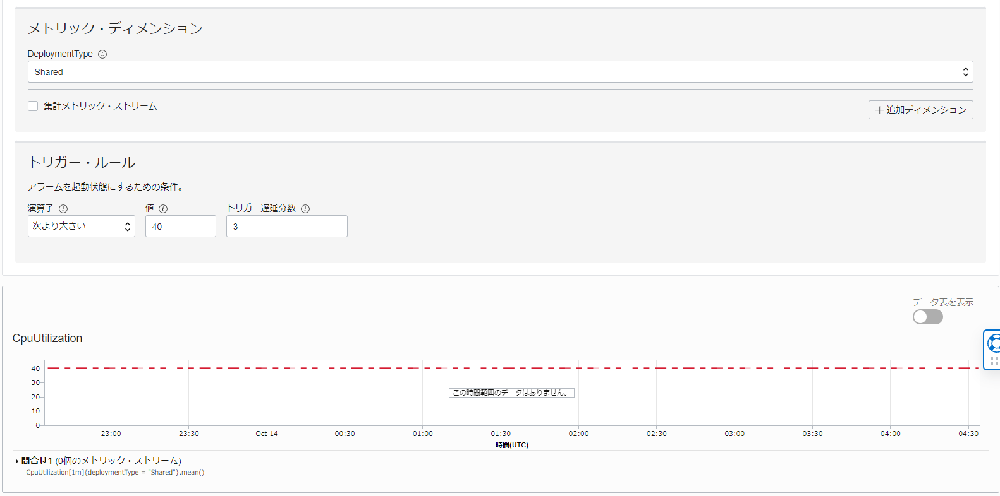
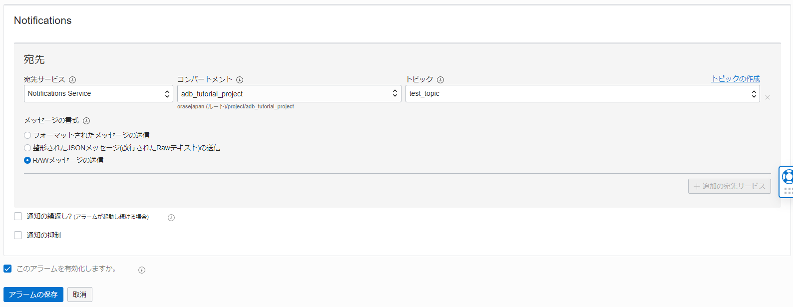

1. アラームが作成されたら、有効になっているかを確認します。


1. Autonomous Database のCPU使用率を40%より大きくするため、データベース・アクションを開き、以下のPL/SQLを実行します。
```sql
begin
  while 1 = 1 loop
    declare n1 number;
    begin n1 := 1; end;
  end loop;
end;
/
```
> （補足）
> 上記PL/SQLは1CPUを占有させるものです。
> ECPU数が8以上のADBインスタンスの場合、アラームの定義のCPU使用率を下げる、もしくは複数のデータベース・アクションで並列実行する必要があります。

1. 数分待つと、アラームの通知先として設定したアドレスに以下のようなメールが届きます。
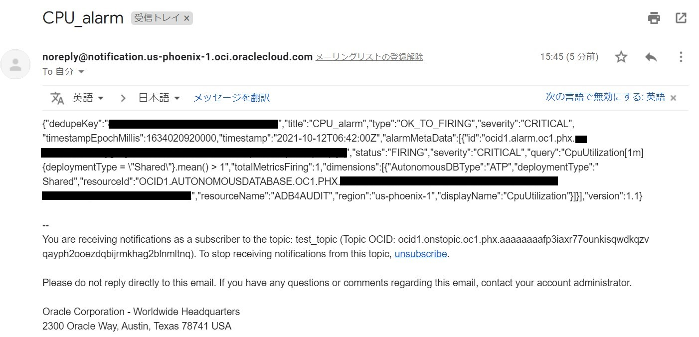  
しばらくすると、上記PL/SQLが終了し、以下のようなメールも届きます。
  
**Status：OK** になっていることがわかります。このように、ADBインスタンスの状態が変化する度に通知が届くようになっています。

1. 続いてCPU使用率をOCIモニタリングのサービス・メトリックから確認してみます。
- **メトリック・ネームスペース：** oci_autonomous_databaseを選択
- **メトリック・ディメンション：** Sharedを選択
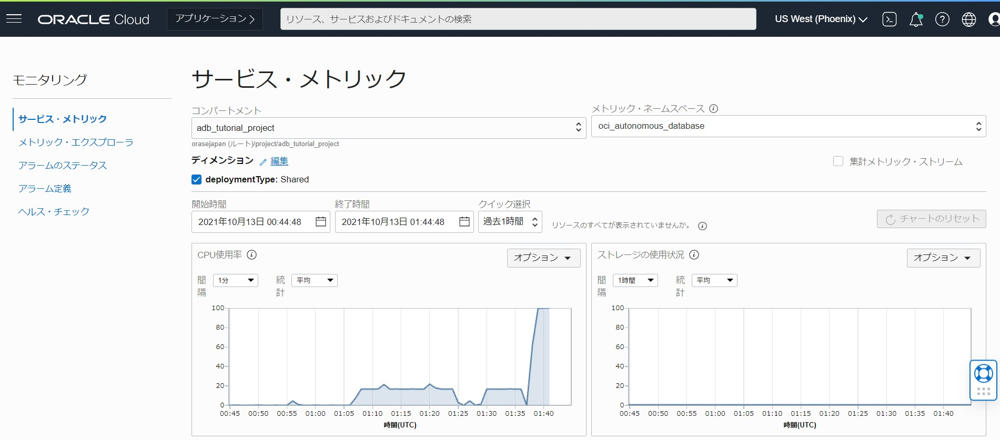

ここでは、CPU使用率のほか、セッション数やトランザクション件数などもグラフで確認することができます。
これらもNotificationsと組み合わせることで、閾値を超えた際に通知を行うことが可能です。

<br>

## 2-3. データベース・ダッシュボードとパフォーマンスハブによるパフォーマンス監視
OCIモニタリングは、事前定義されたメトリックを用いてOCIの各種リソースのモニタリングや通知ができる一方で、データベース・ダッシュボードでは以下のようなADBのアクティビティ状況が把握できます。
- ストレージ使用状況
- CPU使用率
- 割り当てECPU数
- SQL実行数
- SQLの平均レスポンスタイム
- 接続サービス毎の負荷状況
- キューイングの状況

以下のように、ADBの詳細画面から**データベース・アクション** をクリックします。
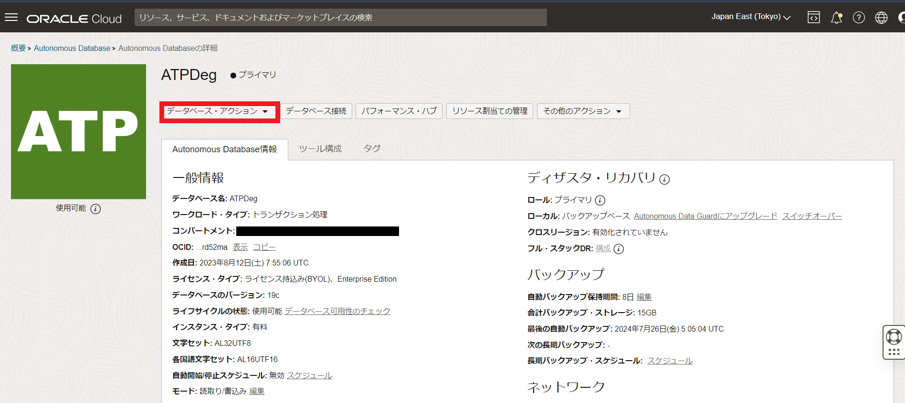

サインイン後、**モニタリング**をクリックし、**データベース・ダッシュボード**をクリックします。
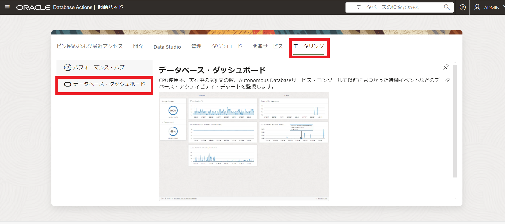

**概要**では、CPU使用率やSQLの平均レスポンスタイムが確認できます。

**モニター**からデータベース・アクティビティやCPU使用率が確認できます。


またパフォーマンスハブでは、リアルタイムSQLモニタリングが可能です。

以下のように、ADBの詳細画面から**パフォーマンス・ハブ** をクリックします。


ASH分析やADDMやSQLモニタリングがあります。ここではSQLモニタリングをクリックします。

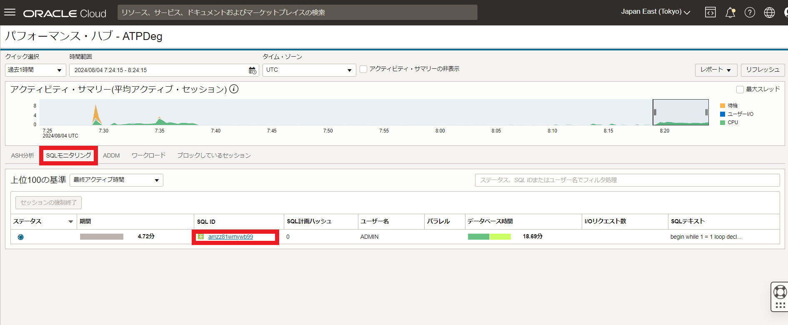

実行しているSQL IDをクリックしてみます。

DB時間や待機時間、I/Oなどのより詳しい情報が確認できます。

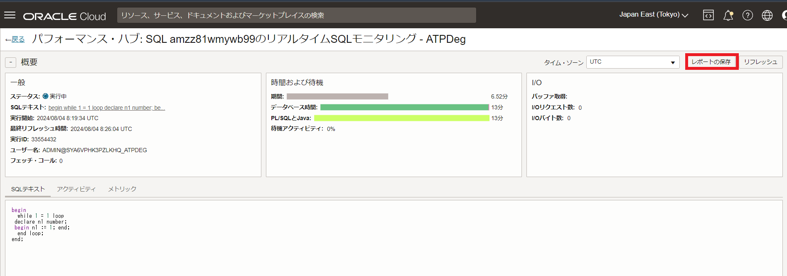

**レポートの保存** をクリックすると、SQL Monitor Active Report(HTMLファイル)が取得できます。
ここではPGAの使用量やI/Oスループットなどのメトリックを確認できます。


<br>

## 2-4. イベント監視
OCIではメトリック監視とは別に、あらかじめ指定されたイベントが対象のリソースに起こった際に、通知やストリーミングなどのアクションを設定することができます。

1. ハンバーガーメニューの**Observability & Management** の **[イベント・サービス]** をクリックします。
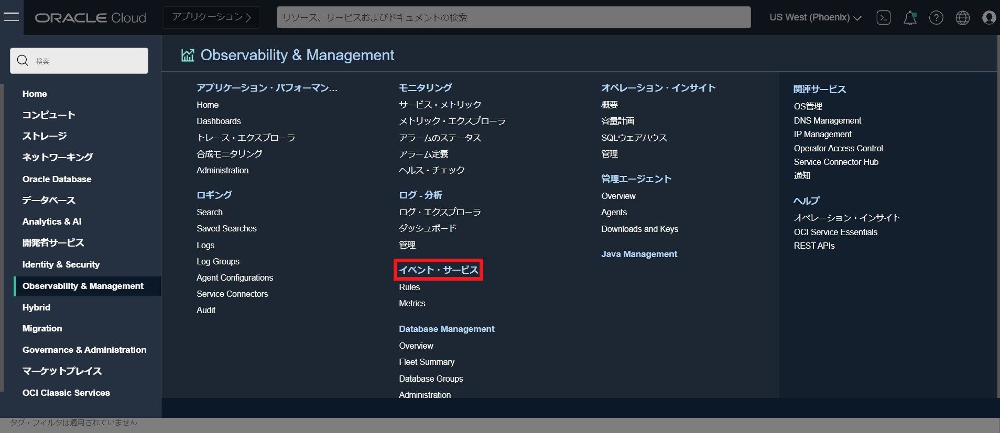

1. **[ルールの作成]** をクリックします。

1. 以下の項目を入力し、**[ルールの作成]** をクリックします。
- **表示名：** ADB_critical_rule とします。
- **説明：** 任意
- ルール条件
  - 条件：イベント・タイプ
  - **サービス名：** Databaseを選択
  - **イベント・タイプ：** Autonomous Database - Criticalを選択
- アクション
  - **アクション・タイプ：** 通知を選択
  - **通知コンパートメント：** 現在使用しているコンパートメント
  - **トピック：** 先ほど作成したトピックを選択

> （補足）
> Autonomous Databaseにおけるイベント・タイプ一覧(※2024年8月時点)
> 
> イベント・タイプ: Critical - ADMINパスワードの期限切れ通知、自動フェイルオーバー開始/終了、DBダウン開始/終了、DBアクセス負荷開始/終了、ログイン失敗通知、インスタンス再配置開始/終了、ウォレット失効通知
> 
> イベント・タイプ: Information - AJDストレージ超過、APEXアップグレード可能/開始/終了、新規DB接続、非アクティブDB接続超過、長期バックアップ開始/終了/スケジューリング、メンテンナンス開始/終了/設定、オペレーター・アクセス、ワークロード・キャプチャ開始/終了、ワークロード・リプレイ開始/終了
> 
> その他のイベント条件の詳細は[こちら](https://docs.oracle.com/en/cloud/paas/autonomous-database/serverless/adbsb/autonomous-database-events.html#GUID-8DBAD1C3-55BE-49F8-AB43-AB3EA708AF03){:target="_blank"}

上記の手順に沿って、ADBに対してイベント・タイプCriticalのルールを作成しておくと、以下のようなメールが届くことがあります。  
この例は、ADBがダウンした場合の通知です。
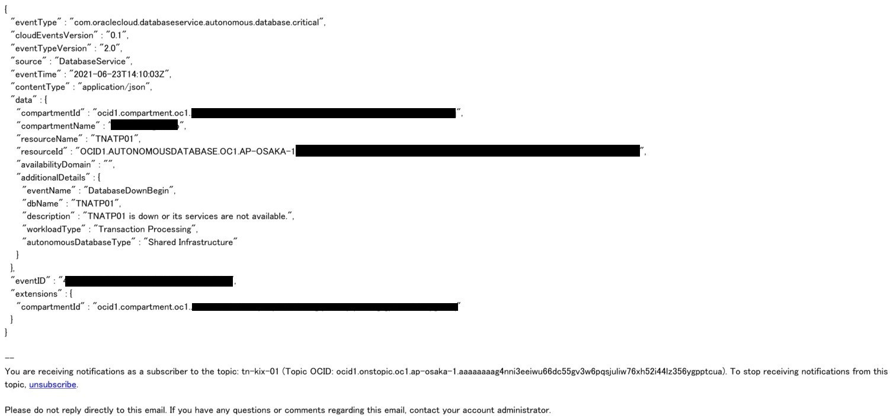

<br>

## 2-5. インスタンス管理者に対する通知設定
Autonomous Databaseサービス関連の問題について、以下の手順で指定された電子メールアドレスに通知を送信することができます。

1. ADBの詳細ページの**メンテナンス**の**顧客の連絡先**フィールドの**管理**をクリックします。
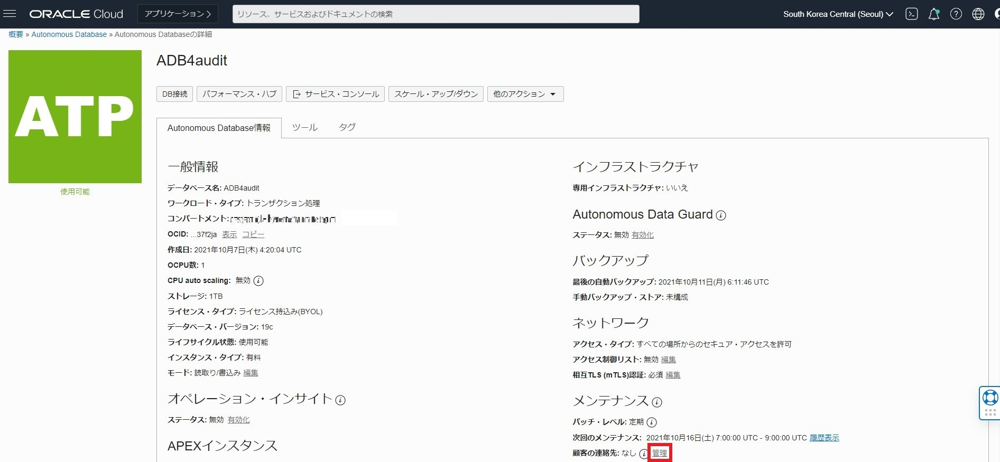

1. **[連絡先の追加]** をクリックします。

1. 連絡先のメールアドレスを入力します。


顧客の連絡先リストが更新されている間、ライフサイクル状態は**更新中**に変わります。

顧客の連絡先が設定されると、主に以下のイベントの通知が送信されます。
+ データベースのアップグレード
+ ウォレットの有効期限の通知
+ 計画外のメンテナンス通知

<br>
なお、顧客の連絡先が設定されていない場合、通知はアカウントに関連付けられているテナント管理者の電子メールアドレスに送信されます。適切な担当者がサービス関連の通知を受信するように、顧客の連絡先を設定することをお勧めします。

> （参考）
> OCIには他にもテナント管理者のみが受け取れる通知がいくつか存在します。
> [こちら](https://qiita.com/NICAREGI/items/30dec52ba4d48c78675c){:target="_blank"} にまとめられている記事がございますので、ご参照ください。


<br>

# 3. 複数のインスタンスをまとめて監視
複数のADBインスタンスをまとめて監視するには、Oracle Enterprise Manager(EM)と Database Managementが有用です。

## 3-1. EM, Database Managementによる監視項目
EM, Database Managementのどちらにも一般的なデータベース監視に必要な項目が多数用意されています。
主な項目は以下です。
- データベースのアクティビティ
- SQLの平均レスポンスタイム
- 初期化パラメータ
- アラートの事前定義
- 閾値のカスタマイズ/アラート通知

## 3-2. EMによる監視設定
Enterprise Manager13.4 RU4(13.4.0.4)以降でAutonomous Databaseに対応しています。
またOCI マーケットプレイスからデプロイができ、コンピュート費用で利用が可能になっています。

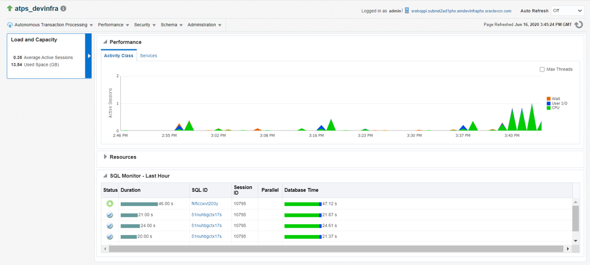

ADBに対する使用手順は[Enterprise Manager Cloud Control 『Oracle Autonomous Database管理者ガイド』](https://docs.oracle.com/cd/F33143_01/emadb/index.html){:target="_blank"} をご参照ください。

<br>

## 3-3. Database Managementによる監視設定
Database Managementでは、オンプレミスおよびクラウドデータベースの監視、パフォーマンス管理、チューニング、および業務管理ができます。高度なデータベースフリート診断とチューニングを使用し、問題のトラブルシューティングとパフォーマンスの最適化を行うことができます。リアルタイムSQL監視でSQLを最適化し、データベース構成を簡素化します。

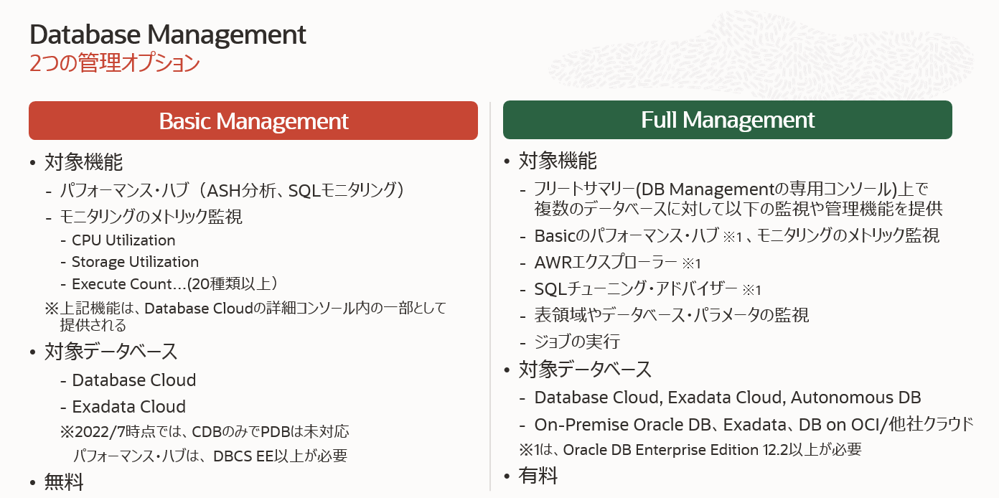

設定手順については、[こちら](https://docs.oracle.com/ja-jp/iaas/database-management/doc/enable-database-management-autonomous-databases.html){:target="_blank"} をご参照ください。

<br>


# おわりに
本記事では、単体のADBインスタンスの監視、複数のADBインスタンスの監視に有効な機能をいくつかご紹介しました。使用用途や対象ユーザーがどれも異なりますが、データベースの運用をする上で全て重要なツールですので、ぜひご活用ください。

<br>

# 参考資料

- [モニタリング機能でOCIのリソースを監視する](https://oracle-japan.github.io/ocitutorials/intermediates/monitoring-resources/){:target="_blank"}

- [イベントの管理](https://docs.oracle.com/ja-jp/iaas/Content/Events/Task/managingrules.htm){:target="_blank"}

<br>
以上でこの章は終了です。次の章にお進みください。

<br>

[ページトップへ戻る](#)