

# はじめに

Autonomous Databaseのデプロイメント方式にはADB-S(Serverless/共有型)とADB-D(Dedicated/専有型)の２つがあります。

ADB-DではインフラストラクチャのExadataをお客様が専有して利用することができます。  
ADB-SもADB-DもAutonomous Databaseの特長である**高性能・高可用性・高いセキュリティ**という点は同じですが、ADB-DではExadataを専有することにより「**高度な分離性**」と「**運用ポリシーのカスタマイズ**」が可能となります。

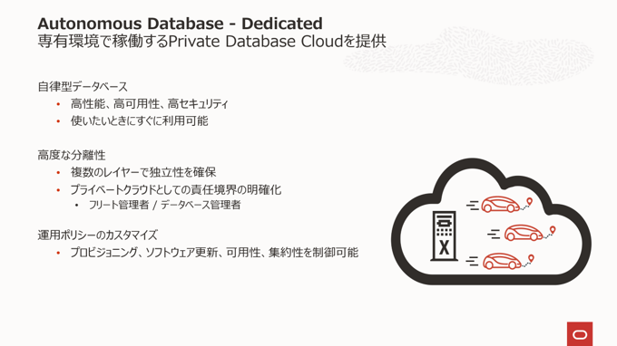

ADB-Dは複数の層で構成されており、それぞれ独立性が確保されています。したがって、どの層でもワークロードを分離させることができるとともに、層別に管理者のロールをわけて責任境界を明確化することができます。運用ポリシーについても、各層をそれぞれどのようにプロビジョニング・構成・メンテナンスするかをユーザ側で制御することが可能です。  

> ADB-Dにおける管理の領域は、OracleではPDBのレイヤを境界として「フリート管理者」および「データベース管理者」で分けることを推奨しています。

このような特長から、ADB-Dは、複数のADBを利用するような大規模なシステムや、セキュリティ上の制約によって他のお客様との同居が許されないようなシステムに適しています。
また、ADB-Dはクラウド(OCI)だけでなく、**お客様データセンターに配置したCloud@Customer(C@C)**でサービスを利用することが可能です。
データをパブリッククラウドに持ち出すことができない場合や、アプリケーションからのネットワークレイテンシが問題となるようなお客様はADB-C@Cの選択ができます。

本チュートリアルでは、OCI上にADB-Dのデプロイメントを行います。

**目次**

- [1. 環境を作成してみよう](#1-環境を作成してみよう)
    - [1-1. ネットワーク設定](#1-1-ネットワーク設定)
    - [1-2. Exadata Infrastructureの作成](#1-1-exadata-infrastructureの作成)
    - [1-3. Autonomous Exadata VMクラスタの作成](#1-3-autonomous-exadata-vmクラスタの作成)
    - [1-4. Autonomous Container Databasesの作成](#1-4-autonomous-container-databasesの作成)
    - [1-5. Autonomous Databaseの作成](#2-6-autonomous-databaseの作成)
- [2. 作成したADBに接続してみよう](#2-作成したadbに接続してみよう)
- [3. 補足](#3-補足)
 

**所要時間 :** 約6時間程程度　※プロビジョニング時間を含みます

 

# 1. 環境を作成してみよう

ADB-Dは次の４つの層で構成されます。

+ **Autonomous Database (ADB)**
    + Oracle Databaseのプラガブル・データベース
+ **Autonomous Container Database (ACD)**
    + Oracle Databaseのコンテナ・データベース
+ **Autonomous VM Cluster(AVM)**
    + ネットワークおよびVMクラスタ
+ **Exadata Infrastructure(EI)**
    + 基盤となるOracle Exadata

 

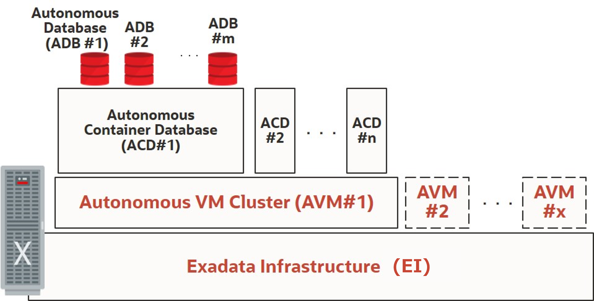

 

手順は次の通りです。
本チュートリアルではコンパートメントおよびユーザグループ・ポリシーの設定は構成済みであるとし、赤字で記載された項目を実施します。

## 1-1. ネットワーク設定

ADB-Dを配置するネットワーク環境を作成します。  
本チュートリアルではネットワークの構成は次のような構成にします：

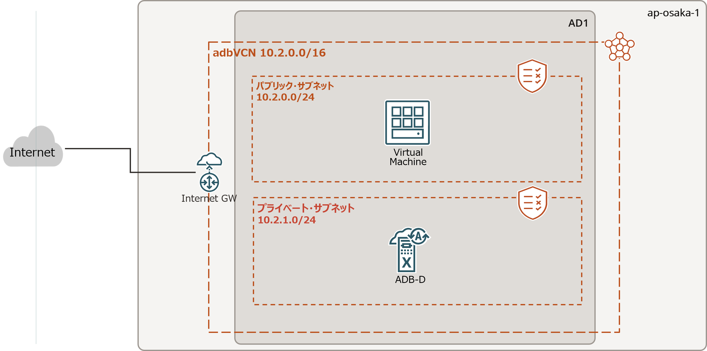

仮想クラウドネットワークの作成方法についての詳細は [クラウドに仮想ネットワーク(VCN)を作る](https://oracle-japan.github.io/ocitutorials/beginners/creating-vcn/){:target="_blank"} を参照ください。

メニューから**ネットワーキング**→**仮想クラウド・ネットワーク**を選択肢、**VCNウィザードの起動**をクリックします。

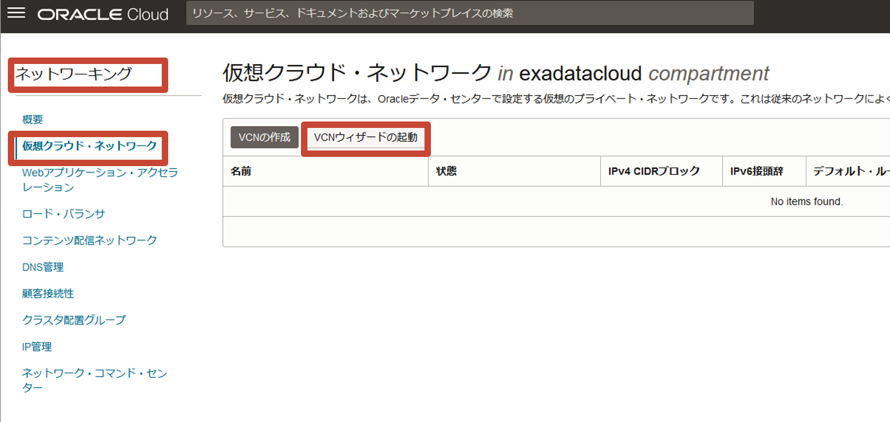

**インターネット接続性を持つVCNの作成**を選択し、設定項目は次の通り入力します。
    
<table>
    <thead>
        <tr>
            <th colspan="3">ウィザードでの入力項目</th>
        </tr>
    </thead>
    <tbody>
        <tr>
            <td rowspan="2">基本情報</td>
			<td>VCN名</td>
            <td>任意</td>
        </tr>
		<tr>
			<td>コンパートメント</td>
            <td>任意</td>
        </tr>
		<tr>
            <td rowspan="3">VCNとサブネットの構成</td>
			<td>VCN CIDRブロック</td>
            <td><b>10.2.0.0/16</b></td>
        </tr>
		<tr>
			<td>パブリック・サブネットCIDRブロック</td>
            <td><b>10.2.0.0/24</b></td>
        </tr>
		<tr>
			<td>プライベート・サブネットCIDRブロック</td>
            <td><b>10.2.1.0/24</b></td>
        </tr>
    </tbody>
</table>

 

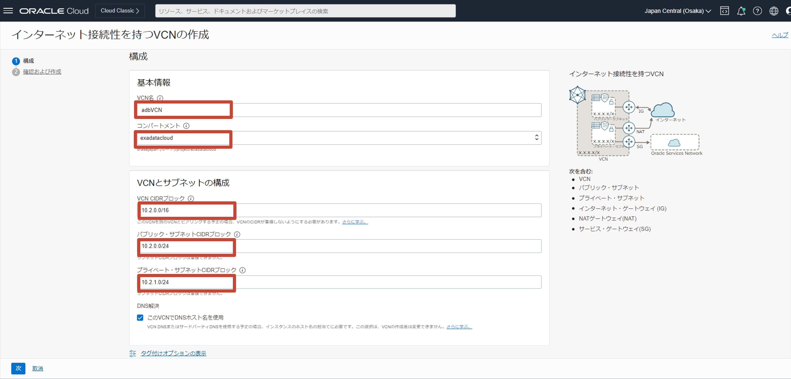    

次に、作成した仮想クラウドネットワークの**セキュリティ・リスト**に次のルールを追加します。  
本チュートリアルではプライベート・サブネットにADB-Dを立て、パブリック・サブネットの仮想マシンからアクセスすることを想定しています。

<table>
    <thead>
        <tr>
            <th colspan="3">セキュリティ・リストに追加</th>
        </tr>
        <tr>
			<td><b>サブネット</b></td>
            <td><b>CIDR</b></td>
			<td><b>ルール</b></td>
        </tr>
    </thead>
    <tbody>       
		<tr>
			<td>プライベート・サブネット</td>
            <td>10.2.1.0/24</td>
            <td><b>イングレス・ルール</b>
                 ・プライベート・サブネット内のノード間のすべての通信を許可(AVM作成に必要)
                 ・パブリック・サブネットからDBリスナーポート1521の通信を許可(DBへの接続)
                 ・パブリック・サブネットからhttpsポート443の通信を許可（Database Actions/APEX)
                 ・（必要に応じて）TCPS用のポート2484、ONS用のポート6200の通信を許可
                 <b>エグレス・ルール</b>
                 ・プライベート・サブネット内のアウトバウンド通信を全て許可
                 ・パブリック・サブネットへのアウトバウンド通信をすべて許可</td>
        </tr>
        <tr>
            <td>パブリック・サブネット</td>
            <td>10.2.0.0/24</td>
            <td><b>イングレス・ルール</b>
                 ・インターネットからsshポート22の通信を許可
                 ・インターネットからhttpsポート443の通信を許可
                 <b>エグレス・ルール</b>
                 ・インターネットへのすべてのアウトバウンド通信を許可</td>
		</tr>
	</tbody>
</table>

 

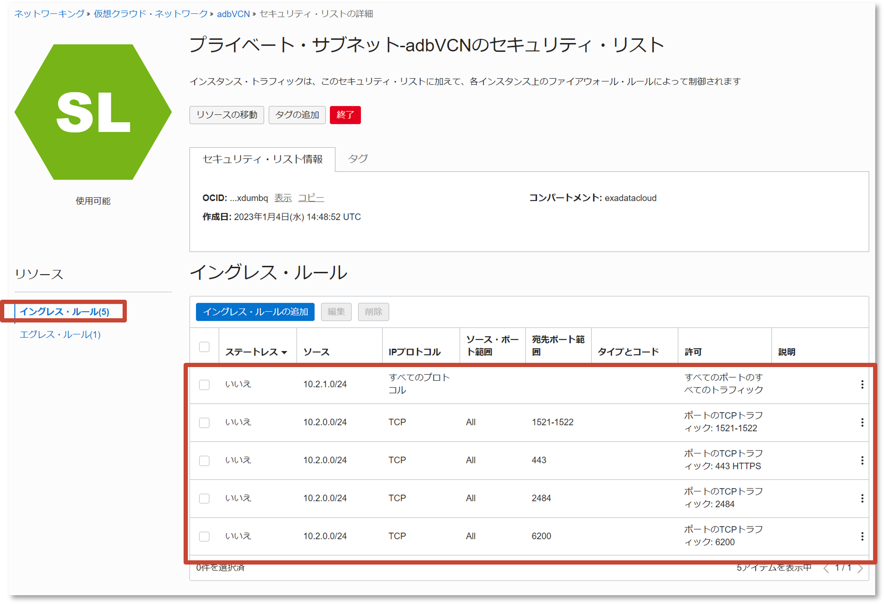

## 1-2. Exadata Infrastructureの作成
Exadata Infrastructure (EI)を作成します。
メニューから**Oracle Database**→**Autonomous Database**をクリックします。**専用インフラストラクチャ**の項目から**Exadata Infrastructure**を選択し、**Exadata Infrastructureの作成**をクリックします。

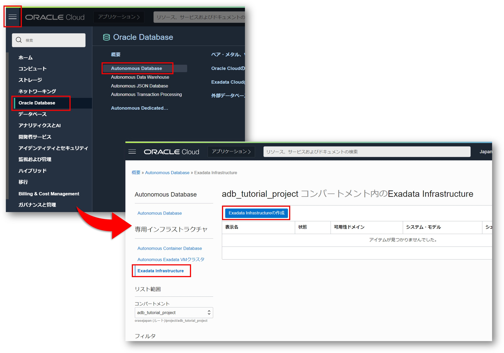

**Exadata Infrastructureの作成**で必要な項目を入力します。  
設定項目は次の表を参考にしてください。

   <table>
    <thead>
        <tr>
            <th colspan="3">Exadata Infrastructureでの入力項目</th>
        </tr>
    </thead>
    <tbody>
        <tr>
            <td rowspan="2">基本情報の指定</td>
			<td><b>コンパートメントの選択</b>：
             Exadata Infrastructureリソースを作成するコンパートメントを選択</td>
            <td>任意</td>
        </tr>
		<tr>
			<td><b>表示名</b>：
             リソースを識別するための名称
             一意である必要はありません。</td>
            <td>任意 例：Exadata-Infra1</td>
        </tr>
		<tr>
            <td rowspan="1"></td>
			<td><b>可用性ドメインの選択</b>：
             リソースを配置する可用性ドメインを選択</td>
            <td>任意</td>
        </tr>
		<tr>
            <td rowspan="2">Exadataシステム・モデルの選択</td>
			<td><b>シェイプの選択</b>：
             割り当てるOracle Exadata Database Machineのタイプを選択
             モデルとその構成に関する容量についての詳細な情報は<a href="https://docs.oracle.com/en/cloud/paas/autonomous-database/dedicated/adbde/index.html" target="_blank">こちら</a></td>
            <td>例： X8-2 X9-2</td>
        </tr>
		<tr>
			<td><b>システム構成の選択</b>：
             固定シェイプ・システムの場合、Quater/Half/Fullから選択します
             エラスティック構成の場合はデータベース・サーバーとストレージ・サーバーの数を指定します</td>
            <td>例： 固定シェイプの場合：Quarter ラック 
            エラスティック構成の場合：データベース・サーバー2、ストレージサーバー3</td>
        </tr>
    </tbody>
    </table>

 
   
 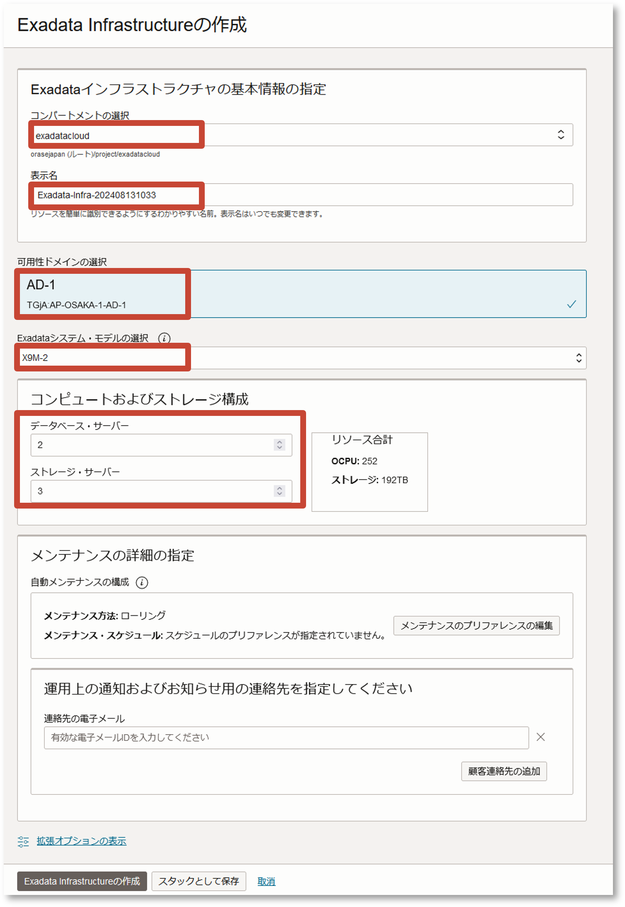

入力完了後、**Exadata Infrastructureの作成**をクリックするとプロビジョニングが始まります。  
EXAのアイコンが緑色になったらプロビジョニング完了です。プロビジョニングには約20秒程かかります。（2023/1時点）

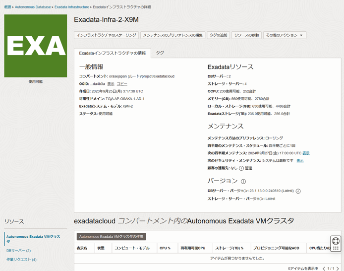

> EIはExaDB-DとADB-Dで共通のインフラストラクチャです。同じEIにExaDB-DのVMとADB-DのAVMを作成することができます。

## 1-3. Autonomous Exadata VMクラスタの作成
作成したEI上にAVMクラスタを作成します。  
Autonomous Datbaseの**専用インフラストラクチャ**の項目から**Autonomous Exadata VMクラスタ**を選択し、**Autonomous Exadata VMクラスタの作成**をクリックします。

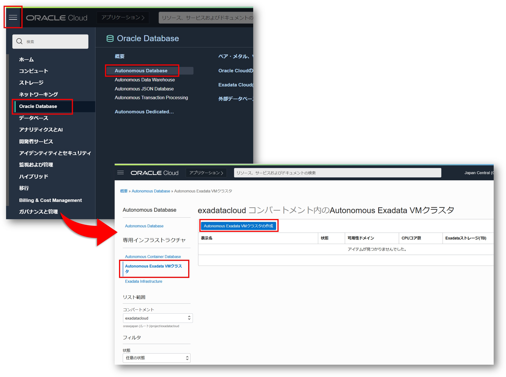

**Autonomous Exadata VMクラスタの作成**で必要な項目を入力します。  
設定項目は次の表を参考にしてください。  

<table>
   <thead>
        <tr>
            <th colspan="3">Autonomous Exadata VMクラスタ作成画面での設定項目</th>
        </tr>
  </thead>
    <tbody>
        <tr>
            <td rowspan="2">基本情報の指定</td>
			<td>
              <b>コンパートメントの選択</b>：
			   Autonomous Exadata VMクラスタを作成するコンパートメントを選択
            </td>
            <td>任意</td>
        </tr>
		<tr>
			<td>
              <b>表示名</b>：
			   リソースを簡単に識別できるようにする名称
            </td>
            <td>
              任意 
               例：AVMCluster1
            </td>
        </tr>
		<tr>
            <td rowspan="1"><b>Exadataインフラストラクチャの選択</b></td>
            <td> Autonomous Exadata VMクラスタを作成するExadata Infrastructureを選択</td>
            <td>作成済みのEIを選択</td>
        </tr>
        <tr>
            <td rowspan="6">Autonomous VMクラスタ・リソースの構成</td>
        	<td><b>コンピュート・モデルの選択:</b>
             ECPUかOCPUを選択 ただしOCPUは今後廃止が予定されています（2024/8時点、詳細はMOS Doc ID2998755.1をご確認ください）</td>
            <td>ECPU</td>
        </tr>
        <tr>
			<td><b>DBサーバーの選択</b></td>            
            <td>任意</td>
        </tr>
        <tr>
			<td><b>1VM当たりのOCPU/ECPU数</b></td>
            <td>任意</td>
        </tr>
        <tr>
			<td><b>Autonomous Container Databaseの最大数</b></td>
            <td>任意</td>
        </tr>
        <tr>
			<td><b>CPU当たりのデータベース・メモリー</b></td>
            <td>任意</td>
        </tr>
        <tr>
			<td><b>データベース・ストレージ(TB)</b></td>
            <td>任意</td>
        </tr>
		<tr>
            <td rowspan="2">ネットワーク構成の設定</td>
			<td><b>仮想クラウドネットワークの選択</b></td>
            <td>作成済みのVCNを選択</td>
        </tr>
		<tr>
			<td><b>サブネットの選択</b></td>
            <td>イングレス・ルールを設定したプライベート・サブネットを選択</td>
        </tr>
        <tr>
            <td rowspan="1"><b>メンテナンスの詳細の指定:</b></td>
            <td>メンテナンスのスケジュールを構成 AVMクラスタ作成後にも変更が可能</td>
            <td>任意</td>
        </tr>
		<tr>
            <td rowspan="1"><b>ライセンス・タイプの選択</b></td>
            <td>「ライセンス持ち込み」および「ライセンス込み」より選択</td>
            <td>ライセンス持ち込み(BYOL)</td>
        </tr>
        <tr>
            <td rowspan="1">拡張オプション</td>
            <td>タイム・ゾーン、リスナーのポート、タグのオプション設定</td>
            <td>任意</td>
        </tr>
    </tbody>
 </table>

 

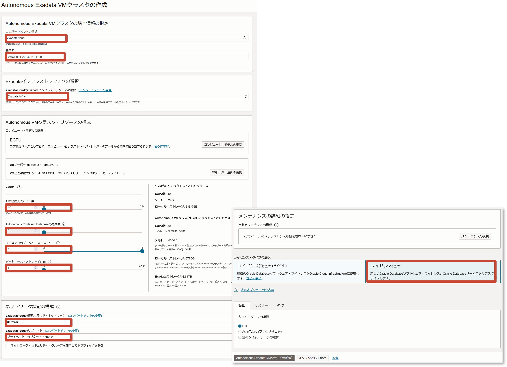
    
入力完了後、**Exadata Exadata VMクラスタの作成**をクリックするとプロビジョニングが始まります。  
AVMのアイコンが緑色になったらプロビジョニング完了です。プロビジョニングには約4時間半程かかります。（2023/1時点）

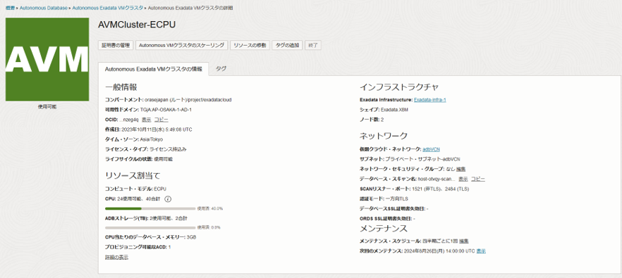

## 1-4. Autonomous Container Databasesの作成

作成したAVM上に、コンテナ・データベースを作成します。  
作成したAVMの詳細画面から、**Autonomous Container Databaseの作成**をクリックします。

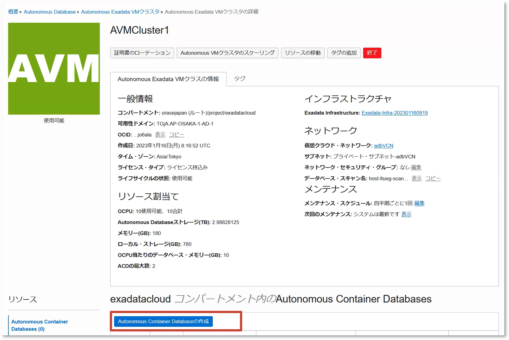

**Autonomous Container Databaseの作成**で必要な項目を入力します。  
設定項目は次の表を参考にしてください。

<table>
    <thead>
        <tr>
            <th colspan="3">Autonomous Container Database作成画面での設定項目</th>
        </tr>
    </thead>
    <tbody>
       <tr>
            <td rowspan="3">基本情報の指定</td>
			<td>
              <b>コンパートメントの選択</b>：
			   Autonomous Container Databaseを作成するコンパートメントを選択
            </td>
            <td>AVMを配置したコンパートメントを選択</td>
       </tr>
	   <tr>
			<td>
             <b>表示名</b>：
			  リソースを簡単に識別できるようにする名称
            </td>
            <td>任意 例：ACD1</td>
      </tr>
      <tr>
    		<td>
              <b>イメージの選択</b>：
			   ベース・イメージまたは作成済みのソフトウェア・イメージを選択
               ベース・イメージからの選択の場合は続けてバージョンを選択
            </td>
            <td>
              例
               ベース・イメージからのバージョンの選択
               19.24.0.1.0
            </td>
      </tr>
	  <tr>
        <td><b>Autonomous Data Guardの構成</b></td>
        <td>Autonomous Data Guardを有効化して、プライマリおよびスタンバイのACDを作成</td>
        <td>任意</td>
      </tr>
      <tr>
        <td><b>自動メンテナンスの構成</b></td>
        <td>必要に応じて、メンテナンスの種類またはスケジュールを構成</td>
        <td>任意</td>
      </tr>
      <tr>
        <td><b>バックアップの構成</b></td>
        <td>自動バックアップの有効化の選択とバックアップ保存期間の指定</td>
        <td>例 自動バックアップの有効化をチェック 15日間</td>
      </tr>
      <tr>
        <td><b>拡張オプション</b></td>
        <td>データベース・リソース管理、ネット・サービス・アーキテクチャ、暗号化キー、タグ付けのオプション設定</td>
        <td>任意</td>
      </tr>
    </tbody>
</table>

 

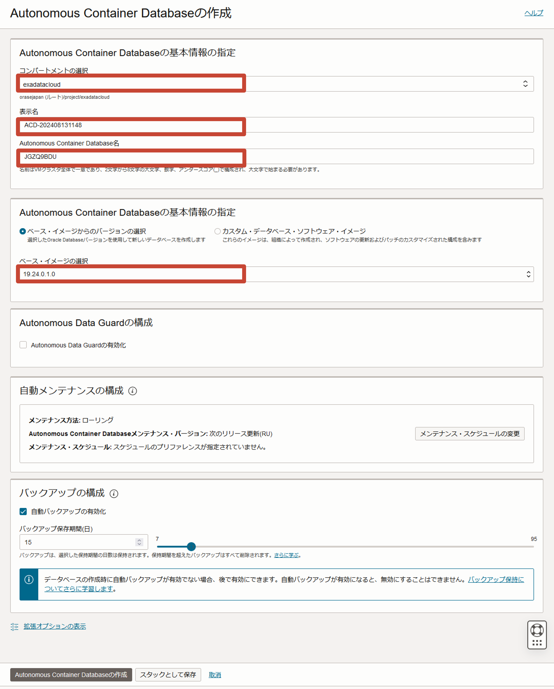 

入力完了後、**Autonomous Container Databaseの作成**をクリックするとプロビジョニングが始まります。  
ACDのアイコンが緑色になったらプロビジョニング完了です。プロビジョニングには約30分程かかります。（2023/1時点）

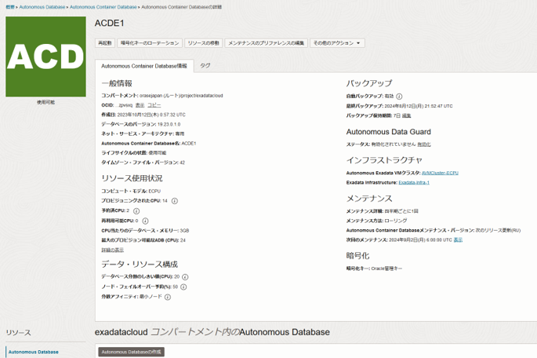

## 1-5. Autonomous Databaseの作成

いよいよADBインスタンスを作成します。作成したACD上にADBを作成します。  
**Autonomous Databaseの作成**をクリックします。

**Autonomous Databaseの作成**で必要な項目を入力します。  
設定項目は次の表を参考にしてください。  
なお、Autonomous Databaseの作成方法については [101: ADBインスタンスを作成してみよう](/adb/adb101-provisioning/){:target="_blank"} で詳細に説明していますので、重複する部分の説明は割愛します。

<table>
    <thead>
        <tr>
            <th colspan="3">Autonomous Database作成画面での設定項目</th>
        </tr>
    </thead>
    <tbody>
        <tr>
            <td rowspan="3">基本情報の指定</td>
			<td><b>コンパートメントの選択</b></td>
            <td>任意</td>
        </tr>
		<tr>
			<td><b>表示名</b></td>
            <td>任意 例：ATPD1</td>
        </tr>
		<tr>
			<td><b>データベース名</b></td>
            <td>任意 例：ATPD1</td>
        </tr>
		<tr>
            <td><b>ワークロード・タイプの選択</b></td>
            <td>データ・ウェアハウス（ADW）またはトランザクション処理（ATP）からワークロード・タイプを選択</td>
            <td>例: トランザクション処理</td>
        </tr>
		<tr>    
            <td><b>デプロイメント・タイプの選択</b></td>
            <td>サーバーレス（ADB-S)または専用インフラストラクチャ（ADB-D）から選択</td>
            <td><b>専有インフラストラクチャ</b></td>
        </tr>
		<tr>
			<td rowspan="2">Autonomous Container Databaseの選択</td>
            <td>Autonomous Data Guard対応のAutonomous Container Database: 
            Autonomous Data Guardを使用する場合はチェック</td>
            <td>任意</td>
        </tr>
        <tr>
            <td><b>Autonomous Container Databaseの選択:</b> ADBを作成するACDを作成済みのACDから選択</td>
            <td><b>作成済みのACDを選択する</b></td>
        </tr>
		<tr>
            <td rowspan="4">データベースの構成</td>
            <td>Autonomous Database for Developers: 無料の開発者向けADBの作成の場合にチェック（ECPUのみ）</td>
            <td>任意</td>
        </tr>
        <tr>
            <td><b>OCPU/ECPU数</b></td>
            <td>任意</td>
        </tr>
        <tr>
			<td><b>OCPU/ECPU自動スケーリングの有効化</b></td>
			<td>任意</td></tr>
		<tr>
			<td><b>ストレージ</b></td>
			<td>任意</td>
		</tr>
		<tr>
			<td rowspan="2">管理者資格証明の作成</td>
			<td><b>ユーザ名</b></td>
            <td>ADMIN</td>
        </tr>
		<tr>
			<td><b>パスワード</b></td>
			<td>任意 例：Welcome12345#</td>
		</tr>
		<tr>
            <td rowspan="1">ネットワーク・アクセスの構成</td>
			<td>アクセス制御リストの編集：
			 特定のIPアドレスのクライアントのみにデータベースへのアクセスを制限できます。</td>
            <td>任意</td>
        </tr>
        <tr>
			<td>通知、お知らせ用の連絡先</td>
			<td>連絡先用の電子メールを設定</td>
 			<td>任意</td>
		</tr>
        <tr>
			<td>拡張オプション</td>
			<td>文字セット、データベース・インメモリー、タグのオプション設定</td>
			<td>任意</td>
		</tr>
    </tbody>
</table>

 

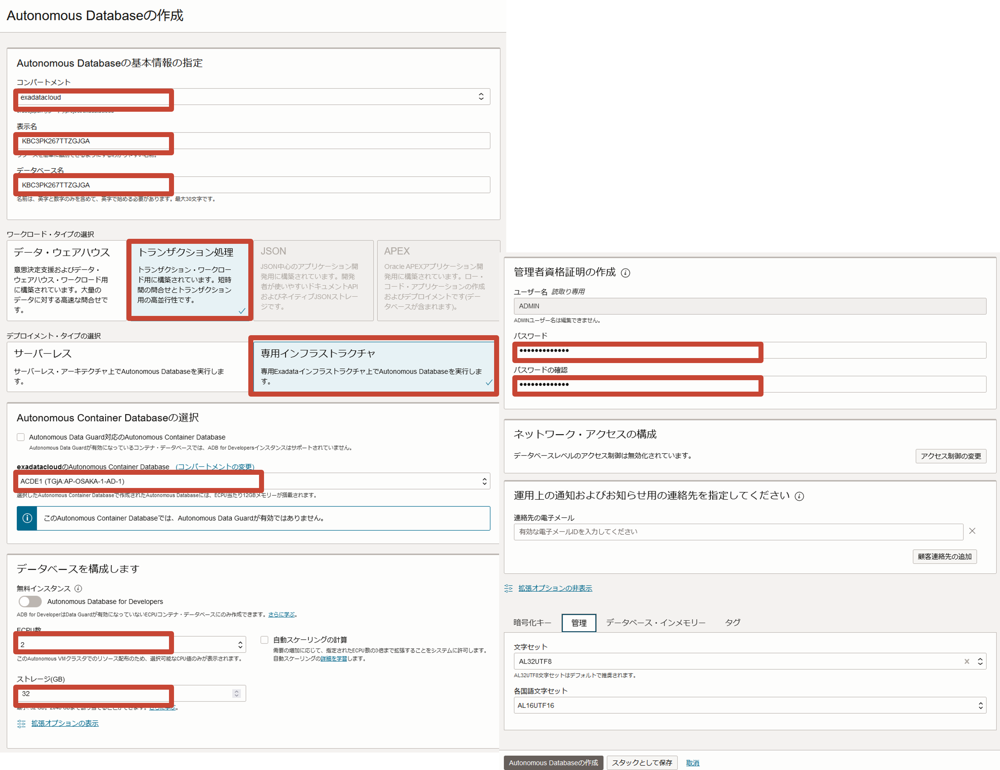

入力完了後、**Autonomous Databaseの作成**をクリックするとプロビジョニングが始まります。  
ADBのアイコンが緑色になったらプロビジョニング完了です。プロビジョニングには約5分程かかります。（2023/1時点）

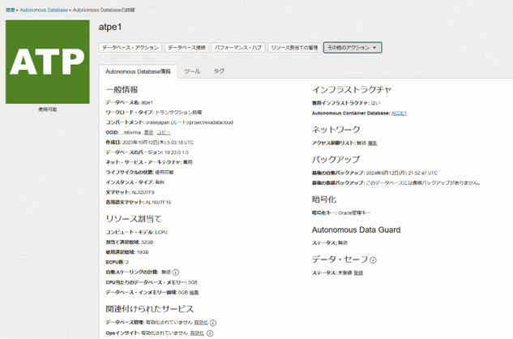

 

# 2. 作成したADBに接続してみよう
作成したADBへSQL*Plusで接続を行います。  
作成したADBの詳細画面を表示し、「**DB接続**」をクリックすると接続に必要な情報を入手できます。

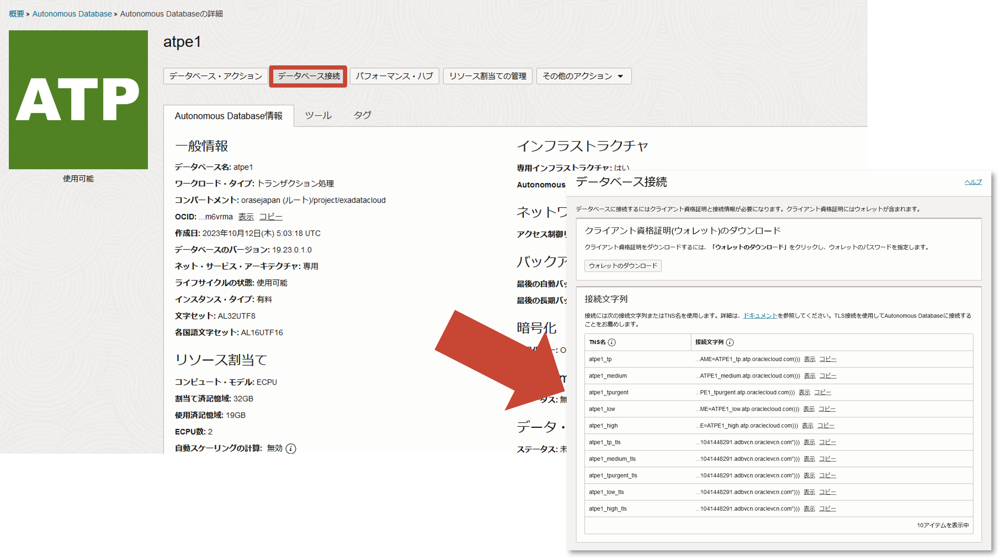

接続を行う仮想マシンの設定は[204: 開発者向け仮想マシンのセットアップ方法](/adb/adb204-setup-VM/){:target="_blank"}を参照ください。TLSがついている接続サービスはADB-Sに接続する場合と同様の方法で接続ができます。またTLSがついていない接続サービスはウォレットなしで接続することが可能です。

 

# 3. 補足

## ADB-Dの課金について
 ADB-DはExadataの筐体を専有してご利用いただくことになるので、Exadata Infrastructure分の課金が発生します。最低利用期間は48時間であり、Exadata Infrastructureを終了するまで課金が継続します。作成する際にはご注意ください。
次の表は、ADB-SとADB-Dの課金の違いについて記載したものです：
 
  <table>
    <tbody>
        <tr><th></th>
			<th>
<b>ADB-S</b>
</th>
			<th>
<b>ADB-D</b>
</th>
        </tr>
       <tr>
			<td>料金体系</td>
			<td>OCPU/ECPU + Storage</td>
           <td>OCPU/ECPU + Infrastructure</td>
        </tr>
       <tr>
			<td>課金単位</td>
            <td>OCPU/ECPU：秒
             Storage：秒</td>
           <td>OCPU/ECPU：秒
			 Infrastructure：秒</td>
        </tr>
        <tr>
			<td>最低利用期間</td>
			<td>OCPU/ECPU：1分
            <b>Storage：1分</b></td>
           <td>OCPU/ECPU：1分
			 <b>Infrastructure：48時間</b></td>
        </tr>
        <tr>
			<td>課金時間</td>
			<td>OCPU/ECPU：起動している間
			 Storage：終了するまで</td>
            <td>OCPU/ECPU：起動している間
			 <b>Infrastructure：EIが終了するまで</b></td>
        </tr>
      </tbody>
    </table>

 

## 自動メンテナンスの構成について
EI、AVM、ACDは四半期に一回自動メンテナンスが行われます。このメンテナンスのスケジュールは、ユーザによるスケジュールの指定と、システムによるスケジュールのいずれかを選択することができます。
スケジュールをカスタマイズする場合は、次の例のACDのメンテナンスの編集画面から分かる通り細かいスケジュールを設定できます。
   
    
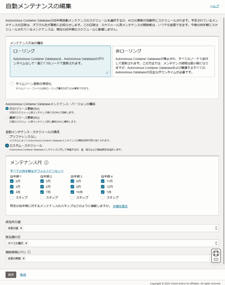

   > ローリング、非ローリングの選択はACDのみです。EI、AVMでは選択できません。

# おわりに
本チュートリアルでは、1つのAVMクラスタに1つのACDを配置し、その上にPDBであるADBを配置するという最もシンプルな構成で作成しました。同様の手順で許可されるリソース範囲でAVM、ACD、ADBを複数作成することができます。

 

# 参考資料
+ ドキュメント：[Oracle Autonomous Database on Dedicated Exadata Infrastructure](https://docs.oracle.com/en/cloud/paas/autonomous-database/dedicated/adbab/#Overview-0)

+ LiveLabs: [Oracle Autonomous Database Dedicated for Fleet Administrators Workshop](https://docs.oracle.com/pls/topic/lookup?ctx=en/cloud/paas/autonomous-database/dedicated/iywpw&id=adbd_ll_fa){:target="_blank"} 

    + Cloud@CustomerでのプロビジョニングやAutonomous Data Guardなど様々なADB-Dの機能も含んだワークショップです。

 

以上で、この章は終了です。  
次の章にお進みください。

 

[ページトップへ戻る](#anchor0)
