<!-- 
リンク：
  networkfirewall-setup-tunnelinspection
-->

「OCI Network Firewall」はパロアルトネットワークスの次世代ファイアウォール技術を基に構築されたOCIクラウドネイティブのマネージド・ファイアウォールとなっており、URLフィルタリングやTSL/SSL検査などの機能を提供します。  
OCI Network Firewallの説明につきましてはOCIチュートリアル「[OCI Network Firewallを構築する](/ocitutorials/security/networkfirewall-setup/)」を参照ください。 

Network Firewallは通信経路を仲介する形（インライン）で構成しますが、本チュートリアルで扱います「トンネルインスペクション」は通信経路の外部から監視する形（アウトオブバンド）で構成することが可能です。そのため、既存の通信経路に変更を加えずに、経路外部からトンネル検査という形でIDSを行うことができます。  
本チュートリアルでは始めに、簡易的な通信経路を用意し、その後「トンネル検査」構成を構築していく流れで進めていきます。


**所要時間 :** 
+ 約90分  
  (このうちNetwork Firewallインスタンスの作成に40分ほどかかります)

**前提条件 :**
+ ユーザーに必要なIAMポリシーが割り当てられていること。ポリシーの詳細は[ドキュメント](https://docs.oracle.com/ja-jp/iaas/Content/network-firewall/overview.htm#iam)を参照ください。

**使用サービス**
+ Compute Instance
+ Network Load Balancer
+ OCI Network Firewall
+ VTAP


**注意 :**
+ ※チュートリアル内の画面ショットについてはOracle Cloud Infrastructureの現在のコンソール画面と異なっている場合があります。

<br>
---

# はじめに

以下が本チュートリアルで作成するNetwork Firewallの構成図と設定です。

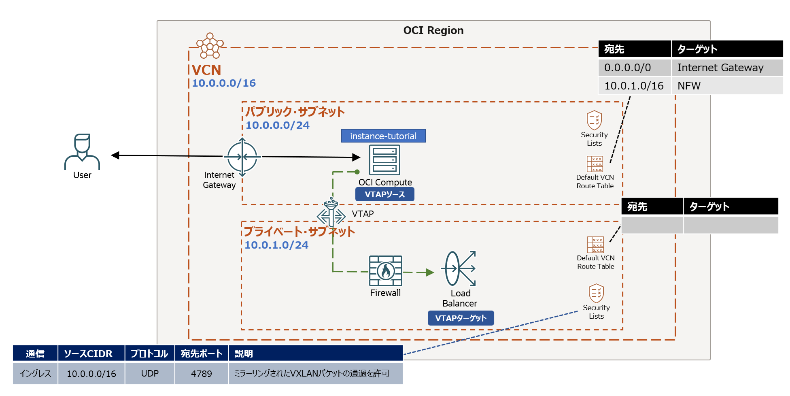


手順の流れとして、まずは以下のような簡易的な事前環境を作成し、その環境に後付けでNetwork Firewallを構築していきます。


---

<br>
<br>

# 1. 事前環境の作成
こちらの手順１では、まず事前環境として、上で示しました構成を構築していきます。

## 1-1. VCNの作成
[VCNウィザードの起動] を選択  

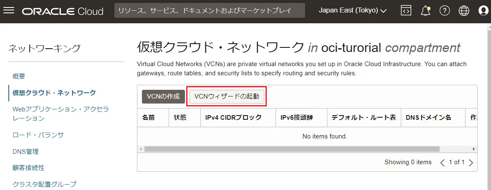  

[インターネット接続性を持つVCNの作成] を選択します。 
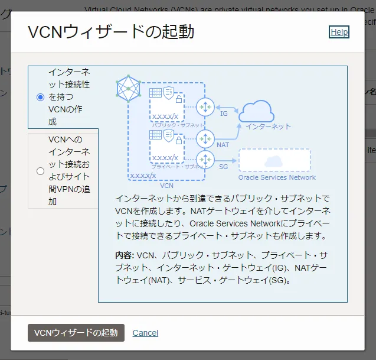

以下の項目を入力し、[次]を選択します。
+ 基本情報
    - `VCN名`：VCN-NFWtutorial
    - `コンパートメント`：\<VCNを作成するコンパートメントを選択\>
+ VCNの構成
    - `VCN IPv4 CIDRブロック`：10.0.0.0/16
+ パブリック・サブネットの構成
    - `IPv4 CIDRブロック`：10.0.0.0/24
+ プライベート・サブネットの構成
    - `IPv4 CIDRブロック`：10.0.1.0/24


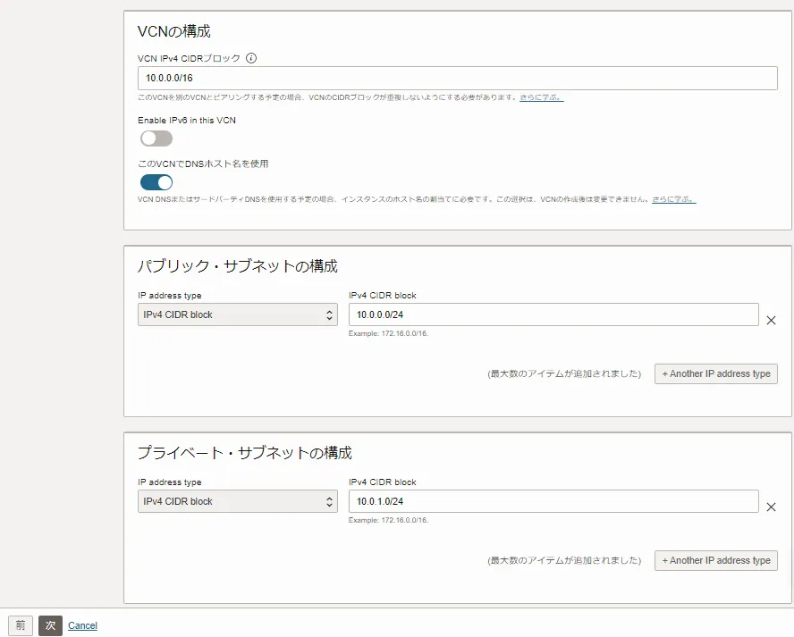

その後、作成されるリソースを確認したら[作成]をクリック、リソースの作成が完了したことを確認します。 


## 1-2. コンピュート・インスタンスの作成
コンピュート・インスタンスをパブリック・サブネット上に配置します。

OCIコンソール画面左上の[メニューボタン] → [コンピュート] → [インスタンス] → [インスタンスの作成]をクリックし、「コンピュート・インスタンスの作成」画面にて、インスタンスをそれぞれ作成します。 
検証のため、入力項目は配置するサブネット以外は任意ですが、ここでは以下のように入力しています。

+ `名前`：任意（例：instance-tutorial）
+ `コンパートメント`：\<ポリシーを作成するコンパートメントを選択\>

+ `配置（可用性ドメイン）`：任意（例：AD１）

+ イメージとシェイプ
  + `イメージ`：任意（例：Oracle Linux 8）
  + `シェイプ`：任意（例：VM.Standard.E5.Flex）

+ プライマリVNIC情報
  + `VNIC名`：inst-tutorial
  + `VCN`：先ほど作成したVCN（VCN-NFWtutorial）
  + `サブネット`：先ほど作成したVCNのパブリック・サブネット（パブリック・サブネット-VCN-NFWtutorial（リージョナル））

+ `SSHキーの追加`：「キー・ペアを自動で生成」を選択し、秘密キーと公開キーをそれぞれ保存。（手元に既存のSSHキーがある場合は、「公開キー・ファイルのアップロード」または「公開キーの貼りつけ」を選択し、公開キーを登録してください。）

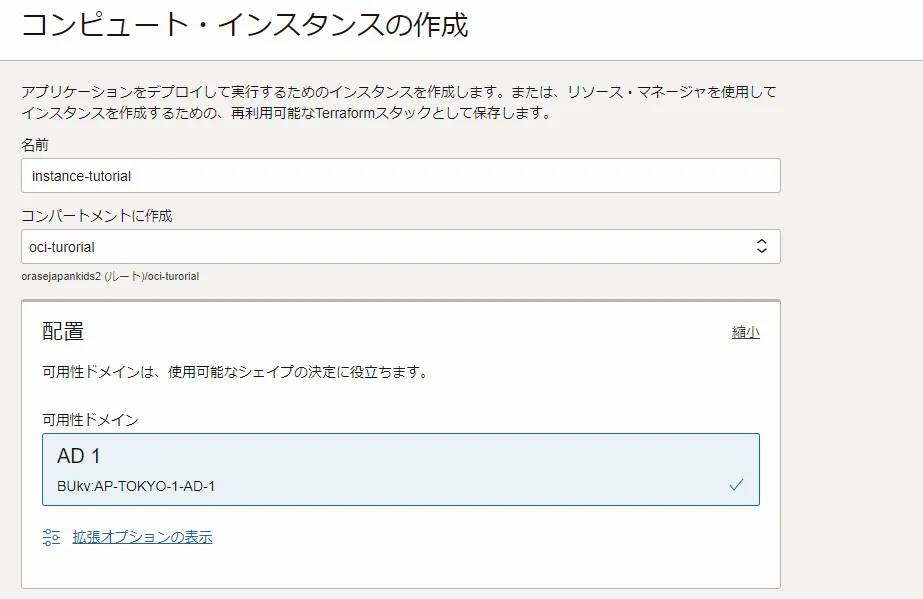

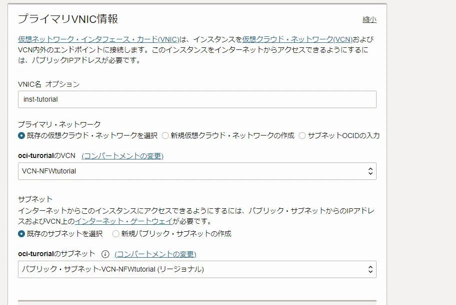

作成を選択し、状態がプロビジョニング中から実行中になったことを確認します。

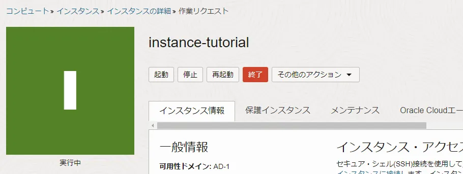

この時点で、作成したインスタンスにSSH接続ができるはずですので、念のため確認をしておきます。


これで「`ユーザー` ー `インターネット・ゲートウェイ` ー `コンピュート`」という簡易的な通信構成ができました。  
次の手順からは、この構成にリソースを付け加える形でNetwork FirewallのIDSを行えるよう設定していきます。


<br>
<br>

# 2. Network Firewallを作成する
NFWの作成には40分ほどかかりますので、手順が前後しますが、VTAPの設定を行う前にNetwork Firewallを作成しておきます。
## 2-1. ファイアウォール・ポリシーの作成
Firewallインスタンスを作成する際、ネットワーク・トラフィックを制御するルールをまとめたポリシー「ネットワーク・ファイアウォール・ポリシー」を指定する必要があるため、インスタンス作成前に用意します。

OCIコンソール画面左上の メニューボタン → [アイデンティティとセキュリティ] → [ファイアウォール] → [ネットワーク・ファイアウォール・ポリシー] と選択、「ネットワーク・ファイアウォール・ポリシーの作成」をクリックし、ポリシーを作成します。
設定項目は本チュートリアルでは以下のようにします。
+ `名前`：network_firewall_policy
+ `コンパートメント`：\<ポリシーを作成するコンパートメントを選択\>

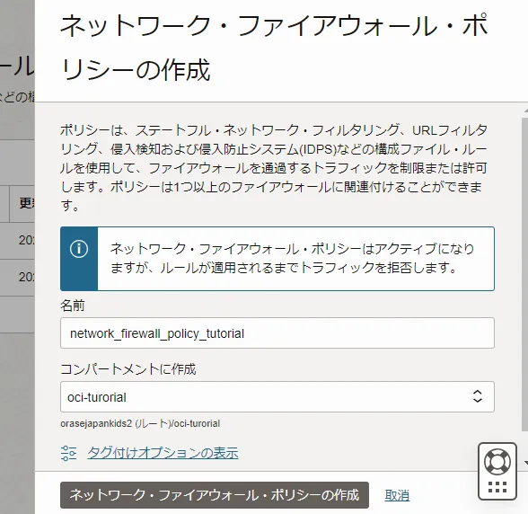

作成ボタンを選択すると詳細画面に移りますので、ファイアウォールを通過するパケットを検知できるよう、ルールを設定していきます。


## 2-2. ポリシー・ルールの設定
VTAPによりミラーリングされたパケットを検査するためには「セキュリティ・ルール」と「トンネル検査ルール」を設定する必要があります。

ファイアウォールは通過するパケットをセキュリティ・ルールと照合し通信の可否を判断、その後にトンネル検査ルールにてVXLANプロトコルにてカプセル化されたパケットの中身から宛先・送信元IPを検査したのち、VTAPターゲットに返します。

### ・セキュリティ・ルールの作成
「セキュリティ・ルールの作成」を選択し、以下の項目を入力してセキュリティ・ルールを作成します。

+ `名前`：ids-rule
+ `ルール・アクション`：侵入検知

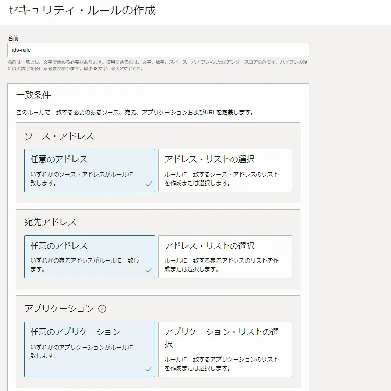
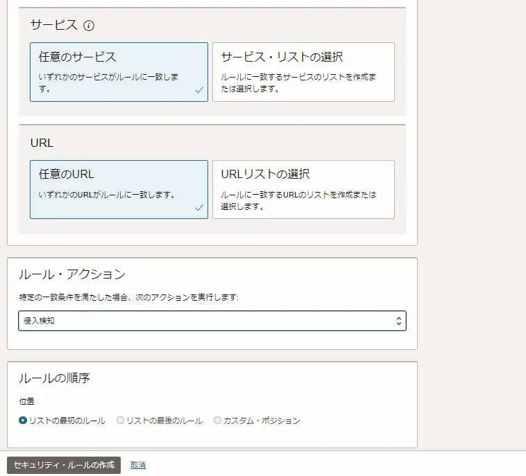


### ・トンネル検査ルールの作成
「セキュリティ・ルールの作成」を選択し、以下の項目を入力してセキュリティ・ルールを作成します。
+ `名前`：tunnel-inspection-rule
+ `ルール・アクション`：検査とログの取得

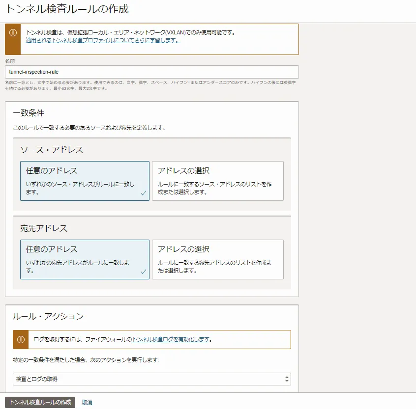


## 2-3. Network Firewallインスタンスの作成
インスタンスを作成します

+ `名前`：firewall-tutorial
+ `コンパートメント`：\<ファイアウォール・インスタンスを作成するコンパートメントを選択\>
+ `ネットワーク・ファイアウォール・ポリシー`：network_firewall_policy_tutorial（手順2-1で作成したポリシーを選択）

+ 強制ポイント
  + `仮想クラウド・ネットワーク`：VCN-NFWtutorial
  + `サブネット`：プライベート・サブネット-VCN-NFWtutorial リージョナル

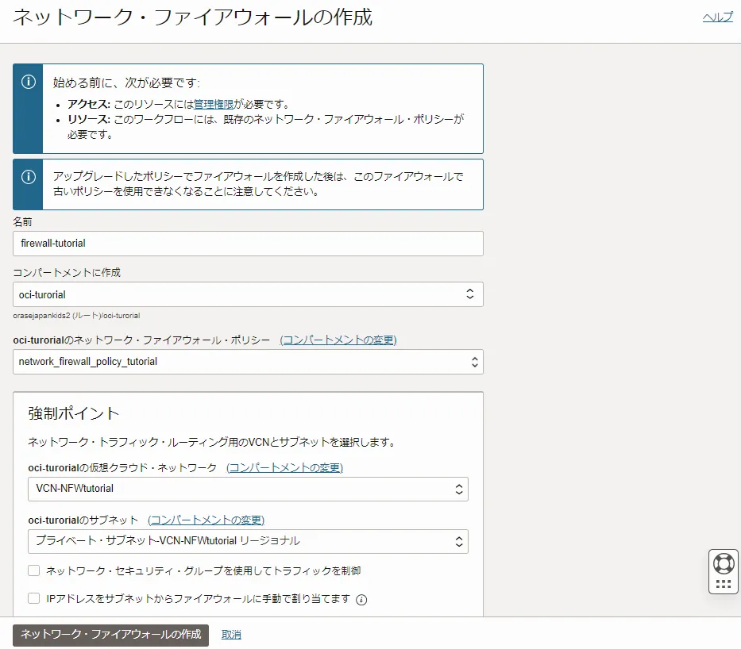

作成中にNetwork Firewallインスタンスの詳細画面にIPv4アドレスが表示されますので、この後の手順4にて行うルート表の設定のため、表示されたIPv4アドレスをメモに控えておきます。  

<br>
<br>


# 3. VTAPを設定する
仮想アクセスポイント（VTAP）とは指定したソースが受け取ったトラフィックを、選択したターゲットに対してミラー化するサービスです。VTAPサービスは無償でご利用いただけますが、VTAPソースやVTAターゲットに対しては課金が発生しますので、ご注意ください。

本チュートリアルではバックエンドに何も配置せず、ネットワーク・ファイアウォールによる侵入検知の確認をログで行いますが、VTAPターゲットであるロード・バランサのバックエンドにインスタンスを配置することで、パケットを取得し検査を行うことも可能です。こちらの手順に関しましては、VTAPのOCIチュートリアル「[VTAPでパケットをミラーリングし、パケットキャプチャをする](/ocitutorials/intermediates/vtap/)」をご覧ください。

ここではVTAPソースを、手順1にて作成したコンピュート・インスタンス、VTAPソースをネットワーク・ロード・バランサとして設定を行っていきます。

## 3-1. ネットワーク・ロード・バランサ（VTAPターゲット）の作成
OCIコンソール画面左上の メニューボタン → [アイデンティティとセキュリティ] → [ネットワーキング] → [ロード・バランサ] → [ネットワーキング・ロード・バランサ] と選択、「ネットワーキング・ロード・バランサの作成」をクリックし、以下の項目でロード・バランサを作成します。
ネットワーク・ロード・バランサの作成を選択

+ `ロード・バランサ名`：nlb_tutorial
+ `可視性タイプの選択`：プライベート

+ ネットワーキングの選択
  + `仮想クラウド・ネットワーク`：VCN-NFWtutorial
  + `サブネット`：プライベート・サブネット-VCN-NFWtutorial
  
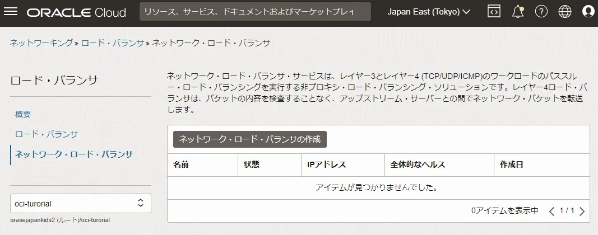

[次]を選択。リスナーの構成を以下の設定で入力します。VTAPによってミラーリングされるパケットはVXLANプロトコルでカプセル化されるため、VXLANの使用するUDP/4789を設定します。

+ `リスナー名`：listener_tutorial
+ `リスナーで処理する`トラフィックのタイプ：UDP
+ `ポート番号`：4789


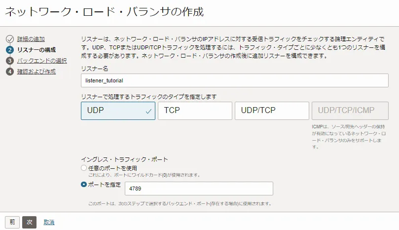

バックエンド・セットは設定を行いません。適用な名前を設定し、そのまま[次]を選択します。

+ `バックエンドセット`：backendset_tutorial


確認画面を確認し、ネットワーク・ロード・バランサの作成をクリックします。

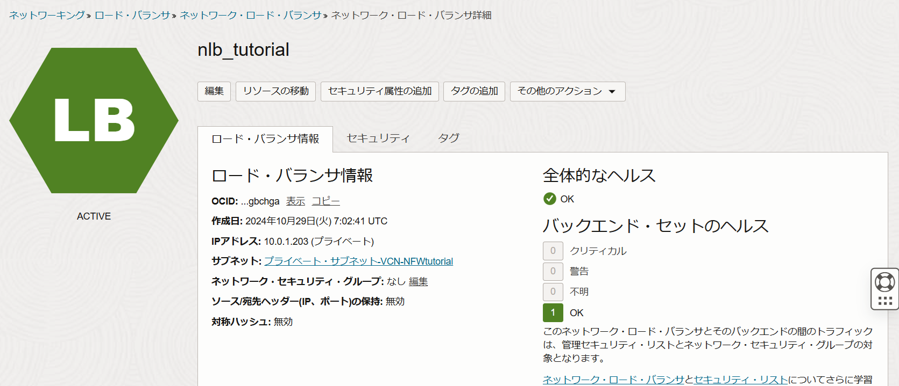

この後、プライベートサブネットのセキュリティリストにて、ミラーリングされたパケットの通信（UDP/4789）を受け入れるためのイングレスルールを追加します。


## 3-2. プライベートサブネットのセキュリティリストの設定
プライベートサブネットのセキュリティ・リストの詳細画面に戻ります。  
OCIコンソール画面にアクセスし、左上の [メニューボタン] → [ネットワーキング] → [仮想クラウド・ネットワーク] と移動、作成したVCN「VCN-NFWtutorial」を選択し、左のリソース一覧からセキュリティ・リストをクリックします。

「プライベート・サブネット-VCN-NFWtutorialのセキュリティ・リスト」をクリックし、[イングレス・ルールの追加]を選択、以下のルールを追加します。

+ `ソース・タイプ`：CIDR
+ `ソースCIDR`：10.0.0.0/16
+ `IPプロトコル`：UDP
+ `宛先ポート範囲`：4789

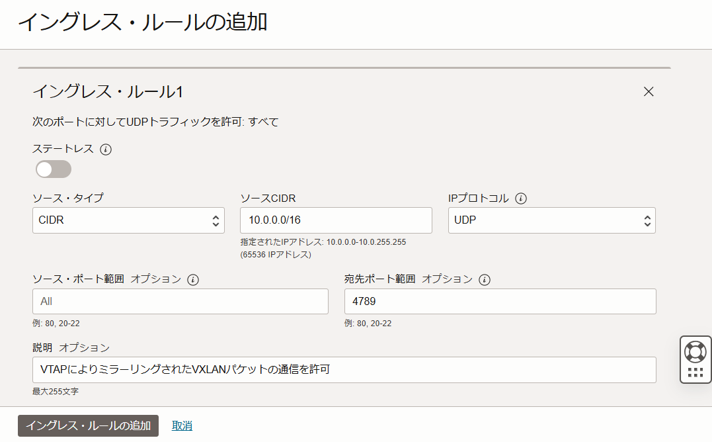

追加後、イングレス・ルールに正しく追加されたことを確認します。


## 3-3. VTAPの設定

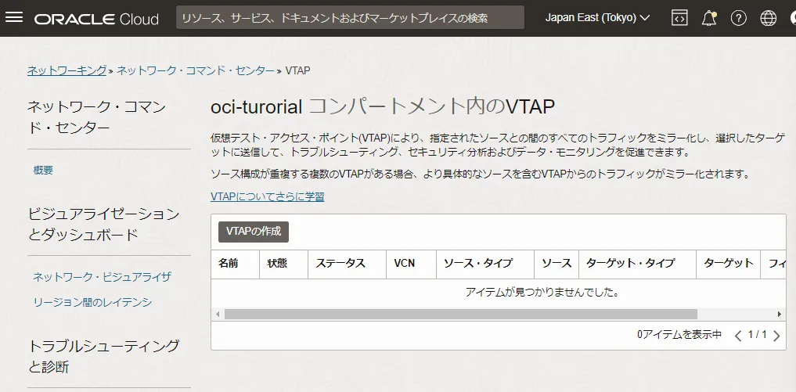

+ `名前`：vtap-tunnelinspection-turorial
+ `コンパートメント`：\<VTAPを作成するコンパートメントを選択\>
+ `VCN`：VCN-NFWtutorial

+ ソース
  + `ソースタイプ`：インスタンスVNIC
  + `サブネット`：パブリック・サブネット-VCN-NFWtutorial
  + `インスタンスのVNIC`：inst-tutorial（instance-tutorial）

+ ターゲット
  + `リソース・タイプ`：ネットワーク・ロード・バランサ
  + `サブネット`：プライベートサブネット-VCN-NFWtutorial
  + `ネットワーク・ロード・バランサ`：nlb_tutorial（手順3-1で作成したロード・バランサ）
  
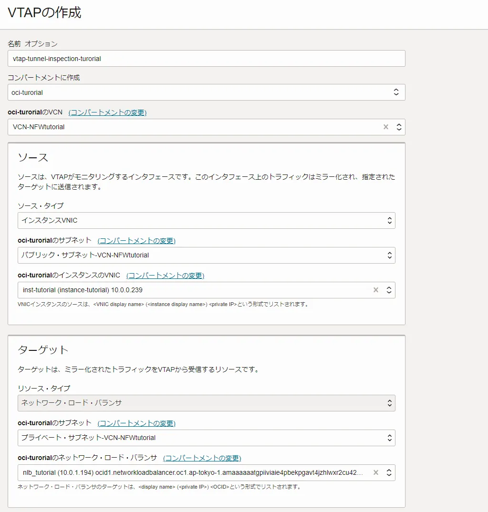

取得フィルタはミラー化するトラフィックの制御ルールを設定します。
以下の項目を入力し、取得フィルタを作成したら、[VTAPの作成]を選択します。

+ `取得フィルタ`：新規取得フィルタの作成
  + `名前`：filter-tunnel-inspection-tutorial
  + `コンパートメント`：\<取得フィルタを作成するコンパートメントを選択\>

+ ルール１
  + `トラフィックの方向`：イングレス
  + `IPプロトコル`：すべて
+ ルール2
  + `トラフィックの方向`：エグレス
  + `IPプロトコル`：すべて

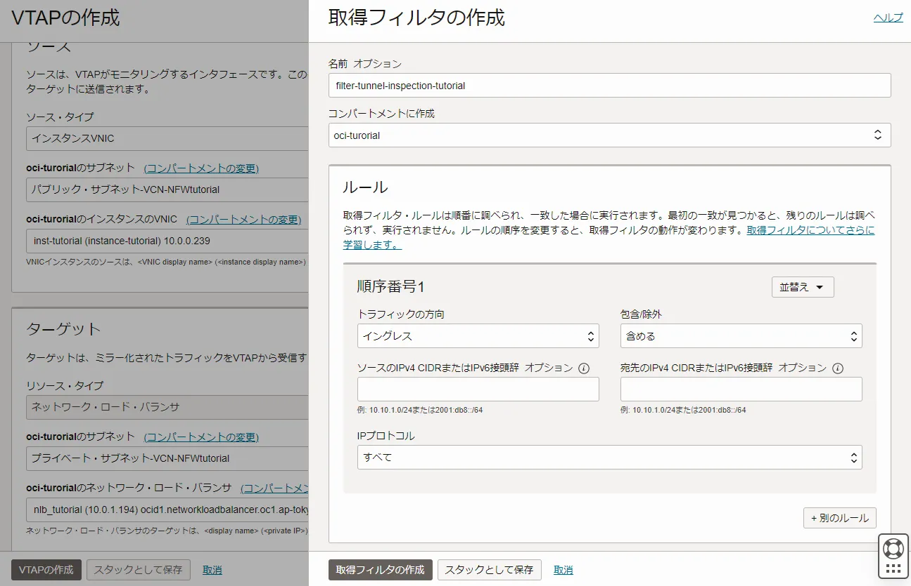


[起動]を選択するとステータスが実行中になり、VTAPが正常に起動されたことを確認します。

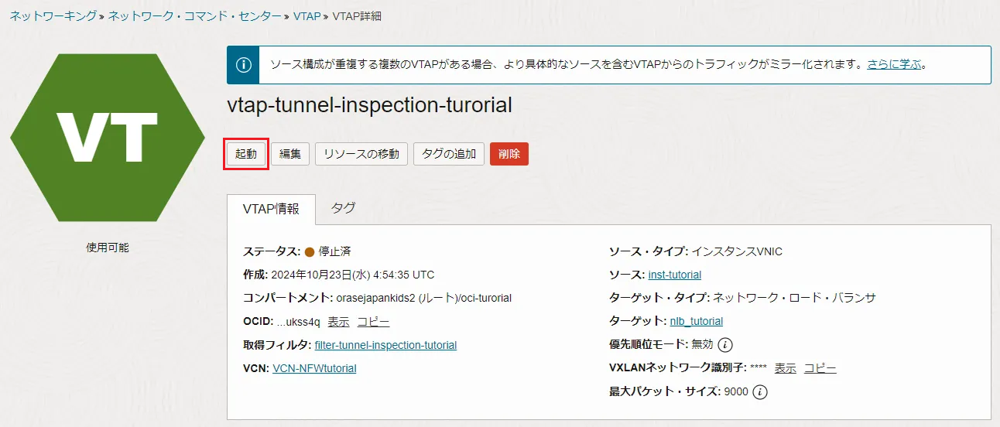

<br>
<br>

# 4. Network Firewallを追加する
手順2-3にて作成したNetwork Fireworkインスタンスの作成が完了後、以下の手順を行っていきます。

## 4-1. ルート表の設定
OCIコンソール画面にアクセスし、左上の [メニューボタン] → [ネットワーキング] → [仮想クラウド・ネットワーク] と移動、作成したVCN「VCN-NFWtutorial」を選択し、左のリソース一覧からルート表をクリックします。

「default route table for VCN-NFWtutorial」をクリックし、VTAPソースからVTAPターゲットまでの通信経路にNetwork Firewallを経由するよう、「ルート・ルールの追加」を選択し、以下のルールを追加します。

+ `ターゲット・タイプ`：プライベートIP
+ `サブネットまたはVLANコンパートメント`：\<コンパートメントを選択\>
+ `宛先タイプ`：CIDRブロック
+ `宛先CIDRブロック`：10.0.1.0/24
+ `ターゲット選択`：\<Network FirewallのプライベートIPアドレス\>

これで、プライベート・サブネットへの通信はNetwork Firewallにルーティングされるようになります。


## 4-2. Network Firewallのログの有効化
[アイデンティティとセキュリティ]→[ファイアウォール]→[ネットワーク・ファイアウォール]→[ネットワーク・ファイアウォール詳細]→[ログ] と遷移し、Network Firewallのログ画面に移ります。

「Theat Log」と「Tunnel Inspection Log」を有効化します。ログ・グループを作成していない場合は、「新規グループの作成」より、適用なログ・グループを作成し、設定します。

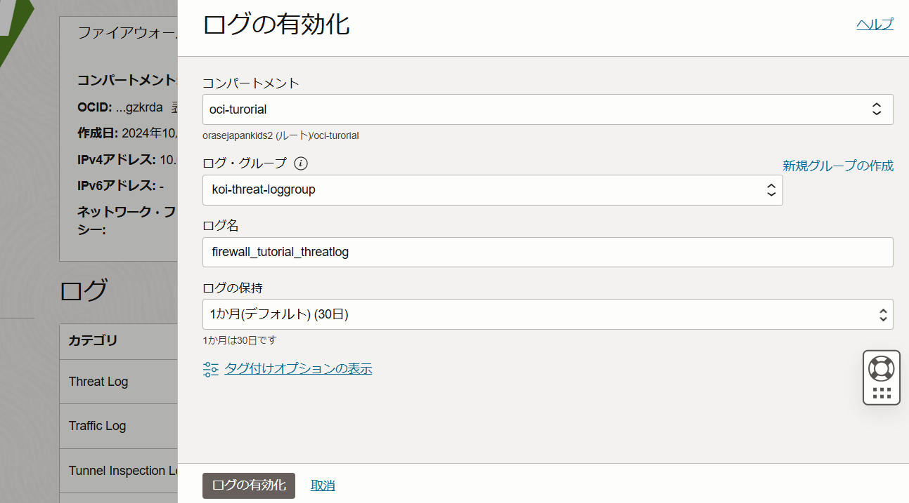

<br>
<br>

# 5. 侵入検知（IDS）を確認する
しばらく放置していると、Network Firewallのメトリック画面からパケットが処理されているのが分かります。  
手順1にて作成したインスタンスにSSH接続を行うとより分かりやすくなります。  
  
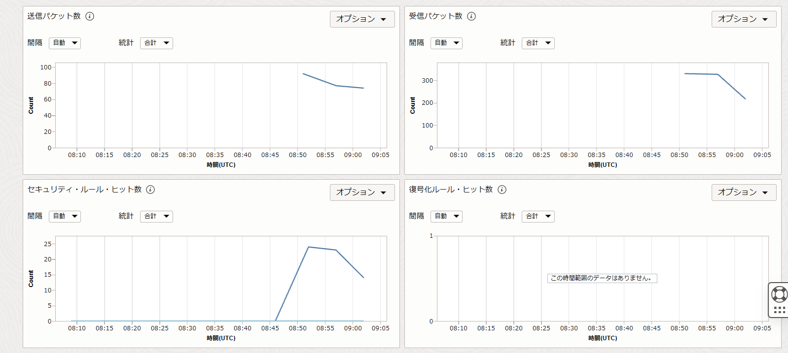

ミラーリングされたパケットのログについては、Tunnel Inspection Logで確認することができます。

また、脅威のログについては先ほど有効化したthreat logで確認ができ、以下のログのようにインスタンスがドイツからブルートフォース攻撃を受けていることなどが観察できる場合があります。  

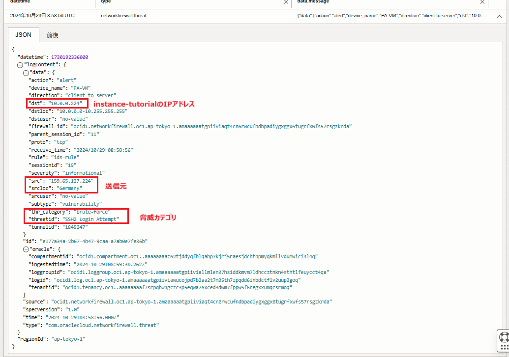

## 5-1. 手動でIDSを検知させる
放置していると、上記のようにある程度脅威を検知していることが確認できますが、最後の手順として意図的に検知をさせます。  
方法としてはインスタンスにSSH接続をし、インスタンスから以下のコマンドでeicarファイルをhttpで取得します。

```
curl http://files.trendmicro.com/products/eicar-file/eicar.com
```


eicarのサイトではeicarファイルのhttpでの提供は終了しているため、[TREND MICRO社のサイト](https://downloadcenter.trendmicro.com/index.php?regs=jp&prodid=1424&ossl=2)からEICARファイルを上記のコマンドで取得しています。
httpsで取得すると暗号化により検知されないため、httpを使用することに注意してください。


```
実行例）
[opc@inst-tutorial ~]$ curl http://files.trendmicro.com/products/eicar-file/eicar.com
X5O!P%@AP[4\PZX54(P^)7CC)7}$EICAR-STANDARD-ANTIVIRUS-TEST-FILE!$H+H*[opc@inst-tutorial ~]$
```


数分後、theat logで確認すると、取得したeicarファイルが検知されていることが分かります。

<!-- 3分ほど遅れてログで確認ができる。 
ログは2つあるが、チュートリアルには一つだけ表示-->

<!--  -->