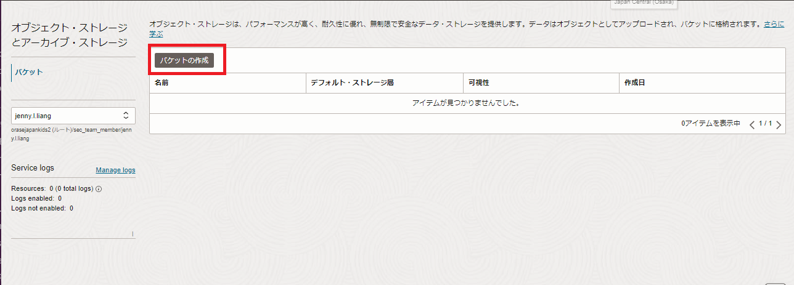
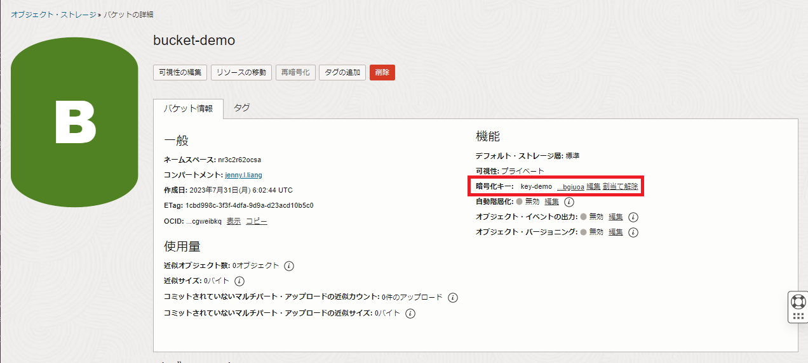
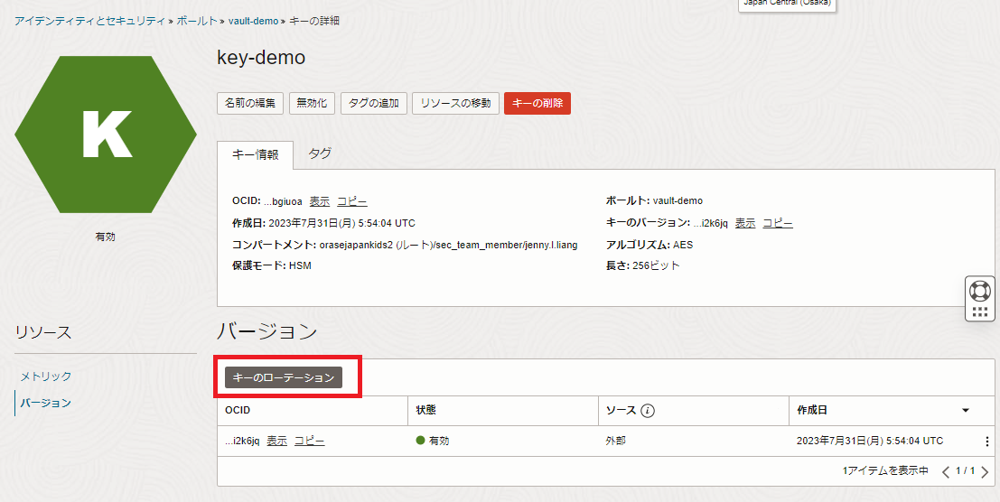

OCI Vaultはユーザーがセキュアに暗号鍵や、パスワードなどの”シークレット”を管理、運用できる鍵管理サービスです。

通常、OCI上のストレージサービスは、デフォルトでオラクルが管理する暗号鍵で暗号化されます。
OCI Vaultサービスを使用すると、ストレージサービスの暗号化に使用する暗号鍵を、オラクル管理の暗号鍵からユーザー管理の暗号鍵に変更することができます。

また、OCI Vaultサービスを利用するメリットとして、OCI IAMや監査ログによるアクセス管理、FIPS 140-2 Security Level 3の要件への対応、ユーザーによる暗号鍵のローテーションやバックアップを実施することができる、などが挙げられます。

OCI Vaultサービスで管理できる暗号鍵の暗号化アルゴリズムなどの詳細は[ドキュメント](https://docs.oracle.com/ja-jp/iaas/Content/KeyManagement/Concepts/keyoverview.htm)をご参照ください。

本チュートリアルでは、Vaultサービスでユーザー管理の暗号鍵を使用してObject Storageを作成する手順について紹介します。


**所要時間 :** 約20分

**前提条件 :**
+ OpenSSLをクライアント端末、もしくは任意のLinuxの環境にインストールしていること（本チュートリアルではデフォルトでOpenSSLがインストールされているCloud Shellを使用します）
+ OCIチュートリアル「[Vaultを作成し 顧客管理の鍵をインポートする](/ocitutorials/security/vault-setup/)」を参考にVaultと暗号鍵を作成し、インポートしていること。マスター暗号キーはAESを指定します。

**注意 :**
+ ※チュートリアル内の画面ショットについてはOracle Cloud Infrastructureの現在のコンソール画面と異なっている場合があります。

<br><br>

## 1. Vaultの準備
OCIチュートリアル「[Vaultを作成し 顧客管理の鍵をインポートする](/ocitutorials/security/vault-setup/)」を参考にVaultと暗号鍵を作成し、インポートしてください。前述のチュートリアル記事通り、マスター暗号化キーはAESを指定して作成してください。

<br>

## 2. IAMポリシーの作成
Vaultサービスに格納された暗号鍵を指定してObject Storageを作成するには、Object StorageがVaultサービスにアクセスする権限が必要です。 Object Storageを作成するコンパートメントにて、以下IAMポリシーを作成します。

```
allow service objectstorage-<リージョン名> to use keys in compartment <コンパートメント名>
```

例）大阪リージョンの場合
```
allow service objectstorage-ap-osaka-1 to use keys in compartment <コンパートメント名>
```

<br>

## 3. Object Storageの作成

OCIコンソール → ストレージ → オブジェクト・ストレージとアーカイブ・ストレージ → バケット → 「バケットの作成」ボタンをクリックします。



「バケットの作成」画面にて任意のバケット名を入力し、「顧客管理キーを使用した暗号化」にチェックします。


手順3で作成したボールトとマスター暗号化キーを選択し、「作成」ボタンをクリックします。

以上の手順で、ユーザーがインポートした暗号鍵を使用してObject Storageを作成することができました。



また、バケットの暗号化に使用したマスター暗号化キーはボールト → ボールト詳細 → マスター暗号化キーの詳細、「バージョン」のメニューからユーザーが好きなタイミングでローテーションすることができます。



キーのローテーション時に、再度公開ラッピング・キーを使用して新しい暗号鍵をラッピングし、インポートすることも可能です。

